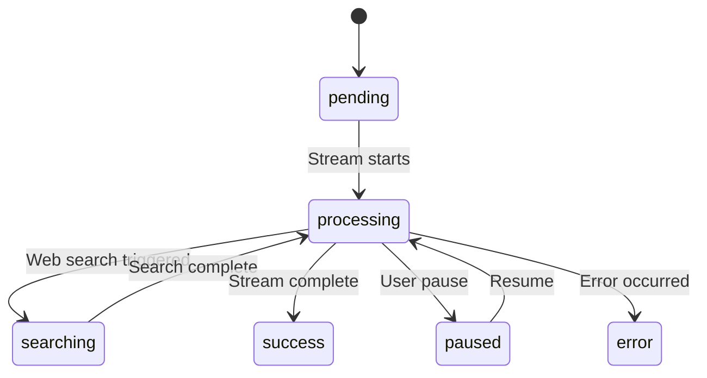
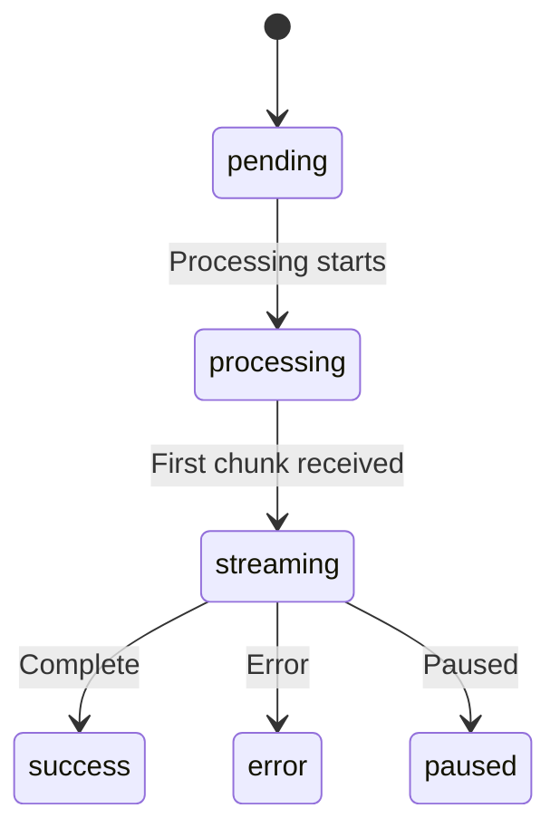
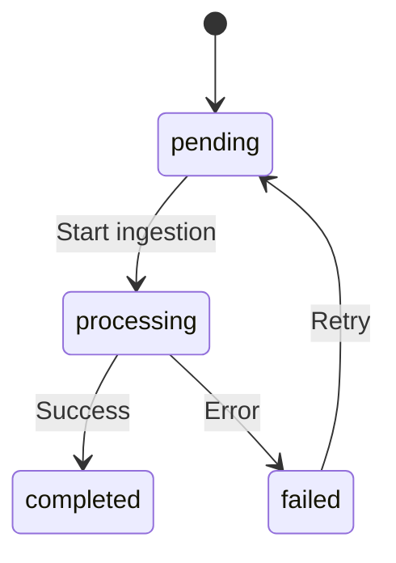

# Entity Registry

**Source**: /Users/coolhero/Study/oss/cherry-studio
**Generated**: 2026-03-02
**Total Entities**: 39

> Used as a preliminary reference when writing data-model.md during spec-kit /speckit.plan.

---

## Entity Index

| Entity | Owner Feature | Referencing Features | Fields | Relationships |
|--------|--------------|---------------------|--------|---------------|
| FileMetadata | F001-app-core | F004, F006, F010 | 11 | 0 |
| Settings (KV) | F002-settings-theme | All | 2 | 0 |
| Provider | F003-provider-management | F005, F006, F007, F010, F011, F012 | 18 | 1 |
| Model | F003-provider-management | F004, F005, F006, F007, F010, F011, F012 | 12 | 0 |
| Assistant | F004-chat-conversation | F005, F006, F007 | 22 | 4 |
| AssistantSettings | F004-chat-conversation | F005 | 14 | 1 |
| Topic | F004-chat-conversation | F005, F006 | 11 | 2 |
| Message | F004-chat-conversation | F005, F006, F007 | 18 | 3 |
| MessageBlock | F004-chat-conversation | F005, F006, F007 | 12 | 1 |
| User | F004-chat-conversation | F008 | 4 | 0 |
| KnowledgeBase | F006-knowledge-base | F004, F008 | 14 | 2 |
| KnowledgeItem | F006-knowledge-base | F004 | 12 | 1 |
| KnowledgeNote | F006-knowledge-base | None | 6 | 1 |
| KnowledgeReference | F006-knowledge-base | F004 | 6 | 1 |
| MCPServer | F007-mcp | F004, F005, F012 | 28 | 1 |
| MCPTool | F007-mcp | F005, F012 | 9 | 1 |
| MCPToolResponse | F007-mcp | F005 | 10 | 1 |
| MemoryItem | F008-memory | F005 | 7 | 1 |
| MemoryHistoryItem | F008-memory | None | 8 | 1 |
| WebDavConfig | F009-backup-sync | None | 7 | 0 |
| S3Config | F009-backup-sync | None | 11 | 0 |
| Painting (variants) | F010-image-generation | None | varies | 1 |
| TranslateHistory | F011-translation | None | 6 | 0 |
| CustomTranslateLanguage | F011-translation | None | 4 | 0 |
| Agent (Drizzle) | F012-api-server-agents | None | 14 | 1 |
| Session (Drizzle) | F012-api-server-agents | None | 16 | 2 |
| SessionMessage (Drizzle) | F012-api-server-agents | None | 8 | 1 |
| ApiServerConfig | F012-api-server-agents | None | 4 | 0 |
| PluginMetadata | F012-api-server-agents | None | 16 | 0 |
| WebSearchProvider | F013-utilities | F004 | 12 | 0 |
| MinAppType | F013-utilities | None | 10 | 0 |
| Notification | F013-utilities | All | 11 | 0 |
| NotesTreeNode | F013-utilities | None | 9 | 1 |
| Shortcut | F001-app-core | None | 4 | 0 |
| OcrProvider | F013-utilities | None | 4 | 0 |
| QuickPhrase | F004-chat-conversation | None | 5 | 0 |
| Citation | F004-chat-conversation | F006 | 7 | 0 |
| Usage | F004-chat-conversation | F005 | 5 | 0 |
| Metrics | F004-chat-conversation | F005 | 4 | 0 |

---

## FileMetadata

**Owner Feature**: F001-app-core
**Original Source**: `src/renderer/src/types/file.ts:83`
**Referencing Features**: F004-chat-conversation, F006-knowledge-base, F010-image-generation

### Fields

| Field Name | Type | Constraints | Description |
|------------|------|------------|-------------|
| id | string | PK | Unique identifier |
| name | string | NOT NULL | File name |
| origin_name | string | NOT NULL | Original display name |
| path | string | NOT NULL | File path |
| size | number | NOT NULL | Size in bytes |
| ext | string | NOT NULL | Extension (with .) |
| type | FileType enum | NOT NULL | image/video/audio/text/document/other |
| created_at | string | NOT NULL | ISO timestamp |
| count | number | NOT NULL | File reference count |
| tokens | number | Optional | Estimated token count |
| purpose | string | Optional | File purpose for API |

### Indexes

| Index Name | Fields | Type | Description |
|------------|--------|------|-------------|
| (Dexie) id | id | PK | Primary key |
| (Dexie) name | name | INDEX | Name lookup |
| (Dexie) type | type | INDEX | Type-based filtering |
| (Dexie) created_at | created_at | INDEX | Chronological ordering |

---

## Provider

**Owner Feature**: F003-provider-management
**Original Source**: `src/renderer/src/types/provider.ts:103`
**Referencing Features**: F005, F006, F007, F010, F011, F012

### Fields

| Field Name | Type | Constraints | Description |
|------------|------|------------|-------------|
| id | string | PK | Provider identifier |
| type | ProviderType enum | NOT NULL | openai/anthropic/gemini/azure-openai/vertexai/mistral/aws-bedrock/etc. |
| name | string | NOT NULL | Display name |
| apiKey | string | NOT NULL | API key (may be comma-separated for rotation) |
| apiHost | string | NOT NULL | API host URL |
| models | Model[] | NOT NULL | Available models (embedded) |
| enabled | boolean | Optional | Whether enabled |
| isSystem | boolean | Optional | Whether system-provided |
| isAuthed | boolean | Optional | Whether authenticated (OAuth) |
| rateLimit | number | Optional | Rate limit |
| authType | string | Optional | apiKey or oauth |
| notes | string | Optional | User notes |
| extra_headers | Record<string,string> | Optional | Extra HTTP headers |
| apiVersion | string | Optional | API version |
| isVertex | boolean | Optional | Whether Vertex AI |
| serviceTier | string | Optional | Service tier |
| verbosity | string | Optional | Verbosity level |
| anthropicCacheControl | object | Optional | Anthropic cache settings |

### Relationships

| Relationship Type | Target Entity | Cardinality | Description |
|-------------------|--------------|-------------|-------------|
| has_many | Model | 1:N | Provider hosts multiple models (embedded array) |

### State Transitions

| Current State | Next State | Trigger | Description |
|---------------|-----------|---------|-------------|
| disabled | enabled | User toggle | Provider becomes active |
| enabled | disabled | User toggle | Provider becomes inactive |
| unauthenticated | authenticated | OAuth flow | OAuth providers get authenticated |

---

## Model

**Owner Feature**: F003-provider-management
**Original Source**: `src/renderer/src/types/index.ts:311`
**Referencing Features**: F004, F005, F006, F007, F008, F010, F011, F012

### Fields

| Field Name | Type | Constraints | Description |
|------------|------|------------|-------------|
| id | string | PK | Model identifier (e.g. gpt-4o) |
| provider | string | NOT NULL | Provider ID |
| name | string | NOT NULL | Display name |
| group | string | NOT NULL | Model group |
| owned_by | string | Optional | Owner |
| description | string | Optional | Description |
| capabilities | ModelCapability[] | Optional | text/vision/embedding/reasoning/function_calling/web_search/rerank |
| pricing | ModelPricing | Optional | Pricing info |
| endpoint_type | EndpointType | Optional | openai/anthropic/gemini/image-generation/jina-rerank |
| supported_endpoint_types | EndpointType[] | Optional | Supported endpoint types |
| supported_text_delta | boolean | Optional | Text delta support |

---

## Assistant

**Owner Feature**: F004-chat-conversation
**Original Source**: `src/renderer/src/types/index.ts:33`
**Referencing Features**: F005, F006, F007

### Fields

| Field Name | Type | Constraints | Description |
|------------|------|------------|-------------|
| id | string | PK | Unique identifier |
| name | string | NOT NULL | Display name |
| prompt | string | NOT NULL | System prompt |
| type | string | NOT NULL | Assistant type |
| topics | Topic[] | NOT NULL | Conversation topics (embedded) |
| model | Model | Optional | Default model reference |
| defaultModel | Model | Optional | Fallback model |
| settings | AssistantSettings | Optional | Configuration settings |
| messages | AssistantMessage[] | Optional | Preset messages |
| knowledge_bases | KnowledgeBase[] | Optional | Attached knowledge bases |
| mcpServers | MCPServer[] | Optional | Selected MCP servers |
| mcpMode | string | Optional | disabled/auto/manual |
| emoji | string | Optional | Emoji icon |
| description | string | Optional | Description |
| enableWebSearch | boolean | Optional | Enable web search |
| webSearchProviderId | string | Optional | Web search provider ID |
| enableUrlContext | boolean | Optional | URL context feature |
| enableGenerateImage | boolean | Optional | Image generation |
| enableMemory | boolean | Optional | Memory feature |
| tags | string[] | Optional | Tags |
| regularPhrases | QuickPhrase[] | Optional | Regular phrases |
| content | string | Optional | For translate assistant |
| targetLanguage | TranslateLanguage | Optional | For translate assistant |

### Relationships

| Relationship Type | Target Entity | Cardinality | Description |
|-------------------|--------------|-------------|-------------|
| has_many | Topic | 1:N | Embedded topics array |
| many_to_many | KnowledgeBase | M:N | Embedded references |
| many_to_many | MCPServer | M:N | Embedded references |
| belongs_to | Model | N:1 | Default model reference |

---

## AssistantSettings

**Owner Feature**: F004-chat-conversation
**Original Source**: `src/renderer/src/types/index.ts:170`

### Fields

| Field Name | Type | Constraints | Description |
|------------|------|------------|-------------|
| temperature | number | NOT NULL | Temperature setting (0-2) |
| topP | number | NOT NULL | Top-P sampling |
| contextCount | number | NOT NULL | Context window message count |
| streamOutput | boolean | NOT NULL | Stream output toggle |
| maxTokens | number | Optional | Maximum tokens |
| enableMaxTokens | boolean | Optional | Max tokens enabled |
| enableTemperature | boolean | Optional | Temperature enabled |
| enableTopP | boolean | Optional | Top-P enabled |
| defaultModel | Model | Optional | Default model override |
| customParameters | array | Optional | Custom API parameters |
| reasoning_effort | string | NOT NULL | none/minimal/low/medium/high/xhigh/auto/default |
| toolUseMode | string | NOT NULL | function/prompt |
| qwenThinkMode | boolean | Optional | Qwen think mode |

---

## Topic

**Owner Feature**: F004-chat-conversation
**Original Source**: `src/renderer/src/types/index.ts:261`
**Referencing Features**: F005, F006

### Fields

| Field Name | Type | Constraints | Description |
|------------|------|------------|-------------|
| id | string | PK, UNIQUE | Unique identifier |
| type | TopicType | Optional | chat or session |
| assistantId | string | NOT NULL, FK | Reference to Assistant |
| name | string | NOT NULL | Topic name |
| createdAt | string | NOT NULL | ISO timestamp |
| updatedAt | string | NOT NULL | ISO timestamp |
| messages | Message[] | NOT NULL | Messages (embedded in Dexie) |
| pinned | boolean | Optional | Pin to top |
| prompt | string | Optional | Topic-level prompt override |
| isNameManuallyEdited | boolean | Optional | Manual name flag |

### Relationships

| Relationship Type | Target Entity | Cardinality | Description |
|-------------------|--------------|-------------|-------------|
| belongs_to | Assistant | N:1 | Via assistantId |
| has_many | Message | 1:N | Embedded messages array |

---

## Message

**Owner Feature**: F004-chat-conversation
**Original Source**: `src/renderer/src/types/newMessage.ts:184`
**Referencing Features**: F005, F006, F007

### Fields

| Field Name | Type | Constraints | Description |
|------------|------|------------|-------------|
| id | string | PK | Unique identifier |
| role | string | NOT NULL | user/assistant/system |
| assistantId | string | NOT NULL | FK to Assistant |
| topicId | string | NOT NULL | FK to Topic |
| createdAt | string | NOT NULL | ISO timestamp |
| updatedAt | string | Optional | ISO timestamp |
| status | string | NOT NULL | success (user) or processing/pending/searching/success/paused/error (assistant) |
| blocks | string[] | NOT NULL | Ordered MessageBlock ID references |
| modelId | string | Optional | Model identifier |
| model | Model | Optional | Full model object |
| askId | string | Optional | FK to related question message |
| mentions | Model[] | Optional | Mentioned models (multi-model) |
| usage | Usage | Optional | Token usage stats |
| metrics | Metrics | Optional | Performance metrics |
| traceId | string | Optional | Trace identifier |
| agentSessionId | string | Optional | Agent session ID |
| multiModelMessageStyle | string | Optional | horizontal/vertical/fold/grid |
| useful | boolean | Optional | Usefulness rating |

### Relationships

| Relationship Type | Target Entity | Cardinality | Description |
|-------------------|--------------|-------------|-------------|
| belongs_to | Topic | N:1 | Via topicId |
| belongs_to | Assistant | N:1 | Via assistantId |
| has_many | MessageBlock | 1:N | Via blocks[] ID references |

### State Transitions (AssistantMessageStatus)

---

## MessageBlock

**Owner Feature**: F004-chat-conversation
**Original Source**: `src/renderer/src/types/newMessage.ts:49-169`
**Referencing Features**: F005, F006, F007

### Fields (Base)

| Field Name | Type | Constraints | Description |
|------------|------|------------|-------------|
| id | string | PK | Block ID |
| messageId | string | NOT NULL, FK | FK to Message |
| type | MessageBlockType | NOT NULL | unknown/main_text/thinking/translation/image/code/tool/file/error/citation/video/compact |
| createdAt | string | NOT NULL | ISO timestamp |
| updatedAt | string | Optional | ISO timestamp |
| status | MessageBlockStatus | NOT NULL | pending/processing/streaming/success/error/paused |
| model | Model | Optional | Model used |
| metadata | Record<string,any> | Optional | Generic metadata |
| error | SerializedError | Optional | Error information |
| content | string | Optional | Text content (main_text, thinking, code, tool, compact) |
| url | string | Optional | URL (image, video) |
| file | FileMetadata | Optional | File reference (image, file) |

### Relationships

| Relationship Type | Target Entity | Cardinality | Description |
|-------------------|--------------|-------------|-------------|
| belongs_to | Message | N:1 | Via messageId |

### State Transitions

---

## KnowledgeBase

**Owner Feature**: F006-knowledge-base
**Original Source**: `src/renderer/src/types/knowledge.ts:82`
**Referencing Features**: F004, F008

### Fields

| Field Name | Type | Constraints | Description |
|------------|------|------------|-------------|
| id | string | PK | Unique identifier |
| name | string | NOT NULL | Knowledge base name |
| model | Model | NOT NULL | Embedding model |
| items | KnowledgeItem[] | NOT NULL | Knowledge items (embedded) |
| created_at | number | NOT NULL | Unix timestamp |
| updated_at | number | NOT NULL | Unix timestamp |
| version | number | NOT NULL | Schema version |
| dimensions | number | Optional | Embedding dimensions |
| description | string | Optional | Description |
| documentCount | number | Optional | Document count |
| chunkSize | number | Optional | Text chunk size |
| chunkOverlap | number | Optional | Chunk overlap |
| threshold | number | Optional | Similarity threshold |
| rerankModel | Model | Optional | Reranking model |

### Relationships

| Relationship Type | Target Entity | Cardinality | Description |
|-------------------|--------------|-------------|-------------|
| has_many | KnowledgeItem | 1:N | Embedded items array |
| belongs_to | Model | N:1 | Embedding model reference |

---

## KnowledgeItem

**Owner Feature**: F006-knowledge-base
**Original Source**: `src/renderer/src/types/knowledge.ts:7`

### Fields

| Field Name | Type | Constraints | Description |
|------------|------|------------|-------------|
| id | string | PK | Unique identifier |
| baseId | string | Optional, FK | FK to KnowledgeBase |
| type | KnowledgeItemType | NOT NULL | file/url/note/sitemap/directory/memory/video |
| content | string or FileMetadata | NOT NULL | Content (polymorphic by type) |
| created_at | number | NOT NULL | Unix timestamp |
| updated_at | number | NOT NULL | Unix timestamp |
| processingStatus | string | Optional | pending/processing/completed/failed |
| processingProgress | number | Optional | 0-100 progress |
| processingError | string | Optional | Error message |
| retryCount | number | Optional | Retry count |
| remark | string | Optional | User remark |
| isPreprocessed | boolean | Optional | Whether preprocessed |

### State Transitions

---

## MCPServer

**Owner Feature**: F007-mcp
**Original Source**: `src/renderer/src/types/index.ts:774`
**Referencing Features**: F004, F005, F012

### Fields

| Field Name | Type | Constraints | Description |
|------------|------|------------|-------------|
| id | string | PK | Internal ID |
| name | string | NOT NULL | MCP server name |
| type | McpServerType | Optional | stdio/sse/streamableHttp/inMemory |
| description | string | Optional | Description |
| baseUrl | string | Optional | Server URL (SSE/HTTP) |
| command | string | Optional | Launch command (stdio) |
| args | string[] | Optional | Command arguments |
| env | Record<string,string> | Optional | Environment variables |
| headers | Record<string,string> | Optional | Custom headers |
| isActive | boolean | NOT NULL | Whether running |
| isTrusted | boolean | Optional | User-trusted flag |
| disabledTools | string[] | Optional | Disabled tool names |
| timeout | number | Optional | Timeout seconds |
| installSource | string | Optional | builtin/manual/protocol/unknown |
| longRunning | boolean | Optional | Long-running flag |
| provider | string | Optional | Provider name |
| logoUrl | string | Optional | Logo URL |
| tags | string[] | Optional | Tags |
| registryUrl | string | Optional | Registry URL |
| dxtVersion | string | Optional | DXT version |
| dxtPath | string | Optional | DXT path |
| reference | string | Optional | Docs link |
| searchKey | string | Optional | Search keyword |
| configSample | object | Optional | Config sample |
| disabledAutoApproveTools | string[] | Optional | Non-auto-approved tools |
| shouldConfig | boolean | Optional | Needs configuration |
| trustedAt | number | Optional | Trust timestamp |
| installedAt | number | Optional | Install timestamp |

### Relationships

| Relationship Type | Target Entity | Cardinality | Description |
|-------------------|--------------|-------------|-------------|
| has_many | MCPTool | 1:N | Via serverId on MCPTool |

---

## MCPTool

**Owner Feature**: F007-mcp
**Original Source**: `src/renderer/src/types/tool.ts:52`

### Fields

| Field Name | Type | Constraints | Description |
|------------|------|------------|-------------|
| id | string | PK | Unique identifier |
| serverId | string | NOT NULL, FK | FK to MCPServer |
| serverName | string | NOT NULL | Server name |
| name | string | NOT NULL | Tool name |
| description | string | Optional | Description |
| inputSchema | MCPToolInputSchema | NOT NULL | JSON Schema for input |
| outputSchema | MCPToolOutputSchema | Optional | JSON Schema for output |
| isBuiltIn | boolean | Optional | Whether built-in |
| type | string | NOT NULL | Always 'mcp' |

---

## MemoryItem

**Owner Feature**: F008-memory
**Original Source**: `src/renderer/src/types/index.ts:1012`

### Fields

| Field Name | Type | Constraints | Description |
|------------|------|------------|-------------|
| id | string | PK | Unique identifier |
| memory | string | NOT NULL | Memory content text |
| hash | string | Optional | Content hash for dedup |
| createdAt | string | Optional | ISO timestamp |
| updatedAt | string | Optional | ISO timestamp |
| score | number | Optional | Relevance score |
| metadata | Record<string,any> | Optional | Extra metadata |

### Relationships

| Relationship Type | Target Entity | Cardinality | Description |
|-------------------|--------------|-------------|-------------|
| has_many | MemoryHistoryItem | 1:N | Via memoryId |

---

## MemoryHistoryItem

**Owner Feature**: F008-memory
**Original Source**: `src/renderer/src/types/index.ts:1051`

### Fields

| Field Name | Type | Constraints | Description |
|------------|------|------------|-------------|
| id | number | PK | Unique identifier |
| memoryId | string | NOT NULL, FK | FK to MemoryItem |
| previousValue | string | Optional | Previous memory value |
| newValue | string | NOT NULL | New memory value |
| action | string | NOT NULL | ADD/UPDATE/DELETE |
| createdAt | string | NOT NULL | ISO timestamp |
| updatedAt | string | NOT NULL | ISO timestamp |
| isDeleted | boolean | NOT NULL | Soft delete flag |

---

## Agent (Drizzle)

**Owner Feature**: F012-api-server-agents
**Original Source**: `src/main/services/agents/database/schema/agents.schema.ts`

### Fields

| Field Name | Type | Constraints | Description |
|------------|------|------------|-------------|
| id | text | PK | Agent unique identifier |
| type | text | NOT NULL | Agent type (e.g. claude-code) |
| name | text | NOT NULL | Display name |
| description | text | Optional | Agent description |
| accessible_paths | text | Optional | JSON array of directory paths |
| instructions | text | Optional | System prompt |
| model | text | NOT NULL | Main model ID |
| plan_model | text | Optional | Plan/thinking model |
| small_model | text | Optional | Small/fast model |
| mcps | text | Optional | JSON array of MCP tool IDs |
| allowed_tools | text | Optional | JSON array of allowed tools |
| configuration | text | Optional | JSON settings |
| created_at | text | NOT NULL | ISO datetime |
| updated_at | text | NOT NULL | ISO datetime |

### Relationships

| Relationship Type | Target Entity | Cardinality | Description |
|-------------------|--------------|-------------|-------------|
| has_many | Session | 1:N | Via sessions.agent_id FK |

### Indexes

| Index Name | Fields | Type |
|------------|--------|------|
| idx_agents_name | name | INDEX |
| idx_agents_type | type | INDEX |
| idx_agents_created_at | created_at | INDEX |

---

## Session (Drizzle)

**Owner Feature**: F012-api-server-agents
**Original Source**: `src/main/services/agents/database/schema/sessions.schema.ts`

### Fields

| Field Name | Type | Constraints | Description |
|------------|------|------------|-------------|
| id | text | PK | Session unique identifier |
| agent_type | text | NOT NULL | Agent type |
| agent_id | text | NOT NULL, FK -> agents.id CASCADE | Primary agent reference |
| name | text | NOT NULL | Session name |
| description | text | Optional | Session description |
| accessible_paths | text | Optional | JSON directory paths |
| instructions | text | Optional | System prompt |
| model | text | NOT NULL | Main model ID |
| plan_model | text | Optional | Plan model |
| small_model | text | Optional | Small model |
| mcps | text | Optional | JSON MCP tool IDs |
| allowed_tools | text | Optional | JSON allowed tools |
| slash_commands | text | Optional | JSON slash commands |
| configuration | text | Optional | JSON settings |
| created_at | text | NOT NULL | ISO datetime |
| updated_at | text | NOT NULL | ISO datetime |

### Relationships

| Relationship Type | Target Entity | Cardinality | Description |
|-------------------|--------------|-------------|-------------|
| belongs_to | Agent | N:1 | Via agent_id FK with CASCADE delete |
| has_many | SessionMessage | 1:N | Via session_messages.session_id |

---

## SessionMessage (Drizzle)

**Owner Feature**: F012-api-server-agents
**Original Source**: `src/main/services/agents/database/schema/messages.schema.ts`

### Fields

| Field Name | Type | Constraints | Description |
|------------|------|------------|-------------|
| id | integer | PK AUTOINCREMENT | Auto-increment ID |
| session_id | text | NOT NULL, FK -> sessions.id CASCADE | Session reference |
| role | text | NOT NULL | user/assistant/system/tool |
| content | text | NOT NULL | JSON structured content |
| agent_session_id | text | DEFAULT '' | Agent session ID for resuming |
| metadata | text | Optional | JSON metadata |
| created_at | text | NOT NULL | ISO datetime |
| updated_at | text | NOT NULL | ISO datetime |

---

## TranslateHistory

**Owner Feature**: F011-translation
**Original Source**: `src/renderer/src/types/index.ts:625`

### Fields

| Field Name | Type | Constraints | Description |
|------------|------|------------|-------------|
| id | string | PK, UNIQUE | Unique identifier |
| sourceText | string | NOT NULL | Source text |
| targetText | string | NOT NULL | Translated text |
| sourceLanguage | TranslateLanguageCode | NOT NULL | Source language code |
| targetLanguage | TranslateLanguageCode | NOT NULL | Target language code |
| createdAt | string | NOT NULL | ISO timestamp |

---

## WebSearchProvider

**Owner Feature**: F013-utilities
**Original Source**: `src/renderer/src/types/index.ts:693`

### Fields

| Field Name | Type | Constraints | Description |
|------------|------|------------|-------------|
| id | WebSearchProviderId | PK | zhipu/tavily/searxng/exa/bocha/local-google/local-bing/local-baidu |
| name | string | NOT NULL | Display name |
| apiKey | string | Optional | API key |
| apiHost | string | Optional | API host |
| engines | string[] | Optional | Search engines |
| url | string | Optional | URL |
| basicAuthUsername | string | Optional | Basic auth user |
| basicAuthPassword | string | Optional | Basic auth pass |
| usingBrowser | boolean | Optional | Browser mode |
| topicId | string | Optional | Topic ID |
| parentSpanId | string | Optional | Trace span |
| modelName | string | Optional | Model name |

---

## Painting (Union Type)

**Owner Feature**: F010-image-generation
**Original Source**: `src/renderer/src/types/index.ts:333-469`

Base fields shared by all variants: `id`, `urls`, `files`, `providerId`.

Variants: Painting (SiliconFlow), GeneratePainting (OpenAI/Aihubmix), TokenFluxPainting, PpioPainting — each adds provider-specific parameters (model, prompt, size, seed, etc.).

State transitions for TokenFluxPainting: starting → processing → succeeded/failed/cancelled.
State transitions for PpioPainting: pending → processing → succeeded/failed.

---

## WebDavConfig

**Owner Feature**: F009-backup-sync
**Original Source**: `src/renderer/src/types/index.ts:551`

### Fields

| Field Name | Type | Constraints | Description |
|------------|------|------------|-------------|
| webdavHost | string | NOT NULL | WebDAV host URL |
| webdavUser | string | Optional | Username |
| webdavPass | string | Optional | Password |
| webdavPath | string | Optional | Remote path |
| fileName | string | Optional | Backup file name |
| skipBackupFile | boolean | Optional | Skip backup file |
| disableStream | boolean | Optional | Disable streaming |

---

## S3Config

**Owner Feature**: F009-backup-sync
**Original Source**: `src/renderer/src/types/index.ts:981`

### Fields

| Field Name | Type | Constraints | Description |
|------------|------|------------|-------------|
| endpoint | string | NOT NULL | S3 endpoint |
| region | string | NOT NULL | AWS region |
| bucket | string | NOT NULL | Bucket name |
| accessKeyId | string | NOT NULL | Access key |
| secretAccessKey | string | NOT NULL | Secret key |
| root | string | Optional | Root path |
| fileName | string | Optional | File name |
| skipBackupFile | boolean | NOT NULL | Skip backup file |
| autoSync | boolean | NOT NULL | Auto-sync enabled |
| syncInterval | number | NOT NULL | Sync interval |
| maxBackups | number | NOT NULL | Max backup count |
