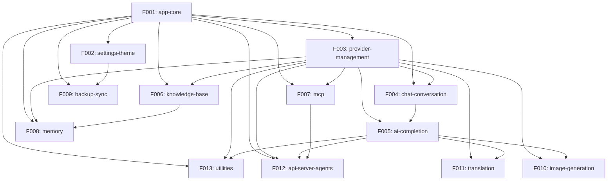

# Project Roadmap: Cherry Studio

**Source**: /Users/coolhero/Study/oss/cherry-studio
**Generated**: 2026-03-02
**Strategy**: Scope: core | Stack: new

---

## Project Overview

### Existing Project Summary
- **Project Description**: Cherry Studio is a cross-platform desktop AI assistant client supporting 20+ LLM providers with advanced features like MCP tool integration, RAG knowledge bases, and multi-model conversations. Target users are developers, researchers, and AI enthusiasts who want a unified interface to interact with multiple AI providers.
- **Domain**: AI/LLM Desktop Client
- **Architecture Type**: Electron monolith (main + preload + renderer) with pnpm monorepo for shared packages

### Tech Stack
| Area | Technology | Version |
|------|-----------|---------|
| Language | TypeScript | ~5.8.3 |
| Desktop Framework | Electron | 40.6.1 |
| UI Framework | React | 19.2.0 |
| Build Tool | Electron-Vite (Rolldown) | 5.0.0 |
| State Management | Redux Toolkit | 2.2.5 |
| UI Component Library | Ant Design + TailwindCSS | 5.27 / 4.1 |
| ORM/DB | Drizzle ORM + LibSQL + Dexie (IndexedDB) | 0.44.5 / 0.14 / 4.0 |
| Testing | Vitest + Playwright | 3.2.4 / 1.55.1 |
| Package Manager | pnpm (monorepo) | 10.27.0 |
| AI SDKs | @ai-sdk/*, Vercel AI SDK, MCP SDK | Multiple |
| i18n | i18next | 23.11.5 |

### Project Scale
- Source files: ~1,730 TS/TSX
- Entities: ~39 (4 Drizzle, 8 Dexie, 27+ TypeScript domain)
- API endpoints: ~232 IPC channels + 18 REST endpoints
- Identified Features: 13

---

## Rebuild Strategy

### Implementation Scope: Core
- Pipeline initially processes only Tier 1 Features. Tier 2/3 Features are generated but deferred in `sdd-state.md`. Use `/smart-sdd expand` to activate additional Tiers when ready.

### Tech Stack Strategy: New
- Migrate to a modernized tech stack. Key changes: Redux Toolkit → **Zustand**, Ant Design + Styled Components → **Shadcn/ui + TailwindCSS**, LibSQL → **better-sqlite3**. See `specs/reverse-spec/stack-migration.md`.

---

## Feature Catalog

### Tier 1 — Essential
> Foundation of the project. The system cannot function without these.

| ID | Feature | Description | Rationale |
|----|---------|-------------|-----------|
| F001 | app-core | Electron shell, window management, IPC bridge, config management, file storage, i18n, shortcuts | Every Feature depends on it for IPC communication, file storage, and window management. Owns core infrastructure entities. |
| F002 | settings-theme | Application settings management, theme system (light/dark/system), proxy configuration, language switching | All Features read settings; required for basic app function. Controls proxy which affects all network calls. |
| F003 | provider-management | AI provider/model configuration, API key management, OAuth flows (Copilot, CherryIN, Anthropic), API key rotation | All AI operations depend on it. Owns Provider/Model entities. 10 reverse dependencies. |
| F004 | chat-conversation | Conversation topics, messages, message blocks, context management, topic naming, message persistence | Core user interaction model. Owns the primary data entities (Topic, Message, MessageBlock). |
| F005 | ai-completion | AI completion streaming pipeline, middleware chain, multi-model responses, prompt processing, tool calling dispatch | The project's reason for existence. Complex dual-layer pipeline (Legacy + Modern) with provider-specific adapters. |
| F006 | knowledge-base | RAG pipeline: document ingestion, embedding generation, vector retrieval, reranking, citation tracking | Core knowledge-augmented generation feature. Owns KnowledgeBase/KnowledgeItem entities. |

### Tier 2 — Recommended
> Features that complete the core user experience. System works without them but core value is significantly diminished.

| ID | Feature | Description | Rationale |
|----|---------|-------------|-----------|
| F007 | mcp | MCP server lifecycle management, tool execution, builtin servers, hub server, tool permission system | Key differentiator for Cherry Studio. Complex tool management with stdio/SSE/HTTP transports. |
| F008 | memory | User memory system: add, search, update, delete memories with embedding-based retrieval | Enhances personalization and conversation continuity across sessions. |
| F009 | backup-sync | Data backup/restore to WebDAV, S3, local directory, Nutstore, and LAN transfer with auto-sync | Important for data safety and cross-device synchronization. |

### Tier 3 — Optional
> Supplementary features, admin tools, convenience features. Can be added in later phases.

| ID | Feature | Description | Rationale |
|----|---------|-------------|-----------|
| F010 | image-generation | Image generation (paintings) with multiple providers: SiliconFlow, PPIO, OpenAI, TokenFlux, ZhiPu | Supplementary creative feature. Independent module with no reverse dependencies. |
| F011 | translation | Translation feature with history, custom languages, source/target language management | Standalone convenience feature. Loosely coupled. |
| F012 | api-server-agents | Built-in OpenAI/Anthropic-compatible REST API server, Claude Code agent sessions, code tools, plugins | Advanced programmatic access feature. Complex but optional. |
| F013 | utilities | Web search providers, OCR, mini apps, selection assistant, notes, export, mini window, OpenClaw gateway | Collection of supplementary features that enhance the overall experience. |

---

## Dependency Graph

### Visualization

### Dependency Table

| Feature | Depends On | Dependency Type | Dependency Details |
|---------|------------|-----------------|-------------------|
| F002 | F001 | Config access | Reads/writes app config via ConfigManager |
| F003 | F001 | IPC, File storage | Uses IPC for OAuth flows, stores API keys securely |
| F004 | F001, F003 | IPC, Entity ref | Uses file storage for attachments, references Model entity |
| F005 | F003, F004 | Entity ref, API call | Consumes Provider/Model config, processes Messages |
| F006 | F001, F003 | IPC, Entity ref | Uses IPC for embedding calls, references Model for embeddings |
| F007 | F001, F003 | IPC, Entity ref | MCP servers managed via IPC, tools reference Provider config |
| F008 | F001, F003, F006 | IPC, Entity ref, Embedding | Uses knowledge embedding infrastructure, references Model |
| F009 | F001, F002 | IPC, Config | Uses file storage for backup, reads WebDAV/S3 settings |
| F010 | F003, F005 | Entity ref, API call | Uses Provider config, routes through completion pipeline |
| F011 | F003, F005 | Entity ref, API call | Uses Provider/Model for translation, calls AI completion |
| F012 | F001, F003, F005, F007 | Multiple | Express server uses IPC, routes through AI pipeline, supports MCP |
| F013 | F001, F003, F005 | Multiple | Various utilities depend on core infrastructure |

---

## Release Groups

Features are grouped into release groups based on dependency order. A preceding group must be completed before the subsequent group can begin.

### Release 1: Foundation
> Core infrastructure that all other Features are built upon

| Order | Feature | Tier | Notes |
|-------|---------|------|-------|
| 1 | F001-app-core | Tier 1 | Must be built first. Establishes Electron shell, IPC, file storage |
| 2 | F002-settings-theme | Tier 1 | Can be built in parallel with F003 after F001 |
| 3 | F003-provider-management | Tier 1 | Can be built in parallel with F002 after F001 |

### Release 2: Core Chat
> The core chat experience: conversations + AI pipeline + knowledge

| Order | Feature | Tier | Notes |
|-------|---------|------|-------|
| 4 | F004-chat-conversation | Tier 1 | Depends on F001, F003 |
| 5 | F005-ai-completion | Tier 1 | Depends on F003, F004. The heart of the application |
| 6 | F006-knowledge-base | Tier 1 | Can be built in parallel with F004/F005 after F003 |

### Release 3: Enhanced Experience
> Features that complete the core user experience

| Order | Feature | Tier | Notes |
|-------|---------|------|-------|
| 7 | F007-mcp | Tier 2 | Can be built in parallel with F008/F009 |
| 8 | F008-memory | Tier 2 | Depends on F006 for embedding infrastructure |
| 9 | F009-backup-sync | Tier 2 | Independent of F007/F008, depends on F002 |

### Release 4: Extensions
> Supplementary features that enrich the platform

| Order | Feature | Tier | Notes |
|-------|---------|------|-------|
| 10 | F010-image-generation | Tier 3 | Depends on F005 |
| 11 | F011-translation | Tier 3 | Depends on F005 |
| 12 | F012-api-server-agents | Tier 3 | Depends on F005, F007 |
| 13 | F013-utilities | Tier 3 | Depends on F005 |

---

## Cross-Feature Entity Dependencies

| Entity | Owner Feature | Referencing Features | Reference Type |
|--------|--------------|---------------------|----------------|
| Provider | F003-provider-management | F005, F006, F007, F008, F010, F011, F012, F013 | Config reference |
| Model | F003-provider-management | F004, F005, F006, F007, F008, F010, F011, F012, F013 | Config reference |
| Topic | F004-chat-conversation | F005, F006, F008 | FK reference |
| Message | F004-chat-conversation | F005, F006, F008 | FK reference |
| MessageBlock | F004-chat-conversation | F005, F006, F007 | FK reference |
| Assistant | F004-chat-conversation | F005, F006, F007, F013 | Config reference |
| KnowledgeBase | F006-knowledge-base | F004, F008 | Config reference |
| MCPServer | F007-mcp | F004, F005, F012 | Config reference |
| MCPTool | F007-mcp | F005, F012 | Tool reference |
| MemoryItem | F008-memory | F005 | Embedding reference |
| FileMetadata | F001-app-core | F004, F006, F010 | File reference |

---

## Cross-Feature API Dependencies

| API | Provider Feature | Consumer Features | Call Purpose |
|-----|-----------------|-------------------|-------------|
| IPC: `config:get/set` | F001-app-core | All Features | Read/write app configuration |
| IPC: `file:*` | F001-app-core | F004, F006, F010, F012 | File upload, read, storage |
| IPC: `knowledge-base:search` | F006-knowledge-base | F005 | RAG retrieval for chat context |
| IPC: `mcp:call-tool` | F007-mcp | F005, F012 | Execute MCP tool during completion |
| IPC: `mcp:list-tools` | F007-mcp | F005, F012 | Discover available tools |
| IPC: `memory:search` | F008-memory | F005 | Retrieve relevant memories for context |
| IPC: `backup:*` | F009-backup-sync | F002 (settings trigger) | Backup/restore operations |
| REST: `POST /v1/chat/completions` | F012-api-server-agents | External clients | OpenAI-compatible chat API |
| REST: `POST /v1/messages` | F012-api-server-agents | External clients | Anthropic-compatible messages API |
