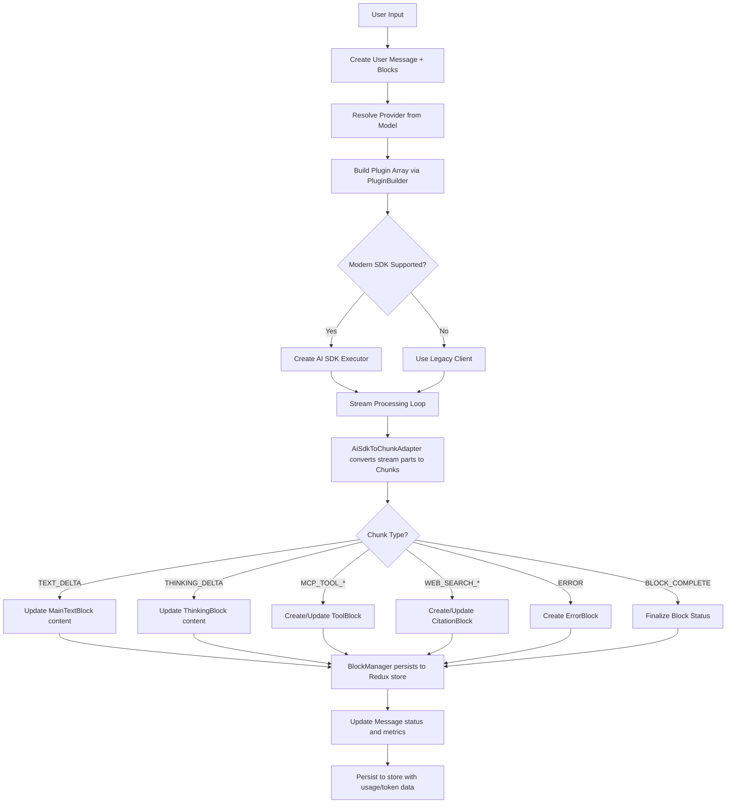
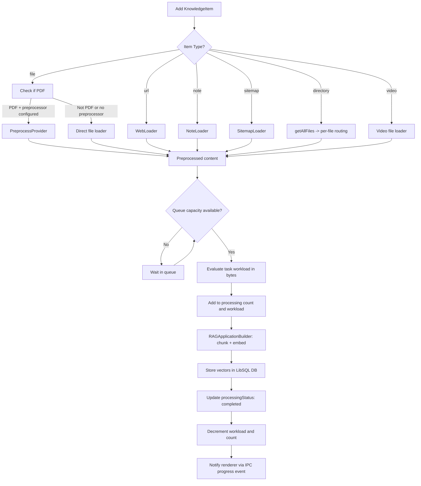

# Business Logic Map

**Source**: `/Users/coolhero/Study/oss/cherry-studio`
**Generated**: 2026-03-02

> Used as a preliminary reference when writing acceptance criteria during spec-kit /speckit.specify.
> When writing specs for each Feature, verify that all business rules documented here are
> fully reflected in Requirements and Success Criteria.

---

## Logic Index

| Feature | Rules | Validations | Workflows | Cross-Feature Rules |
|---------|-------|-------------|-----------|-------------------|
| F001-platform | 8 | 4 | 4 | 3 |
| F002-ai-foundation | 7 | 4 | 3 | 2 |
| F003-chat | 9 | 3 | 3 | 3 |
| F004-knowledge | 6 | 3 | 3 | 2 |
| F005-data-mgmt | 6 | 3 | 3 | 1 |
| F006-creative | 5 | 2 | 2 | 2 |
| F007-extensions | 7 | 3 | 3 | 2 |

---

## F001-platform

### Core Rules

| Rule ID | Description | Related Entity | Original Location |
|---------|-------------|---------------|-------------------|
| BR-001 | Electron 3-process architecture: main process (Node.js), preload bridge (contextBridge), renderer (React SPA). Renderer never accesses Node APIs directly. | App | `src/main/index.ts:1`, `src/preload/index.ts:707-716` |
| BR-002 | All IPC communication between renderer and main goes through preload bridge using `contextBridge.exposeInMainWorld`. Context isolation is enforced. | IPC | `src/preload/index.ts:707-716` |
| BR-003 | File operations are sandboxed to the app data path (`userData/Data`). File path containment is enforced via `isPathInside` check. | FileStorage | `src/preload/index.ts:131` |
| BR-004 | Proxy management supports HTTP, HTTPS, and SOCKS protocols. Bypass rules support domain patterns, CIDR ranges, IP addresses, and wildcard subdomains. | ProxyManager | `src/main/services/ProxyManager.ts:16-35` |
| BR-005 | Auto-update supports channel selection: stable (latest), rc, and beta channels. Update feed URLs are mirror-aware and region-sensitive (IP country detection). | AppUpdater | `src/main/services/AppUpdater.ts:27-47` |
| BR-006 | Theme synchronization supports three modes: light, dark, and system. System mode follows OS-level theme changes. | ThemeMode | `src/renderer/src/types/index.ts:529-533` |
| BR-007 | App initialization sequence: bootstrap.ts (init app data dir, copy occupied dirs) -> config -> services -> IPC registration -> window creation. | App | `src/main/index.ts:1-4`, `src/main/bootstrap.ts:1-33` |
| BR-008 | Data path migration: on Windows, occupied directories are copied in the main process before renderer starts, using `--new-data-path=` command-line argument. | AppDataMigration | `src/main/bootstrap.ts:13-31` |

### Validation Logic

| Validation ID | Target | Condition | Error Message | Original Location |
|---------------|--------|-----------|---------------|-------------------|
| VL-001 | File path | `isPathInside(childPath, parentPath)` -- child path must be contained within parent path | Path containment violation | `src/preload/index.ts:131` |
| VL-002 | Write permission | `hasWritePermission(path)` -- target path must be writable | Insufficient write permissions | `src/preload/index.ts:128` |
| VL-003 | Binary existence | `isBinaryExists(name)` -- required binary (uv, bun, ovms) must exist on system | Binary not found | `src/preload/index.ts:460` |
| VL-004 | Minimum window size | Window dimensions must not go below `MIN_WINDOW_WIDTH` x `MIN_WINDOW_HEIGHT` | N/A (enforced by Electron) | `src/main/ipc.ts` (references `@shared/config/constant`) |

### Workflows

#### App Initialization Flow

```
1. bootstrap.ts runs: initAppDataDir (packaged only)
2. Copy occupied dirs if --new-data-path= argument present (Windows)
3. Load config (ConfigManager)
4. Conditionally disable hardware acceleration
5. Register protocol client (cherry-studio://)
6. On app ready: register IPC handlers, start services (MCP, analytics, tray, shortcuts)
7. Create main window
8. Register shortcuts, webview hotkeys, power monitor
```

**Original Location**: `src/main/index.ts:1-100`, `src/main/bootstrap.ts:1-33`
**Related Entity**: App
**Side Effects**: Window creation, service initialization, protocol registration

#### File Upload/Download Flow

```
1. Renderer calls window.api.file.select() -> preload -> IPC -> main
2. Main process opens native dialog, returns FileMetadata[]
3. Renderer calls window.api.file.upload(file) -> preload -> IPC -> main
4. Main process copies file to app data path (Data/files/)
5. Returns file ID for reference
```

**Original Location**: `src/preload/index.ts:217-283`
**Related Entity**: FileMetadata
**Side Effects**: File system write in app data directory

#### App Update Check/Download/Install Flow

```
1. Check for update config from remote URL
2. Determine channel (latest/rc/beta) based on user setting
3. Select appropriate mirror feed URL based on IP country
4. electron-updater downloads update in background
5. User triggers quitAndInstall() to apply
```

**Original Location**: `src/main/services/AppUpdater.ts:49-50`
**Related Entity**: AppUpdater
**State Transition**: idle -> checking -> downloading -> ready -> installing

#### Data Path Migration Flow

```
1. User selects new data path via UI
2. Renderer calls api.setAppDataPath(newPath)
3. Main process validates path, copies data via api.copy(oldPath, newPath, occupiedDirs)
4. App relaunches with --new-data-path= argument
5. bootstrap.ts copies occupied dirs (Windows only) before renderer starts
```

**Original Location**: `src/main/bootstrap.ts:13-31`, `src/preload/index.ts:132-135`
**Related Entity**: AppData
**Side Effects**: Full app relaunch

### Cross-Feature Rules

| Rule ID | Description | Related Features | Original Location |
|---------|-------------|-----------------|-------------------|
| XR-001 | All IPC calls from renderer must go through the preload bridge; direct `ipcRenderer` access is blocked by context isolation | All | `src/preload/index.ts:707-716` |
| XR-002 | File operations from renderer always go through F001-platform IPC (never direct fs access). Renderer has no Node.js `fs` module. | F003, F004, F005, F006 | `src/preload/index.ts:216-283` |
| XR-003 | Redux state is persisted with encryption-capable redux-persist. All features share the same persistence layer. | All | `src/renderer/src/store/index.ts` |

---

## F002-ai-foundation

### Core Rules

| Rule ID | Description | Related Entity | Original Location |
|---------|-------------|---------------|-------------------|
| BR-009 | Provider->Model hierarchy: each Provider contains an array of Models. A Model references its Provider by string ID. | Provider, Model | `src/renderer/src/types/provider.ts:103-139`, `src/renderer/src/types/index.ts:311-327` |
| BR-010 | 60+ system provider configurations with type-specific URL formatting. Provider types: openai, openai-response, anthropic, gemini, azure-openai, vertexai, mistral, aws-bedrock, vertex-anthropic, new-api, gateway, ollama. | ProviderType | `src/renderer/src/types/provider.ts:7-20` |
| BR-011 | AI SDK provider mapping translates Cherry Studio provider IDs to AI SDK standard IDs: gemini->google, azure-openai->azure, openai-response->openai, grok->xai, copilot->github-copilot-openai-compatible, tokenflux->openrouter. | ProviderMapping | `src/renderer/src/aiCore/provider/factory.ts:29-36` |
| BR-012 | Provider API options control compatibility flags: isNotSupportArrayContent, isNotSupportStreamOptions, isSupportDeveloperRole, isSupportServiceTier, isNotSupportEnableThinking, isNotSupportVerbosity. | ProviderApiOptions | `src/renderer/src/types/provider.ts:25-48` |
| BR-013 | EndpointType determines API format: openai, openai-response, anthropic, gemini, image-generation, jina-rerank. | EndpointType | `src/renderer/src/types/index.ts:286-294` |
| BR-014 | ModelType capabilities: text, vision, embedding, reasoning, function_calling, web_search, rerank. Each model can have multiple capabilities with user override support (isUserSelected). | Model, ModelCapability | `src/renderer/src/types/index.ts:281-309` |
| BR-015 | McpMode controls MCP tool availability per assistant: disabled (no MCP), auto (hub server only), manual (user selects servers). Legacy assistants default based on mcpServers array presence. | McpMode, Assistant | `src/renderer/src/types/index.ts:31, 69-72` |

### Validation Logic

| Validation ID | Target | Condition | Error Message | Original Location |
|---------------|--------|-----------|---------------|-------------------|
| VL-005 | Model->Provider | Model's `provider` field must reference a valid, enabled Provider ID | N/A | `src/renderer/src/types/index.ts:311-327` |
| VL-006 | API Key | Provider must have non-empty `apiKey` unless `authType` is 'oauth' or provider uses Vertex/Bedrock auth | Authentication required | `src/renderer/src/types/provider.ts:107` |
| VL-007 | Custom Parameters | AssistantSettingCustomParameters type must be one of: string, number, boolean, json | Invalid parameter type | `src/renderer/src/types/index.ts:91-95` |
| VL-008 | Agent creation | Agent name min 1 char, model min 1 char, accessible_paths must be non-empty array | Zod validation errors | `src/renderer/src/types/agent.ts:353-364` |

### Workflows

#### Provider CRUD with Model Auto-Fetch

```
1. User creates/updates Provider with type, apiKey, apiHost
2. Provider type determines URL formatting (e.g., gemini adds /openai suffix)
3. System auto-fetches available models from provider API
4. Models receive capabilities based on provider-specific detection rules
5. Provider and models stored in Redux state (llm slice)
```

**Original Location**: `src/renderer/src/services/ProviderService.ts`, `src/renderer/src/aiCore/provider/providerConfig.ts`
**Related Entity**: Provider, Model

#### Model Capability Detection

```
1. On model fetch, capabilities inferred from model ID patterns and provider config
2. Vision: detected from model name patterns (e.g., "vision", "gpt-4o")
3. Embedding: separate endpoint type, model group patterns
4. Reasoning: detected from ThinkModelTypes enum (28+ model type patterns)
5. Function_calling: provider-level and model-level capability flags
6. User can manually override any capability via isUserSelected
```

**Original Location**: `src/renderer/src/types/index.ts:97-156, 281-309`
**Related Entity**: Model, ModelCapability, ThinkingModelType

#### Assistant Preset Loading from Marketplace

```
1. Fetch assistant presets from marketplace API
2. Parse preset configuration (prompt, settings, model preferences)
3. Create local Assistant entity with topic array
4. Bind default model or user-selected model
5. Store in Redux assistants slice
```

**Original Location**: `src/renderer/src/services/MarketplaceService.ts`, `src/renderer/src/services/AssistantService.ts`
**Related Entity**: Assistant, AssistantPreset

### Cross-Feature Rules

| Rule ID | Description | Related Features | Original Location |
|---------|-------------|-----------------|-------------------|
| XR-004 | Provider/Model entities from F002 are read-only references consumed by F003 (chat), F004 (knowledge embedding), and F006 (creative). Model selection is always resolved through the provider hierarchy. | F003, F004, F006 | `src/renderer/src/types/provider.ts:103-139` |
| XR-005 | ProviderType and EndpointType determine API call format across all consuming features. Changing a provider's type affects chat, knowledge embedding, and image generation. | F003, F004, F006 | `src/renderer/src/types/provider.ts:7-20` |

---

## F003-chat

### Core Rules

| Rule ID | Description | Related Entity | Original Location |
|---------|-------------|---------------|-------------------|
| BR-016 | Plugin-based AI pipeline: 12+ plugins executed in lifecycle order. Plugins include telemetry, simulate streaming, reasoning extraction, Anthropic cache, OpenRouter reasoning, no-think, Qwen thinking, web search orchestration, prompt tool use, Gemini thought signature skip. | AiPlugin | `src/renderer/src/aiCore/plugins/PluginBuilder.ts:29-80` |
| BR-017 | Message->Block decomposition: each Message contains an array of Block IDs. 11 block types: UNKNOWN, MAIN_TEXT, THINKING, TRANSLATION, IMAGE, CODE, TOOL, FILE, ERROR, CITATION, VIDEO, COMPACT. | Message, MessageBlock | `src/renderer/src/types/newMessage.ts:23-36, 157-169` |
| BR-018 | Streaming chunk adaptation: AI SDK stream parts are converted to Cherry Studio Chunk types (30+ chunk types covering text, thinking, image, audio, tool, web search, knowledge, error lifecycle events). | Chunk, ChunkType | `src/renderer/src/types/chunk.ts:15-53` |
| BR-019 | MCP tool calling with abort support: tools listed via listTools, formatted as function_call parameters, AI decides invocation, callTool executed with progress tracking, results integrated into message blocks. Abort via callId. | MCPToolResponse | `src/preload/index.ts:399-419` |
| BR-020 | Web search integration supports multiple sources: external providers (Tavily, SearXNG, Exa, Bocha, local-google/bing/baidu) and LLM-native search (Gemini grounding, OpenAI annotations, Anthropic web search, Perplexity citations). | WebSearchProvider, WebSearchSource | `src/renderer/src/types/index.ts:675-743` |
| BR-021 | Multi-model messages: user can @mention multiple models in a single message. Each mention triggers a parallel AI call. Results are aggregated into blocks with display style selection (horizontal, vertical, fold, grid). | Message, Model | `src/renderer/src/types/newMessage.ts:199-210` |
| BR-022 | AssistantMessageStatus lifecycle: processing -> pending -> searching -> success OR paused OR error. | AssistantMessageStatus | `src/renderer/src/types/newMessage.ts:175-182` |
| BR-023 | MessageBlockStatus lifecycle: pending -> processing -> streaming -> success OR error OR paused. | MessageBlockStatus | `src/renderer/src/types/newMessage.ts:39-46` |
| BR-024 | MCPToolResponseStatus lifecycle: pending -> streaming -> invoking -> done OR error OR cancelled. | MCPToolResponseStatus | `src/renderer/src/types/index.ts:881` |

### Validation Logic

| Validation ID | Target | Condition | Error Message | Original Location |
|---------------|--------|-----------|---------------|-------------------|
| VL-009 | Model existence | Model must exist and be resolvable to a valid provider before chat execution | Model not found | `src/renderer/src/aiCore/index_new.ts:119` |
| VL-010 | Provider config | Provider must have valid apiHost and apiKey (or OAuth credentials) for the resolved model | Provider configuration missing | `src/renderer/src/aiCore/index_new.ts:90-106` |
| VL-011 | Abort signal | AbortController signal must be checked at stream processing boundaries; abort causes graceful stream termination | N/A (graceful termination) | `src/renderer/src/utils/abortController.ts` |

### Workflows

#### Chat Message Flow



**Original Location**: `src/renderer/src/aiCore/index_new.ts:119`, `src/renderer/src/aiCore/plugins/PluginBuilder.ts:29`, `src/renderer/src/aiCore/chunk/AiSdkToChunkAdapter.ts`
**Related Entity**: Message, MessageBlock, Chunk, AiPlugin
**Side Effects**: Redux state update, token usage tracking, trace span creation

#### MCP Tool Call Flow

```
1. Assistant has mcpMode != 'disabled' and mcpServers configured
2. listTools() called for each active MCP server via IPC -> main process
3. Tools formatted as function_call parameters in AI SDK format
4. AI model decides to invoke tool(s) in response
5. For each tool call:
   a. ChunkType.MCP_TOOL_CREATED emitted -> ToolBlock created (status: pending)
   b. ChunkType.MCP_TOOL_STREAMING emitted -> partialArguments accumulated
   c. callTool(server, name, args, callId) via IPC -> main MCPService
   d. ChunkType.MCP_TOOL_IN_PROGRESS -> ToolBlock status: invoking
   e. Tool result returned -> ChunkType.MCP_TOOL_COMPLETE
   f. ToolBlock finalized with response content
6. Tool results fed back to AI for next response generation
7. User can abort via abortTool(callId) at any point
```

**Original Location**: `src/preload/index.ts:399-419`, `src/main/services/MCPService.ts`
**Related Entity**: MCPServer, MCPToolResponse, MCPTool
**State Transition**: pending -> streaming -> invoking -> done|error|cancelled

#### Multi-Model Message Flow

```
1. User types message with @mentions of multiple models
2. Message created with mentions[] array populated
3. For each mentioned model:
   a. Resolve provider independently
   b. Create separate AI completion call in parallel
   c. Each call produces its own set of MessageBlocks
4. All blocks aggregated under the single assistant Message
5. Display style determined by user preference or default:
   - horizontal: side-by-side columns
   - vertical: stacked vertically
   - fold: collapsible with selection
   - grid: grid layout
```

**Original Location**: `src/renderer/src/types/newMessage.ts:199-210`
**Related Entity**: Message, Model
**Side Effects**: Parallel API calls, multiple block sets per message

### Cross-Feature Rules

| Rule ID | Description | Related Features | Original Location |
|---------|-------------|-----------------|-------------------|
| XR-006 | Knowledge search results (F004) are injected into chat context as RAG references. Citation blocks track knowledge source references. | F004 | `src/renderer/src/services/KnowledgeService.ts:8` |
| XR-007 | Memory search results inject into chat context for personalization. Memory items stored via MemoryService and retrieved based on semantic similarity. | F003 (internal), F004 | `src/renderer/src/services/MemoryService.ts` |
| XR-008 | MCP tools from F007 agent system can be shared with chat via the hub server when mcpMode is 'auto'. | F007 | `src/renderer/src/types/index.ts:53-54` |

---

## F004-knowledge

### Core Rules

| Rule ID | Description | Related Entity | Original Location |
|---------|-------------|---------------|-------------------|
| BR-025 | Knowledge base per-directory isolation: each KB gets its own LibSQL database instance. Storage directory is `{appData}/KnowledgeBase/{sanitized-id}/`. | KnowledgeBase, LibSqlDb | `src/main/services/KnowledgeService.ts:99` |
| BR-026 | Concurrent processing queue: maximum workload of 80 MB and maximum 30 items processing simultaneously. Tasks are queued until capacity is available. | KnowledgeService | `src/main/services/KnowledgeService.ts:107-108` |
| BR-027 | Preprocessing only for PDF files: supported preprocessor providers are doc2x, mistral, mineru, open-mineru, paddleocr. Other file types go directly to embedding. | PreprocessProvider | `src/renderer/src/types/knowledge.ts:107-119` |
| BR-028 | Embedding normalization: provider-specific URL formatting applied (Gemini adds /openai, Azure adds /v1, Ollama strips /api suffix) before embedding API calls. | KnowledgeBaseParams | `src/renderer/src/services/KnowledgeService.ts:55-65` |
| BR-029 | KnowledgeItemType supports 7 source types: file, url, note, sitemap, directory, memory, video. Each type has its own loader implementation. | KnowledgeItem | `src/renderer/src/types/knowledge.ts:5` |
| BR-030 | Similarity threshold filtering: search results below the configured threshold score are excluded. Optional reranking applied post-search. | KnowledgeBase | `src/renderer/src/types/knowledge.ts:95` |

### Validation Logic

| Validation ID | Target | Condition | Error Message | Original Location |
|---------------|--------|-----------|---------------|-------------------|
| VL-012 | Embedding model | Knowledge base must have a valid embedding model assigned with proper API credentials | No embedding model configured | `src/renderer/src/services/KnowledgeService.ts:37-40` |
| VL-013 | Chunk size | Chunk size must be positive and not exceed the embedding model's max context window. Auto-capped if exceeded. | N/A (auto-corrected) | `src/renderer/src/services/KnowledgeService.ts:69-78` |
| VL-014 | File size | Task workload evaluated in bytes; individual items contribute to the 80 MB concurrent workload cap | Queue capacity exceeded | `src/main/services/KnowledgeService.ts:107` |

### Workflows

#### Document Ingestion Pipeline



**Original Location**: `src/main/services/KnowledgeService.ts:98-115`
**Related Entity**: KnowledgeItem, KnowledgeBase, RAGApplication
**Side Effects**: LibSQL database writes, IPC progress notifications to renderer

#### Search and Rerank Flow

```
1. Receive search query and KnowledgeBase reference
2. Get or create RAGApplication for the KB (cached in Map)
3. Execute vector similarity search via LibSQL DB
4. Apply similarity threshold filtering (exclude low-score results)
5. If rerank model configured:
   a. Send results to reranker (5 strategy types via Reranker class)
   b. Re-order results by rerank score
6. Limit results to documentCount (configurable, default constant)
7. Return KnowledgeSearchResult[] with pageContent, score, metadata
```

**Original Location**: `src/main/services/KnowledgeService.ts`, `src/main/knowledge/reranker/Reranker.ts`
**Related Entity**: KnowledgeSearchResult, KnowledgeBase
**State Transition**: N/A (stateless query)

#### Concurrent Queue Processing

```
1. New item submitted via add()
2. Evaluate task workload (file size in bytes)
3. Check: workload + currentWorkload <= 80MB AND processingItemCount < 30
4. If capacity available: start processing immediately
5. If not: add to queue, resolve promise when capacity frees
6. On task completion: decrement counters, check queue for pending items
7. Batch notifications sent to renderer for progress updates
```

**Original Location**: `src/main/services/KnowledgeService.ts:102-108`
**Related Entity**: LoaderTaskItem, QueueTaskItem
**State Transition**: PENDING -> PROCESSING -> DONE

### Cross-Feature Rules

| Rule ID | Description | Related Features | Original Location |
|---------|-------------|-----------------|-------------------|
| XR-009 | Knowledge search results are formatted as KnowledgeReference[] and injected into F003 chat context via REFERENCE_PROMPT template. | F003 | `src/renderer/src/services/KnowledgeService.ts:8` |
| XR-010 | Embedding model and rerank model are Provider/Model entities from F002. Knowledge base creation requires selecting from available embedding-capable models. | F002 | `src/renderer/src/services/KnowledgeService.ts:37-40` |

---

## F005-data-mgmt

### Core Rules

| Rule ID | Description | Related Entity | Original Location |
|---------|-------------|---------------|-------------------|
| BR-031 | Backup creates ZIP archive using archiver with zlib compression level 1 (fastest) and ZIP64 support for large files. | BackupManager | `src/main/services/BackupManager.ts:276-279` |
| BR-032 | Restore replaces app data atomically: extract ZIP to temp, parse data.json, close all data connections (DB, knowledge bases), replace Data directory, return parsed state. | BackupManager | `src/main/services/BackupManager.ts` |
| BR-033 | WebDAV integration with SSL permissive mode option. Connection test required before sync operations. Instance caching with config change detection (only core connection fields trigger recreation). | WebDav, WebDavConfig | `src/main/services/BackupManager.ts:147-208` |
| BR-034 | S3 storage with virtual-host style for known providers. Instance caching with connection config comparison. Supports custom root path and region configuration. | S3Storage, S3Config | `src/main/services/BackupManager.ts:131-183` |
| BR-035 | LAN transfer uses mDNS (Bonjour) service discovery with service type 'cherrystudio' over TCP. Supports peer discovery, connection handshake, and file transfer. | LocalTransferService | `src/main/services/LocalTransferService.ts:9-10` |
| BR-036 | Backup progress stages reported via IPC: preparing -> writing_data -> copying_files -> preparing_compression -> compressing -> completed. Progress tracked by both entry count and byte count. | BackupProgress | `src/main/services/BackupManager.ts:219-226` |

### Validation Logic

| Validation ID | Target | Condition | Error Message | Original Location |
|---------------|--------|-----------|---------------|-------------------|
| VL-015 | WebDAV connection | `checkConnection(webdavConfig)` must succeed before any sync operation. Tests connectivity with configured credentials. | Connection test failed | `src/preload/index.ts:186, 202` |
| VL-016 | S3 bucket | `checkS3Connection(s3Config)` must succeed. Verifies bucket accessibility with provided credentials and endpoint. | S3 connection failed | `src/preload/index.ts:210` |
| VL-017 | Temp path | Backup temp directory (`{system-temp}/cherry-studio/backup/temp`) must be writable. Recursive permission setting applied on Windows. | Permission denied | `src/main/services/BackupManager.ts:38-39, 81-103` |

### Workflows

#### Backup Flow

```
1. Prepare: ensure temp directory exists
2. Write data.json: serialize Redux state to temp/data.json via stream
3. Copy Data directory: stream-copy userData/Data to temp/Data with progress
4. Set writable permissions recursively (Windows compatibility)
5. Compress: create ZIP archive (zlib level 1, ZIP64) from temp directory
6. Upload: send to destination (local dir / WebDAV / S3 / LAN peer)
7. Cleanup: remove temp directory
```

**Original Location**: `src/main/services/BackupManager.ts:210-330`
**Related Entity**: BackupManager
**Side Effects**: IPC progress events to renderer, temp file creation/cleanup

#### Restore Flow

```
1. Download/read backup ZIP file
2. Extract ZIP to temp directory using node-stream-zip
3. Parse data.json from extracted contents
4. Close all active data connections (DB instances, knowledge base connections)
5. Replace userData/Data directory with extracted Data directory
6. Return parsed state object for Redux rehydration
```

**Original Location**: `src/main/services/BackupManager.ts`
**Related Entity**: BackupManager
**Side Effects**: Data directory replacement, all connections closed and reopened

#### LAN Transfer Flow

```
1. Start mDNS discovery: browse for 'cherrystudio' services over TCP
2. Discovered peers added to services Map, broadcast state to renderer
3. User selects peer, initiates connect(payload) -> handshake
4. On handshake ack: create temp backup file
5. Send file to peer via established connection
6. Receiver extracts and restores
7. Cleanup: delete temp backup, disconnect
```

**Original Location**: `src/main/services/LocalTransferService.ts:18-60`, `src/main/services/lanTransfer/`
**Related Entity**: LocalTransferService, LocalTransferPeer
**State Transition**: idle -> scanning -> connected -> transferring -> complete

### Cross-Feature Rules

| Rule ID | Description | Related Features | Original Location |
|---------|-------------|-----------------|-------------------|
| XR-011 | Restore operation must close all data connections before replacing the Data directory. This includes knowledge base LibSQL instances (F004), any active file watchers (F007 notes), and cached DB connections. | F004, F007 | `src/main/services/BackupManager.ts` (calls `closeAllDataConnections`) |

---

## F006-creative

### Core Rules

| Rule ID | Description | Related Entity | Original Location |
|---------|-------------|---------------|-------------------|
| BR-037 | Provider-specific painting page routing: different providers (silicon, dmxapi, tokenflux, zhipu, aihubmix, openai, ovms, ppio) have distinct painting state slices and UI configurations. | PaintingsState | `src/renderer/src/types/index.ts:483-505` |
| BR-038 | Two generation paths: Modern AI SDK path (via ModernAiProvider for supported providers) and legacy path (direct API calls for provider-specific endpoints). | ModernAiProvider, LegacyAiProvider | `src/renderer/src/aiCore/index_new.ts:47` |
| BR-039 | Multi-mode painting: generate (text-to-image), edit (inpainting with mask), remix (image-to-image with weight), scale (upscaling with resemblance/detail controls). | GeneratePainting, EditPainting, RemixPainting, ScalePainting | `src/renderer/src/types/index.ts:355-413` |
| BR-040 | TokenFluxPainting status lifecycle: starting -> processing -> succeeded OR failed OR cancelled. PpioPainting has separate ppioStatus: pending -> processing -> succeeded OR failed. | TokenFluxPainting, PpioPainting | `src/renderer/src/types/index.ts:440, 463` |
| BR-041 | Translation uses franc library for client-side language detection and LLM-based detection as alternative. Auto-detection method selectable: franc, llm, or auto (try franc first, fallback to llm). | AutoDetectionMethod | `src/renderer/src/types/index.ts:643-653` |

### Validation Logic

| Validation ID | Target | Condition | Error Message | Original Location |
|---------------|--------|-----------|---------------|-------------------|
| VL-018 | Image size | Image size constraints are provider-specific (e.g., DALL-E has fixed sizes, SiliconFlow supports custom dimensions). Each painting type defines its own size/dimension fields. | Invalid image size | `src/renderer/src/types/index.ts:355-469` |
| VL-019 | Prompt | Prompt is required for generate, edit, remix, and scale operations. Must be non-empty string. | Prompt required | `src/renderer/src/types/index.ts:357, 380, 393, 404` |

### Workflows

#### Image Generation Flow

```
1. User selects provider and model from painting page
2. Configure generation parameters (prompt, size, seed, style, etc.)
3. Submit generation request:
   a. Modern path: ModernAiProvider.generateImage() for supported providers
   b. Legacy path: Provider-specific API call (SiliconFlow, DMXAPI, TokenFlux, etc.)
4. For async providers (TokenFlux, PPIO):
   a. Submit task, receive generationId/taskId
   b. Poll status until succeeded/failed/cancelled
5. Display results in painting grid
6. User can save generated images to file system via IPC
```

**Original Location**: `src/renderer/src/types/index.ts:333-505`
**Related Entity**: Painting, GeneratePainting, PaintingsState
**Side Effects**: API calls to image generation services, file system writes

#### Translation Flow

```
1. User inputs text or uploads file for translation
2. Language detection:
   a. franc: client-side detection using franc library
   b. llm: AI-based detection via chat completion
   c. auto: try franc first, fallback to llm
3. Create translation assistant with target language prompt
4. Stream chat completion via fetchChatCompletion
5. Collect TEXT_DELTA chunks for real-time display
6. On TEXT_COMPLETE: finalize translated text
7. Save translation history to local database (Dexie)
```

**Original Location**: `src/renderer/src/services/TranslateService.ts:39-60`
**Related Entity**: TranslateAssistant, TranslateHistory, TranslateLanguage
**Side Effects**: Chat API call, database write

### Cross-Feature Rules

| Rule ID | Description | Related Features | Original Location |
|---------|-------------|-----------------|-------------------|
| XR-012 | Image generation uses Provider/Model entities from F002. Provider selection determines available models and generation parameters. | F002 | `src/renderer/src/types/index.ts:341` |
| XR-013 | Translation reuses the F003 chat completion pipeline (fetchChatCompletion) with a specialized TranslateAssistant. Streaming, abort, and token tracking share the same infrastructure. | F003 | `src/renderer/src/services/TranslateService.ts:21-22` |

---

## F007-extensions

### Core Rules

| Rule ID | Description | Related Entity | Original Location |
|---------|-------------|---------------|-------------------|
| BR-042 | Agent system uses Drizzle ORM with SQLite for persistence. Agent entities include type (currently only 'claude-code'), configuration, and model bindings. | AgentEntity, DrizzleORM | `src/main/services/agents/index.ts:1-10`, `src/renderer/src/types/agent.ts:110-117` |
| BR-043 | REST API server (Express-based) follows OpenAI and Anthropic conventions. Endpoints include agents CRUD, sessions, and message streaming (SSE). | ApiServerService | `src/main/services/ApiServerService.ts:16`, `src/main/apiServer/` |
| BR-044 | Notes system uses file-based storage with Obsidian vault integration. File tree synced with external directory. Auto-save support with file watcher (start/stop/pause/resume). | NotesService | `src/renderer/src/services/NotesService.ts:20-50`, `src/preload/index.ts:266-282` |
| BR-045 | MCP plugin system supports DXT package format. Plugins can be installed from ZIP, directory, or DXT upload. Each plugin has metadata, install source tracking, and trust management. | MCPServer, DxtService | `src/preload/index.ts:415-417, 633-646` |
| BR-046 | Agent session auto-creation on agent create. Sessions inherit agent configuration (model, instructions, accessible_paths, MCP tools). | AgentSessionEntity | `src/renderer/src/types/agent.ts:131-145` |
| BR-047 | API server authentication uses timing-safe string comparison for API key validation. Server supports start/stop/restart lifecycle. | ApiServerService | `src/main/services/ApiServerService.ts:16-53` |
| BR-048 | SessionMessageRole follows AI SDK conventions: assistant, user, system, tool. Messages persisted with exchange pattern (user + assistant pair). | SessionMessageRole, AgentSessionMessageEntity | `src/renderer/src/types/agent.ts:17-24, 148-160` |

### Validation Logic

| Validation ID | Target | Condition | Error Message | Original Location |
|---------------|--------|-----------|---------------|-------------------|
| VL-020 | Agent CRUD | Zod schema validation: name min 1 char, model min 1 char, accessible_paths non-empty array, type must be valid AgentType | Zod validation errors | `src/renderer/src/types/agent.ts:333-374` |
| VL-021 | Session message | Content must be non-empty string (min 1 char) via CreateSessionMessageRequestSchema | Content must be a valid string | `src/renderer/src/types/agent.ts:378-380` |
| VL-022 | API auth | API key compared using timing-safe comparison to prevent timing attacks | Authentication failed | `src/main/apiServer/middleware/` |

### Workflows

#### Agent Session Flow

```
1. Create agent with type, model, instructions, accessible_paths
2. Auto-create default session inheriting agent configuration
3. User sends message to session:
   a. Validate message content via Zod schema
   b. Create SSE stream for response
   c. Agent processes message using configured model
   d. Stream response parts back to client
4. Persist exchange (user message + assistant message pair) to SQLite via Drizzle ORM
5. Session maintains conversation history via agent_session_id for resume support
```

**Original Location**: `src/main/services/agents/services/`, `src/renderer/src/types/agent.ts:131-189`
**Related Entity**: AgentEntity, AgentSessionEntity, AgentSessionMessageEntity
**Side Effects**: SQLite database writes, SSE stream to client

#### Notes Flow

```
1. Configure notes directory (external path or default)
2. Start file watcher for the directory via IPC
3. Load directory tree structure via getDirectoryStructure()
4. User creates/edits notes:
   a. TipTap editor for rich text editing
   b. Auto-save on changes
   c. File watcher detects external changes and syncs
5. Obsidian vault integration:
   a. getVaults() discovers installed Obsidian vaults
   b. getFolders()/getFiles() browse vault contents
   c. User can import/reference vault files
6. Search across notes via NotesSearchService
```

**Original Location**: `src/renderer/src/services/NotesService.ts`, `src/preload/index.ts:266-282, 292-296`
**Related Entity**: NotesTreeNode, FileWatcher
**Side Effects**: File system reads/writes, file watcher events

#### API Server Flow

```
1. Start Express server via ApiServerService
2. Register middleware: auth (timing-safe key comparison), CORS, body parsing
3. Register routes following OpenAI/Anthropic conventions:
   a. Agent CRUD endpoints
   b. Session management endpoints
   c. Message send endpoint (SSE streaming)
4. On message request:
   a. Validate auth header
   b. Parse and validate request body
   c. Create or resume agent session
   d. Stream response via SSE
5. Server lifecycle: start -> running -> stop/restart
```

**Original Location**: `src/main/apiServer/app.ts`, `src/main/apiServer/routes/`, `src/main/services/ApiServerService.ts:16-53`
**Related Entity**: ApiServerService, Express
**Side Effects**: HTTP server binding, SSE connections

### Cross-Feature Rules

| Rule ID | Description | Related Features | Original Location |
|---------|-------------|-----------------|-------------------|
| XR-014 | Agent model selection uses Provider/Model entities from F002. Model ID must resolve to a valid, enabled provider. | F002 | `src/renderer/src/types/agent.ts:78` |
| XR-015 | MCP servers configured in agents (via mcps field) are the same MCPServer entities managed at the platform level. Agent sessions inherit MCP tool access from their agent configuration. | F001, F003 | `src/renderer/src/types/agent.ts:83` |

---

## Cross-Feature Rules (Global)

| Rule ID | Description | Related Features | Original Location |
|---------|-------------|-----------------|-------------------|
| XR-001 | All IPC calls from renderer must go through the preload bridge; direct ipcRenderer access is blocked by context isolation | All | `src/preload/index.ts:707-716` |
| XR-002 | File operations from renderer always go through F001-platform IPC (never direct fs access) | F003, F004, F005, F006, F007 | `src/preload/index.ts:216-283` |
| XR-003 | Redux state is persisted with encryption-capable redux-persist | All | `src/renderer/src/store/index.ts` |
| XR-004 | Provider/Model entities from F002 are read-only references for F003 (chat), F004 (knowledge), F006 (creative), F007 (agents) | F002, F003, F004, F006, F007 | `src/renderer/src/types/provider.ts:103-139` |
| XR-006 | Knowledge search results (F004) inject into F003 chat context as RAG references | F003, F004 | `src/renderer/src/services/KnowledgeService.ts:8` |
| XR-007 | Memory search results inject into F003 chat context for personalization | F003 | `src/renderer/src/services/MemoryService.ts` |
| XR-011 | Restore operation (F005) must close all data connections before replacing Data directory, affecting F004 and F007 | F004, F005, F007 | `src/main/services/BackupManager.ts` |
