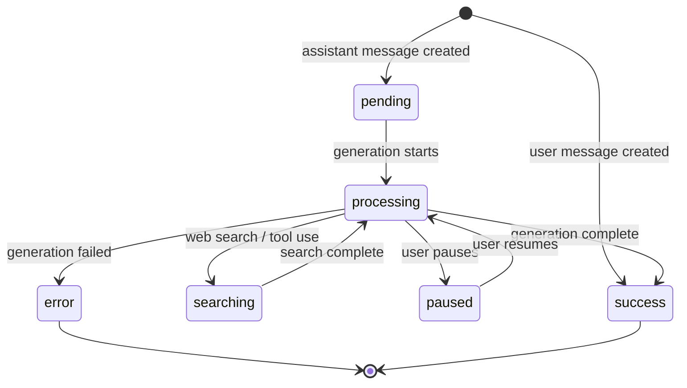
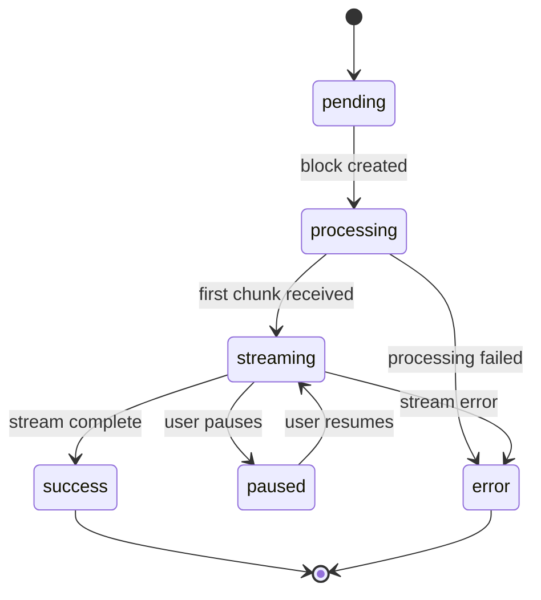
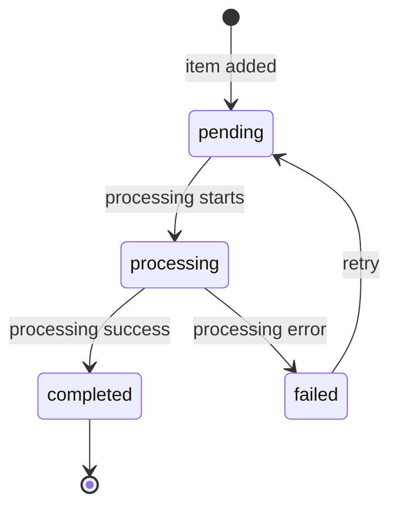

# Entity Registry

**Source**: `/Users/coolhero/Study/oss/cherry-studio`
**Generated**: 2026-03-02
**Total Entities**: 30

> Used as a preliminary reference when writing data-model.md during spec-kit /speckit.plan.
> When writing the plan for each Feature, directly reflect owned entities into data-model.md,
> and check schemas for referenced entities in this registry to ensure compatibility.

---

## Entity Index

| Entity | Owner Feature | Referencing Features | Fields | Relationships |
|--------|--------------|---------------------|--------|---------------|
| FileMetadata | F001-platform | F003, F004, F006 | 8 | 0 | ✅ Finalized in plan |
| Shortcut | F001-platform | -- | 3 | 0 | ✅ Finalized in plan |
| User | F001-platform | -- | 3 | 0 | ✅ Finalized in plan |
| AppInfo | F001-platform | -- | 6 | 0 | ✅ Finalized in plan |
| Provider | F002-ai-foundation | F003, F006 | 20 | 1 |
| Model | F002-ai-foundation | F003, F004, F006 | 10 | 1 |
| Assistant | F002-ai-foundation | F003, F004 | 21 | 5 |
| AssistantSettings | F002-ai-foundation | F003 | 10 | 1 |
| Topic | F002-ai-foundation | F003 | 10 | 2 |
| QuickPhrase | F002-ai-foundation | F003 | 6 | 0 |
| Message | F003-chat | F007 | 20 | 4 |
| MessageBlock | F003-chat | F007 | 8 (base) | 1 |
| MCPServer | F003-chat | F002, F007 | 27 | 0 |
| MCPTool | F003-chat | F002, F007 | 8 | 1 |
| MCPPrompt | F003-chat | -- | 6 | 1 |
| MCPResource | F003-chat | -- | 8 | 1 |
| WebSearchProvider | F003-chat | F002 | 11 | 0 |
| Citation | F003-chat | -- | 7 | 0 |
| MemoryItem | F003-chat | -- | 7 | 0 |
| MemoryHistoryItem | F003-chat | -- | 7 | 1 |
| MemoryConfig | F003-chat | -- | 6 | 2 |
| KnowledgeBase | F004-knowledge | F002 | 14 | 3 |
| KnowledgeItem | F004-knowledge | -- | 12 | 1 |
| KnowledgeNoteItem | F004-knowledge | -- | 13 | 1 |
| KnowledgeReference | F004-knowledge | F003 | 6 | 1 |
| PreprocessProvider | F004-knowledge | -- | 6 | 0 |
| Painting | F006-creative | -- | 13 | 1 |
| TranslateHistory | F006-creative | -- | 7 | 0 |
| Agent (Entity) | F007-extensions | -- | 14 | 1 |
| AgentSession (Entity) | F007-extensions | -- | 16 | 2 |
| AgentSessionMessage (Entity) | F007-extensions | -- | 8 | 1 |
| Migration | F007-extensions | -- | 3 | 0 |
| NotesTreeNode | F007-extensions | -- | 8 | 0 |
| MinAppType | F007-extensions | -- | 9 | 0 |
| PluginMetadata | F007-extensions | -- | 14 | 0 |
| ApiServerConfig | F007-extensions | -- | 4 | 0 |
| Notification | F007-extensions | -- | 10 | 0 |
| OcrProvider | F007-extensions | -- | 4 | 0 |
| WebDavConfig | F005-data-mgmt | -- | 7 | 0 |
| S3Config | F005-data-mgmt | -- | 10 | 0 |
| CustomTranslateLanguage | F006-creative | -- | 4 | 0 |

---

## FileMetadata

**Owner Feature**: F001-platform
**Original Source**: `src/renderer/src/types/file.ts:83`
**Referencing Features**: F003-chat, F004-knowledge, F006-creative
**Storage**: Dexie table `files`
**Status**: ✅ Finalized in F001 plan (`specs/001-platform/data-model.md`)

### Fields

| Field Name | Type | Constraints | Description |
|------------|------|------------|-------------|
| id | string | PK, auto-generated UUID | Unique file identifier |
| name | string | NOT NULL | Original file name (e.g., "document.pdf") |
| path | string | NOT NULL | Storage path relative to app data directory |
| size | number | NOT NULL | File size in bytes |
| ext | string | NOT NULL | File extension including dot (e.g., ".pdf") |
| type | string | NOT NULL | MIME type (e.g., "application/pdf", "image/png") |
| count | number | OPTIONAL, default 0 | Reference count tracking how many entities reference this file |
| created_at | number | NOT NULL | Creation timestamp (Unix milliseconds) |

> **Changes from reverse-spec draft**: Removed `origin_name` (merged into `name`), `tokens`, `purpose` fields. Changed `type` from FileType enum to MIME type string. Changed `created_at` from ISO string to Unix milliseconds number. Simplified from 11 to 8 fields.

### Indexes (Dexie)

| Index Name | Fields | Type | Description |
|------------|--------|------|-------------|
| (primary) | id | PK | Primary key lookup |

---

## Provider

**Owner Feature**: F002-ai-foundation
**Original Source**: `src/renderer/src/types/provider.ts:103`
**Referencing Features**: F003-chat, F006-creative
**Storage**: Redux persisted slice `llm`

### Fields

| Field Name | Type | Constraints | Description |
|------------|------|------------|-------------|
| id | string | PK | Provider identifier (SystemProviderId or custom) |
| type | ProviderType enum | NOT NULL | One of: openai, openai-response, anthropic, gemini, azure-openai, vertexai, mistral, aws-bedrock, vertex-anthropic, new-api, gateway, ollama |
| name | string | NOT NULL | Display name |
| apiKey | string | NOT NULL | API authentication key |
| apiHost | string | NOT NULL | API base URL |
| anthropicApiHost | string | OPTIONAL | Anthropic-specific API host |
| apiVersion | string | OPTIONAL | API version string |
| models | Model[] | NOT NULL | Array of associated models |
| enabled | boolean | OPTIONAL | Whether provider is active |
| isSystem | boolean | OPTIONAL | Whether provider is built-in |
| isAuthed | boolean | OPTIONAL | Whether provider is authenticated |
| rateLimit | number | OPTIONAL | Rate limit configuration |
| apiOptions | ProviderApiOptions | OPTIONAL | API compatibility options |
| serviceTier | ServiceTier | OPTIONAL | OpenAI/Groq service tier |
| verbosity | OpenAIVerbosity | OPTIONAL | OpenAI verbosity setting |
| authType | 'apiKey' \| 'oauth' | OPTIONAL | Authentication method |
| isVertex | boolean | OPTIONAL | Whether this is a Vertex AI provider |
| notes | string | OPTIONAL | User notes |
| extra_headers | Record<string,string> | OPTIONAL | Custom request headers |
| anthropicCacheControl | AnthropicCacheControlSettings | OPTIONAL | Anthropic prompt caching settings |

### Relationships

| Relationship Type | Target Entity | Cardinality | FK/Join | Description |
|-------------------|--------------|-------------|---------|-------------|
| has_many | Model | 1:N | Model.provider | Provider owns multiple models |

---

## Model

**Owner Feature**: F002-ai-foundation
**Original Source**: `src/renderer/src/types/index.ts:311`
**Referencing Features**: F003-chat, F004-knowledge, F006-creative
**Storage**: Embedded within Provider (Redux persisted slice `llm`)

### Fields

| Field Name | Type | Constraints | Description |
|------------|------|------------|-------------|
| id | string | PK | Model identifier |
| provider | string | NOT NULL | Provider ID reference |
| name | string | NOT NULL | Display name |
| group | string | NOT NULL | Model group/family |
| owned_by | string | OPTIONAL | Organization that owns the model |
| description | string | OPTIONAL | Model description |
| capabilities | ModelCapability[] | OPTIONAL | Array of model capabilities (vision, embedding, reasoning, etc.) |
| pricing | ModelPricing | OPTIONAL | Input/output token pricing |
| endpoint_type | EndpointType | OPTIONAL | Preferred endpoint type |
| supported_endpoint_types | EndpointType[] | OPTIONAL | All supported endpoint types |

### Relationships

| Relationship Type | Target Entity | Cardinality | FK/Join | Description |
|-------------------|--------------|-------------|---------|-------------|
| belongs_to | Provider | N:1 | provider (field) | Model belongs to a provider |

---

## Assistant

**Owner Feature**: F002-ai-foundation
**Original Source**: `src/renderer/src/types/index.ts:33`
**Referencing Features**: F003-chat, F004-knowledge
**Storage**: Redux persisted slice `assistants`

### Fields

| Field Name | Type | Constraints | Description |
|------------|------|------------|-------------|
| id | string | PK | Unique assistant identifier |
| name | string | NOT NULL | Display name |
| prompt | string | NOT NULL | System prompt |
| type | string | NOT NULL | Assistant type identifier |
| emoji | string | OPTIONAL | Display emoji |
| description | string | OPTIONAL | Assistant description |
| model | Model | OPTIONAL | Associated model |
| defaultModel | Model | OPTIONAL | Fallback default model |
| settings | Partial\<AssistantSettings\> | OPTIONAL | Configuration settings |
| messages | AssistantMessage[] | OPTIONAL | Preset conversation messages |
| topics | Topic[] | NOT NULL | Associated conversation topics |
| knowledge_bases | KnowledgeBase[] | OPTIONAL | Linked knowledge bases |
| enableWebSearch | boolean | OPTIONAL | Enable built-in web search |
| webSearchProviderId | WebSearchProviderId | OPTIONAL | Web search provider reference |
| enableUrlContext | boolean | OPTIONAL | Gemini/Anthropic URL context |
| enableGenerateImage | boolean | OPTIONAL | Image generation toggle |
| mcpMode | McpMode | OPTIONAL | MCP mode: disabled, auto, manual |
| mcpServers | MCPServer[] | OPTIONAL | Manual MCP server selections |
| knowledgeRecognition | 'off' \| 'on' | OPTIONAL | Knowledge base recognition toggle |
| regularPhrases | QuickPhrase[] | OPTIONAL | Quick phrase shortcuts |
| tags | string[] | OPTIONAL | Assistant classification tags |
| enableMemory | boolean | OPTIONAL | Memory service toggle |

### Relationships

| Relationship Type | Target Entity | Cardinality | FK/Join | Description |
|-------------------|--------------|-------------|---------|-------------|
| has_many | Topic | 1:N | Topic.assistantId | Assistant owns topics |
| has_one | Model | N:1 | model | Assistant uses a model |
| has_many | KnowledgeBase | M:N | knowledge_bases[] | Assistant references knowledge bases |
| has_many | MCPServer | M:N | mcpServers[] | MCP servers used by assistant |
| has_one | AssistantSettings | 1:1 | settings | Assistant configuration |

### Validation Rules

| Rule ID | Field | Rule | Description |
|---------|-------|------|-------------|
| VR-001 | mcpMode | Backward compat: absent mcpMode defaults by mcpServers presence | getEffectiveMcpMode() helper |
| VR-002 | name | NOT NULL, non-empty | Required display name |

---

## AssistantSettings

**Owner Feature**: F002-ai-foundation
**Original Source**: `src/renderer/src/types/index.ts:170`
**Referencing Features**: F003-chat
**Storage**: Embedded within Assistant (Redux persisted slice `assistants`)

### Fields

| Field Name | Type | Constraints | Description |
|------------|------|------------|-------------|
| temperature | number | NOT NULL | Sampling temperature |
| enableTemperature | boolean | OPTIONAL | Whether temperature is explicitly set |
| topP | number | NOT NULL | Top-P nucleus sampling |
| enableTopP | boolean | OPTIONAL | Whether topP is explicitly set |
| maxTokens | number | OPTIONAL | Maximum output tokens |
| enableMaxTokens | boolean | OPTIONAL | Whether maxTokens is explicitly set |
| contextCount | number | NOT NULL | Number of context messages to include |
| streamOutput | boolean | NOT NULL | Enable streaming output |
| reasoning_effort | ReasoningEffortOption | NOT NULL | Reasoning effort level |
| reasoning_effort_cache | ReasoningEffortOption | OPTIONAL | Cached reasoning effort for model switching |
| customParameters | AssistantSettingCustomParameters[] | OPTIONAL | User-defined custom parameters |
| toolUseMode | 'function' \| 'prompt' | NOT NULL | Tool use invocation mode |

### Relationships

| Relationship Type | Target Entity | Cardinality | FK/Join | Description |
|-------------------|--------------|-------------|---------|-------------|
| belongs_to | Assistant | 1:1 | (embedded) | Settings belong to an assistant |

### State Transitions

> ReasoningEffortOption values progression

| Current State | Next State | Trigger | Condition | Side Effects |
|---------------|-----------|---------|-----------|-------------|
| default | none/low/medium/high/xhigh/auto | User changes reasoning effort | Model supports reasoning | Updates reasoning_effort_cache |
| any effort level | default | Switch to non-thinking model | Model lacks thinking support | Preserves value in reasoning_effort_cache |

---

## Topic

**Owner Feature**: F002-ai-foundation
**Original Source**: `src/renderer/src/types/index.ts:261`
**Referencing Features**: F003-chat
**Storage**: Dexie table `topics` (messages embedded)

### Fields

| Field Name | Type | Constraints | Description |
|------------|------|------------|-------------|
| id | string | PK, UNIQUE | Topic identifier |
| type | TopicType enum | OPTIONAL | 'chat' or 'session' |
| assistantId | string | NOT NULL | Owning assistant reference |
| name | string | NOT NULL | Topic display name |
| createdAt | string (ISO) | NOT NULL | Creation timestamp |
| updatedAt | string (ISO) | NOT NULL | Last update timestamp |
| messages | Message[] | NOT NULL | Array of messages in the topic |
| pinned | boolean | OPTIONAL | Whether topic is pinned |
| prompt | string | OPTIONAL | Topic-specific system prompt override |
| isNameManuallyEdited | boolean | OPTIONAL | Whether user manually named the topic |

### Relationships

| Relationship Type | Target Entity | Cardinality | FK/Join | Description |
|-------------------|--------------|-------------|---------|-------------|
| belongs_to | Assistant | N:1 | assistantId | Topic belongs to an assistant |
| has_many | Message | 1:N | Message.topicId | Topic contains messages |

### Indexes (Dexie)

| Index Name | Fields | Type | Description |
|------------|--------|------|-------------|
| (primary) | id | UNIQUE PK | Unique topic lookup |

---

## QuickPhrase

**Owner Feature**: F002-ai-foundation
**Original Source**: `src/renderer/src/types/index.ts:950`
**Referencing Features**: F003-chat
**Storage**: Dexie table `quick_phrases`

### Fields

| Field Name | Type | Constraints | Description |
|------------|------|------------|-------------|
| id | string | PK | Phrase identifier |
| title | string | NOT NULL | Short display title |
| content | string | NOT NULL | Full phrase text content |
| createdAt | number | NOT NULL | Creation timestamp (epoch ms) |
| updatedAt | number | NOT NULL | Last update timestamp (epoch ms) |
| order | number | OPTIONAL | Sort order index |

### Indexes (Dexie)

| Index Name | Fields | Type | Description |
|------------|--------|------|-------------|
| (primary) | id | PK | Primary key lookup |

---

## Message

**Owner Feature**: F003-chat
**Original Source**: `src/renderer/src/types/newMessage.ts:184`
**Referencing Features**: F007-extensions
**Storage**: Dexie table `topics` (embedded in Topic.messages); Redux runtime slice `messages`

### Fields

| Field Name | Type | Constraints | Description |
|------------|------|------------|-------------|
| id | string | PK | Message identifier |
| role | 'user' \| 'assistant' \| 'system' | NOT NULL | Message author role |
| assistantId | string | NOT NULL | Owning assistant reference |
| topicId | string | NOT NULL | Owning topic reference |
| createdAt | string (ISO) | NOT NULL | Creation timestamp |
| updatedAt | string (ISO) | OPTIONAL | Last update timestamp |
| status | UserMessageStatus \| AssistantMessageStatus | NOT NULL | Current message status |
| modelId | string | OPTIONAL | Model identifier used |
| model | Model | OPTIONAL | Full model object snapshot |
| type | 'clear' | OPTIONAL | Special message type marker |
| useful | boolean | OPTIONAL | User feedback: helpful flag |
| askId | string | OPTIONAL | Linked question message ID |
| mentions | Model[] | OPTIONAL | @ mentioned models |
| enabledMCPs | MCPServer[] | OPTIONAL, DEPRECATED | Legacy MCP server selection |
| usage | Usage | OPTIONAL | Token usage statistics |
| metrics | Metrics | OPTIONAL | Performance metrics |
| multiModelMessageStyle | 'horizontal' \| 'vertical' \| 'fold' \| 'grid' | OPTIONAL | Multi-model display layout |
| foldSelected | boolean | OPTIONAL | Selected state in fold view |
| blocks | string[] (MessageBlock IDs) | NOT NULL | Ordered list of block IDs |
| traceId | string | OPTIONAL | Trace identifier for observability |
| agentSessionId | string | OPTIONAL | Agent session ID for Claude Code resume |

### Relationships

| Relationship Type | Target Entity | Cardinality | FK/Join | Description |
|-------------------|--------------|-------------|---------|-------------|
| belongs_to | Topic | N:1 | topicId | Message belongs to a topic |
| belongs_to | Assistant | N:1 | assistantId | Message belongs to an assistant |
| has_many | MessageBlock | 1:N | blocks[] (IDs) | Message contains blocks |
| references | Model | N:1 | modelId | Model used for generation |

### State Transitions

| Current State | Next State | Trigger | Condition | Side Effects |
|---------------|-----------|---------|-----------|-------------|
| pending | processing | Stream begins | Assistant role | -- |
| processing | searching | Web search or tool invoked | Tool/search block created | Creates CitationMessageBlock |
| processing | success | Stream completes | No errors | Updates usage/metrics |
| processing | paused | User clicks pause | -- | Preserves partial content |
| processing | error | Stream error | Exception thrown | Sets error on ErrorMessageBlock |
| paused | processing | User resumes | -- | Continues stream |

---

## MessageBlock

**Owner Feature**: F003-chat
**Original Source**: `src/renderer/src/types/newMessage.ts:49`
**Referencing Features**: F007-extensions
**Storage**: Dexie table `message_blocks`; Redux runtime slice `messageBlocks`

### Fields (BaseMessageBlock)

| Field Name | Type | Constraints | Description |
|------------|------|------------|-------------|
| id | string | PK | Block identifier |
| messageId | string | NOT NULL, FK | Owning message reference |
| type | MessageBlockType enum | NOT NULL | Block variant type |
| createdAt | string (ISO) | NOT NULL | Creation timestamp |
| updatedAt | string (ISO) | OPTIONAL | Last update timestamp |
| status | MessageBlockStatus enum | NOT NULL | Block processing status |
| model | Model | OPTIONAL | Model used for this block |
| metadata | Record<string,any> | OPTIONAL | Extensible metadata |
| error | SerializedError | OPTIONAL | Error details if status is ERROR |

### Block Variants

| Variant | Type Enum | Extra Fields | Description |
|---------|-----------|-------------|-------------|
| PlaceholderMessageBlock | UNKNOWN | -- | Placeholder before type is determined |
| MainTextMessageBlock | MAIN_TEXT | content, knowledgeBaseIds, citationReferences | Primary text content |
| ThinkingMessageBlock | THINKING | content, thinking_millsec | Model reasoning chain |
| TranslationMessageBlock | TRANSLATION | content, sourceBlockId, sourceLanguage, targetLanguage | Translated content |
| CodeMessageBlock | CODE | content, language | Code snippet |
| ImageMessageBlock | IMAGE | url, file, metadata.prompt | Generated or uploaded image |
| ToolMessageBlock | TOOL | toolId, toolName, arguments, content, metadata.rawMcpToolResponse | Tool invocation and result |
| FileMessageBlock | FILE | file (FileMetadata) | Attached file |
| ErrorMessageBlock | ERROR | (uses base error field) | Error display |
| CitationMessageBlock | CITATION | response (WebSearchResponse), knowledge, memories | Web search, knowledge, memory citations |
| VideoMessageBlock | VIDEO | url, filePath | Video content |
| CompactMessageBlock | COMPACT | content, compactedContent | Compact command response |

### Relationships

| Relationship Type | Target Entity | Cardinality | FK/Join | Description |
|-------------------|--------------|-------------|---------|-------------|
| belongs_to | Message | N:1 | messageId | Block belongs to a message |

### State Transitions

### Indexes (Dexie)

| Index Name | Fields | Type | Description |
|------------|--------|------|-------------|
| (primary) | id | PK | Primary key lookup |
| idx_messageId | messageId | INDEX | Lookup blocks by message |
| idx_file_id | file.id | INDEX | Lookup blocks by attached file |

---

## MCPServer

**Owner Feature**: F003-chat
**Original Source**: `src/renderer/src/types/index.ts:774`
**Referencing Features**: F002-ai-foundation, F007-extensions
**Storage**: Redux persisted slice `mcp`

### Fields

| Field Name | Type | Constraints | Description |
|------------|------|------------|-------------|
| id | string | PK | Internal server identifier |
| name | string | NOT NULL | Server name, used as unique key |
| type | McpServerType \| 'inMemory' | OPTIONAL | Communication type: stdio, sse, streamableHttp, inMemory |
| description | string | OPTIONAL | Server description |
| baseUrl | string | OPTIONAL | Server URL address |
| command | string | OPTIONAL | Launch command (e.g., uvx, npx) |
| registryUrl | string | OPTIONAL | Registry address |
| args | string[] | OPTIONAL | Command arguments |
| env | Record<string,string> | OPTIONAL | Environment variables |
| headers | Record<string,string> | OPTIONAL | Custom request headers |
| provider | string | OPTIONAL | Provider name (ModelScope, Higress, etc.) |
| providerUrl | string | OPTIONAL | Provider documentation URL |
| logoUrl | string | OPTIONAL | Server logo URL |
| tags | string[] | OPTIONAL | Categorization tags |
| longRunning | boolean | OPTIONAL | Whether server is long-running |
| timeout | number | OPTIONAL | Request timeout in seconds (default 60) |
| dxtVersion | string | OPTIONAL | DXT package version |
| dxtPath | string | OPTIONAL | DXT extraction path |
| reference | string | OPTIONAL | Documentation/homepage link |
| searchKey | string | OPTIONAL | Search keyword |
| configSample | MCPConfigSample | OPTIONAL | Configuration example |
| disabledTools | string[] | OPTIONAL | Disabled tool names |
| disabledAutoApproveTools | string[] | OPTIONAL | Tools excluded from auto-approve |
| shouldConfig | boolean | OPTIONAL | Whether built-in MCP needs configuration |
| isActive | boolean | NOT NULL | Whether server is currently running |
| installSource | MCPServerInstallSource | OPTIONAL | Install origin: builtin, manual, protocol, unknown |
| isTrusted | boolean | OPTIONAL | Whether user has trusted this server |
| trustedAt | number | OPTIONAL | Timestamp when trusted |
| installedAt | number | OPTIONAL | Installation timestamp |

### Validation Rules

| Rule ID | Field | Rule | Description |
|---------|-------|------|-------------|
| VR-001 | type + name | inMemory type requires builtin server name | Validated via McpServerConfigSchema refine |
| VR-002 | baseUrl/url | URL implies streamableHttp or sse type | Auto-inferred via schema transform |

---

## MCPTool

**Owner Feature**: F003-chat
**Original Source**: `src/renderer/src/types/tool.ts:52`
**Referencing Features**: F002-ai-foundation, F007-extensions
**Storage**: Runtime (fetched from MCP server on connection)

### Fields

| Field Name | Type | Constraints | Description |
|------------|------|------------|-------------|
| id | string | PK | Tool identifier |
| serverId | string | NOT NULL | Owning MCP server ID |
| serverName | string | NOT NULL | Owning MCP server name |
| name | string | NOT NULL | Tool name |
| description | string | OPTIONAL | Tool description |
| inputSchema | MCPToolInputSchema | NOT NULL | JSON Schema for input parameters |
| outputSchema | MCPToolOutputSchema | OPTIONAL | JSON Schema for output |
| isBuiltIn | boolean | OPTIONAL | Whether tool is built-in (no MCP protocol call) |
| type | 'mcp' | NOT NULL, CONSTANT | Always 'mcp' |

### Relationships

| Relationship Type | Target Entity | Cardinality | FK/Join | Description |
|-------------------|--------------|-------------|---------|-------------|
| belongs_to | MCPServer | N:1 | serverId | Tool belongs to a server |

---

## MCPPrompt

**Owner Feature**: F003-chat
**Original Source**: `src/renderer/src/types/index.ts:853`
**Referencing Features**: --
**Storage**: Runtime (fetched from MCP server)

### Fields

| Field Name | Type | Constraints | Description |
|------------|------|------------|-------------|
| id | string | PK | Prompt identifier |
| name | string | NOT NULL | Prompt name |
| description | string | OPTIONAL | Prompt description |
| arguments | MCPPromptArguments[] | OPTIONAL | Array of prompt arguments |
| serverId | string | NOT NULL | Owning MCP server ID |
| serverName | string | NOT NULL | Owning MCP server name |

### Relationships

| Relationship Type | Target Entity | Cardinality | FK/Join | Description |
|-------------------|--------------|-------------|---------|-------------|
| belongs_to | MCPServer | N:1 | serverId | Prompt belongs to a server |

---

## MCPResource

**Owner Feature**: F003-chat
**Original Source**: `src/renderer/src/types/index.ts:934`
**Referencing Features**: --
**Storage**: Runtime (fetched from MCP server)

### Fields

| Field Name | Type | Constraints | Description |
|------------|------|------------|-------------|
| serverId | string | NOT NULL | Owning MCP server ID |
| serverName | string | NOT NULL | Owning MCP server name |
| uri | string | NOT NULL | Resource URI |
| name | string | NOT NULL | Resource display name |
| description | string | OPTIONAL | Resource description |
| mimeType | string | OPTIONAL | MIME type |
| size | number | OPTIONAL | Resource size in bytes |
| text | string | OPTIONAL | Text content |

### Relationships

| Relationship Type | Target Entity | Cardinality | FK/Join | Description |
|-------------------|--------------|-------------|---------|-------------|
| belongs_to | MCPServer | N:1 | serverId | Resource belongs to a server |

---

## WebSearchProvider

**Owner Feature**: F003-chat
**Original Source**: `src/renderer/src/types/index.ts:693`
**Referencing Features**: F002-ai-foundation
**Storage**: Redux persisted slice `websearch`

### Fields

| Field Name | Type | Constraints | Description |
|------------|------|------------|-------------|
| id | WebSearchProviderId | PK | Provider ID: zhipu, tavily, searxng, exa, exa-mcp, bocha, local-google, local-bing, local-baidu |
| name | string | NOT NULL | Display name |
| apiKey | string | OPTIONAL | API authentication key |
| apiHost | string | OPTIONAL | Custom API host |
| engines | string[] | OPTIONAL | SearXNG search engines |
| url | string | OPTIONAL | Provider URL |
| basicAuthUsername | string | OPTIONAL | Basic auth username |
| basicAuthPassword | string | OPTIONAL | Basic auth password |
| usingBrowser | boolean | OPTIONAL | Whether to use browser for local search |
| topicId | string | OPTIONAL | Topic ID context |
| modelName | string | OPTIONAL | Model name for search |

---

## Citation

**Owner Feature**: F003-chat
**Original Source**: `src/renderer/src/types/index.ts:959`
**Referencing Features**: --
**Storage**: Embedded within CitationMessageBlock

### Fields

| Field Name | Type | Constraints | Description |
|------------|------|------------|-------------|
| number | number | NOT NULL | Citation reference number |
| url | string | NOT NULL | Source URL |
| title | string | OPTIONAL | Source title |
| hostname | string | OPTIONAL | Source hostname |
| content | string | OPTIONAL | Cited content snippet |
| showFavicon | boolean | OPTIONAL | Whether to show favicon |
| type | string | OPTIONAL | Citation type |

---

## MemoryItem

**Owner Feature**: F003-chat
**Original Source**: `src/renderer/src/types/index.ts:1012`
**Referencing Features**: --
**Storage**: External memory service (mem0-based); referenced in Redux persisted slice `memory`

### Fields

| Field Name | Type | Constraints | Description |
|------------|------|------------|-------------|
| id | string | PK | Memory item identifier |
| memory | string | NOT NULL | Memory content text |
| hash | string | OPTIONAL | Content hash for dedup |
| createdAt | string (ISO) | OPTIONAL | Creation timestamp |
| updatedAt | string (ISO) | OPTIONAL | Last update timestamp |
| score | number | OPTIONAL | Relevance score from search |
| metadata | Record<string,any> | OPTIONAL | Additional metadata |

---

## MemoryHistoryItem

**Owner Feature**: F003-chat
**Original Source**: `src/renderer/src/types/index.ts:1051`
**Referencing Features**: --
**Storage**: External memory service

### Fields

| Field Name | Type | Constraints | Description |
|------------|------|------------|-------------|
| id | number | PK | Auto-increment primary key |
| memoryId | string | NOT NULL, FK | Reference to MemoryItem |
| previousValue | string | OPTIONAL | Value before change |
| newValue | string | NOT NULL | Value after change |
| action | 'ADD' \| 'UPDATE' \| 'DELETE' | NOT NULL | Type of change |
| createdAt | string (ISO) | NOT NULL | Creation timestamp |
| updatedAt | string (ISO) | NOT NULL | Update timestamp |
| isDeleted | boolean | NOT NULL | Soft delete flag |

### Relationships

| Relationship Type | Target Entity | Cardinality | FK/Join | Description |
|-------------------|--------------|-------------|---------|-------------|
| belongs_to | MemoryItem | N:1 | memoryId | History entry tracks a memory item |

### State Transitions

| Current State | Next State | Trigger | Condition | Side Effects |
|---------------|-----------|---------|-----------|-------------|
| -- | ADD | New memory created | -- | Creates MemoryItem |
| ADD | UPDATE | Memory content modified | -- | Updates MemoryItem |
| ADD/UPDATE | DELETE | Memory removed | -- | Sets isDeleted = true |

---

## MemoryConfig

**Owner Feature**: F003-chat
**Original Source**: `src/renderer/src/types/index.ts:1000`
**Referencing Features**: --
**Storage**: Redux persisted slice `memory`

### Fields

| Field Name | Type | Constraints | Description |
|------------|------|------------|-------------|
| embeddingDimensions | number | OPTIONAL | Embedding vector dimensions |
| embeddingModel | Model | OPTIONAL | Model used for embeddings |
| llmModel | Model | OPTIONAL | LLM model for memory extraction |
| embeddingApiClient | ApiClient | OPTIONAL, RUNTIME | API client (not persisted) |
| customFactExtractionPrompt | string | OPTIONAL | Custom prompt for fact extraction |
| customUpdateMemoryPrompt | string | OPTIONAL | Custom prompt for memory updates |
| isAutoDimensions | boolean | OPTIONAL | Whether dimensions are auto-detected |

### Relationships

| Relationship Type | Target Entity | Cardinality | FK/Join | Description |
|-------------------|--------------|-------------|---------|-------------|
| references | Model | N:1 | embeddingModel | Embedding model reference |
| references | Model | N:1 | llmModel | LLM model reference |

---

## KnowledgeBase

**Owner Feature**: F004-knowledge
**Original Source**: `src/renderer/src/types/knowledge.ts:82`
**Referencing Features**: F002-ai-foundation
**Storage**: Redux persisted slice `knowledge`

### Fields

| Field Name | Type | Constraints | Description |
|------------|------|------------|-------------|
| id | string | PK | Knowledge base identifier |
| name | string | NOT NULL | Display name |
| model | Model | NOT NULL | Embedding model |
| dimensions | number | OPTIONAL | Embedding dimensions |
| description | string | OPTIONAL | KB description |
| items | KnowledgeItem[] | NOT NULL | Array of knowledge items |
| created_at | number (epoch) | NOT NULL | Creation timestamp |
| updated_at | number (epoch) | NOT NULL | Last update timestamp |
| version | number | NOT NULL | Schema version |
| documentCount | number | OPTIONAL | Total document count |
| chunkSize | number | OPTIONAL | Text chunk size for splitting |
| chunkOverlap | number | OPTIONAL | Overlap between chunks |
| threshold | number | OPTIONAL | Search relevance threshold |
| rerankModel | Model | OPTIONAL | Reranking model |
| preprocessProvider | { type: 'preprocess', provider: PreprocessProvider } | OPTIONAL | Document preprocessing config |

### Relationships

| Relationship Type | Target Entity | Cardinality | FK/Join | Description |
|-------------------|--------------|-------------|---------|-------------|
| has_many | KnowledgeItem | 1:N | items[] | KB contains items |
| references | Model | N:1 | model | Embedding model used |
| referenced_by | Assistant | M:N | Assistant.knowledge_bases | Assistants reference KBs |

---

## KnowledgeItem

**Owner Feature**: F004-knowledge
**Original Source**: `src/renderer/src/types/knowledge.ts:7`
**Referencing Features**: --
**Storage**: Embedded within KnowledgeBase (Redux persisted slice `knowledge`)

### Fields

| Field Name | Type | Constraints | Description |
|------------|------|------------|-------------|
| id | string | PK | Item identifier |
| baseId | string | OPTIONAL | Parent knowledge base ID |
| uniqueId | string | OPTIONAL | Unique content identifier |
| uniqueIds | string[] | OPTIONAL | Multiple unique identifiers |
| type | KnowledgeItemType | NOT NULL | One of: file, url, note, sitemap, directory, memory, video |
| content | string \| FileMetadata \| FileMetadata[] | NOT NULL | Polymorphic content based on type |
| remark | string | OPTIONAL | User remark/note |
| created_at | number (epoch) | NOT NULL | Creation timestamp |
| updated_at | number (epoch) | NOT NULL | Last update timestamp |
| processingStatus | ProcessingStatus | OPTIONAL | pending, processing, completed, failed |
| processingProgress | number | OPTIONAL | Processing progress 0-100 |
| processingError | string | OPTIONAL | Error message if processing failed |
| retryCount | number | OPTIONAL | Number of processing retries |
| isPreprocessed | boolean | OPTIONAL | Whether item was preprocessed |

### Relationships

| Relationship Type | Target Entity | Cardinality | FK/Join | Description |
|-------------------|--------------|-------------|---------|-------------|
| belongs_to | KnowledgeBase | N:1 | baseId | Item belongs to a knowledge base |

### State Transitions

---

## KnowledgeNoteItem

**Owner Feature**: F004-knowledge
**Original Source**: `src/renderer/src/types/knowledge.ts:42`
**Referencing Features**: --
**Storage**: Dexie table `knowledge_notes`

### Fields

| Field Name | Type | Constraints | Description |
|------------|------|------------|-------------|
| id | string | PK, UNIQUE | Note item identifier |
| baseId | string | OPTIONAL | Parent knowledge base ID |
| type | 'note' | NOT NULL, CONSTANT | Always 'note' |
| content | string | NOT NULL | Note text content |
| sourceUrl | string | OPTIONAL | Source URL if imported |
| (inherits all KnowledgeItem fields) | -- | -- | See KnowledgeItem |

### Relationships

| Relationship Type | Target Entity | Cardinality | FK/Join | Description |
|-------------------|--------------|-------------|---------|-------------|
| belongs_to | KnowledgeBase | N:1 | baseId | Note belongs to a knowledge base |

### Indexes (Dexie)

| Index Name | Fields | Type | Description |
|------------|--------|------|-------------|
| (primary) | id | UNIQUE PK | Primary key lookup |
| idx_baseId | baseId | INDEX | Lookup by knowledge base |
| idx_type | type | INDEX | Type-based filtering |
| idx_created_at | created_at | INDEX | Temporal ordering |
| idx_updated_at | updated_at | INDEX | Update ordering |

---

## KnowledgeReference

**Owner Feature**: F004-knowledge
**Original Source**: `src/renderer/src/types/knowledge.ts:145`
**Referencing Features**: F003-chat
**Storage**: Embedded within CitationMessageBlock

### Fields

| Field Name | Type | Constraints | Description |
|------------|------|------------|-------------|
| id | number | PK | Reference identifier |
| content | string | NOT NULL | Referenced content text |
| sourceUrl | string | NOT NULL | Source URL or path |
| type | KnowledgeItemType | NOT NULL | Source item type |
| file | FileMetadata | OPTIONAL | Source file metadata |
| metadata | Record<string,any> | OPTIONAL | Additional metadata |

### Relationships

| Relationship Type | Target Entity | Cardinality | FK/Join | Description |
|-------------------|--------------|-------------|---------|-------------|
| references | FileMetadata | N:1 | file | Optional file reference |

---

## PreprocessProvider

**Owner Feature**: F004-knowledge
**Original Source**: `src/renderer/src/types/knowledge.ts:121`
**Referencing Features**: --
**Storage**: Redux persisted slice `preprocess`

### Fields

| Field Name | Type | Constraints | Description |
|------------|------|------------|-------------|
| id | PreprocessProviderId | PK | One of: doc2x, mistral, mineru, open-mineru, paddleocr |
| name | string | NOT NULL | Provider display name |
| apiKey | string | OPTIONAL | API key for authentication |
| apiHost | string | OPTIONAL | Custom API host |
| model | string | OPTIONAL | Model identifier |
| options | any | OPTIONAL | Provider-specific options |

---

## Painting

**Owner Feature**: F006-creative
**Original Source**: `src/renderer/src/types/index.ts:343`
**Referencing Features**: --
**Storage**: Redux persisted slice `paintings`

### Fields

| Field Name | Type | Constraints | Description |
|------------|------|------------|-------------|
| id | string | PK | Painting identifier |
| urls | string[] | NOT NULL | Generated image URLs |
| files | FileMetadata[] | NOT NULL | Associated file metadata |
| providerId | string | OPTIONAL | Provider this painting belongs to |
| model | string | OPTIONAL | Model used for generation |
| prompt | string | OPTIONAL | Text prompt |
| negativePrompt | string | OPTIONAL | Negative prompt |
| imageSize | string | OPTIONAL | Output image dimensions |
| numImages | number | OPTIONAL | Number of images to generate |
| seed | string | OPTIONAL | Random seed for reproducibility |
| steps | number | OPTIONAL | Inference steps |
| guidanceScale | number | OPTIONAL | CFG guidance scale |
| promptEnhancement | boolean | OPTIONAL | Whether prompt was enhanced |

### Relationships

| Relationship Type | Target Entity | Cardinality | FK/Join | Description |
|-------------------|--------------|-------------|---------|-------------|
| references | FileMetadata | N:M | files[] | Painting references file metadata |

> **Note**: Painting has many provider-specific variants (GeneratePainting, EditPainting, RemixPainting, ScalePainting, DmxapiPainting, TokenFluxPainting, OvmsPainting, PpioPainting) that extend PaintingParams with additional fields. Each variant is stored in a separate array within the PaintingsState Redux slice (e.g., `siliconflow_paintings`, `dmxapi_paintings`, `tokenflux_paintings`, etc.).

---

## TranslateHistory

**Owner Feature**: F006-creative
**Original Source**: `src/renderer/src/types/index.ts:625`
**Referencing Features**: --
**Storage**: Dexie table `translate_history`

### Fields

| Field Name | Type | Constraints | Description |
|------------|------|------------|-------------|
| id | string | PK, UNIQUE | History entry identifier |
| sourceText | string | NOT NULL | Original text |
| targetText | string | NOT NULL | Translated text |
| sourceLanguage | TranslateLanguageCode | NOT NULL | Source language code |
| targetLanguage | TranslateLanguageCode | NOT NULL | Target language code |
| createdAt | string (ISO) | NOT NULL | Creation timestamp |
| star | boolean | OPTIONAL | Favorite/bookmarked flag |

### Indexes (Dexie)

| Index Name | Fields | Type | Description |
|------------|--------|------|-------------|
| (primary) | id | UNIQUE PK | Primary key lookup |
| idx_sourceLanguage | sourceLanguage | INDEX | Filter by source language |
| idx_targetLanguage | targetLanguage | INDEX | Filter by target language |
| idx_createdAt | createdAt | INDEX | Temporal ordering |

---

## Agent (Entity)

**Owner Feature**: F007-extensions
**Original Source**: `src/renderer/src/types/agent.ts:110` (type), `src/main/services/agents/database/schema/agents.schema.ts:7` (table)
**Referencing Features**: --
**Storage**: Drizzle SQLite table `agents`

### Fields

| Field Name | Type | Constraints | Description |
|------------|------|------------|-------------|
| id | string (text) | PK | Agent identifier |
| type | AgentType enum | NOT NULL | Currently only 'claude-code' |
| name | string (text) | NOT NULL | Agent display name |
| description | string (text) | OPTIONAL | Agent description |
| accessible_paths | string (text, JSON) | NOT NULL | JSON array of directory paths |
| instructions | string (text) | OPTIONAL | System prompt |
| model | string (text) | NOT NULL | Main model ID |
| plan_model | string (text) | OPTIONAL | Planning/thinking model ID |
| small_model | string (text) | OPTIONAL | Small/fast model ID |
| mcps | string (text, JSON) | OPTIONAL | JSON array of MCP tool IDs |
| allowed_tools | string (text, JSON) | OPTIONAL | JSON array of allowed tool IDs |
| configuration | string (text, JSON) | OPTIONAL | JSON agent configuration |
| created_at | string (text, ISO) | NOT NULL | Creation timestamp |
| updated_at | string (text, ISO) | NOT NULL | Last update timestamp |

### Relationships

| Relationship Type | Target Entity | Cardinality | FK/Join | Description |
|-------------------|--------------|-------------|---------|-------------|
| has_many | AgentSession | 1:N | AgentSession.agent_id | Agent owns sessions |

### Validation Rules

| Rule ID | Field | Rule | Description |
|---------|-------|------|-------------|
| VR-001 | name | min(1), non-empty | Required via CreateAgentRequestSchema |
| VR-002 | model | min(1), non-empty | Required via CreateAgentRequestSchema |
| VR-003 | accessible_paths | nonempty array | At least one accessible path required |

### Indexes (Drizzle/SQLite)

| Index Name | Fields | Type | Description |
|------------|--------|------|-------------|
| (primary) | id | PK | Primary key |
| idx_agents_name | name | INDEX | Name lookup |
| idx_agents_type | type | INDEX | Type filtering |
| idx_agents_created_at | created_at | INDEX | Temporal ordering |

---

## AgentSession (Entity)

**Owner Feature**: F007-extensions
**Original Source**: `src/renderer/src/types/agent.ts:131` (type), `src/main/services/agents/database/schema/sessions.schema.ts:9` (table)
**Referencing Features**: --
**Storage**: Drizzle SQLite table `sessions`

### Fields

| Field Name | Type | Constraints | Description |
|------------|------|------------|-------------|
| id | string (text) | PK | Session identifier |
| agent_type | AgentType enum | NOT NULL | Agent type for this session |
| agent_id | string (text) | NOT NULL, FK | Primary agent ID |
| name | string (text) | NOT NULL | Session display name |
| description | string (text) | OPTIONAL | Session description |
| accessible_paths | string (text, JSON) | OPTIONAL | JSON array of directory paths |
| instructions | string (text) | OPTIONAL | System prompt override |
| model | string (text) | NOT NULL | Main model ID |
| plan_model | string (text) | OPTIONAL | Planning model ID |
| small_model | string (text) | OPTIONAL | Small model ID |
| mcps | string (text, JSON) | OPTIONAL | JSON array of MCP tool IDs |
| allowed_tools | string (text, JSON) | OPTIONAL | JSON array of allowed tool IDs |
| slash_commands | string (text, JSON) | OPTIONAL | JSON array of slash command objects |
| configuration | string (text, JSON) | OPTIONAL | JSON session configuration |
| created_at | string (text, ISO) | NOT NULL | Creation timestamp |
| updated_at | string (text, ISO) | NOT NULL | Last update timestamp |

### Relationships

| Relationship Type | Target Entity | Cardinality | FK/Join | Description |
|-------------------|--------------|-------------|---------|-------------|
| belongs_to | Agent | N:1 | agent_id -> agents.id | Session belongs to an agent (CASCADE delete) |
| has_many | AgentSessionMessage | 1:N | AgentSessionMessage.session_id | Session contains messages |

### Indexes (Drizzle/SQLite)

| Index Name | Fields | Type | Description |
|------------|--------|------|-------------|
| (primary) | id | PK | Primary key |
| idx_sessions_created_at | created_at | INDEX | Temporal ordering |
| idx_sessions_agent_id | agent_id | INDEX | Agent lookup |
| idx_sessions_model | model | INDEX | Model filtering |

---

## AgentSessionMessage (Entity)

**Owner Feature**: F007-extensions
**Original Source**: `src/renderer/src/types/agent.ts:148` (type), `src/main/services/agents/database/schema/messages.schema.ts:6` (table)
**Referencing Features**: --
**Storage**: Drizzle SQLite table `session_messages`

### Fields

| Field Name | Type | Constraints | Description |
|------------|------|------------|-------------|
| id | integer | PK, AUTO INCREMENT | Message identifier |
| session_id | string (text) | NOT NULL, FK | Owning session reference |
| role | SessionMessageRole | NOT NULL | One of: user, assistant, system, tool |
| content | string (text, JSON) | NOT NULL | JSON structured message content |
| agent_session_id | string (text) | DEFAULT '' | Agent session ID for resume |
| metadata | string (text, JSON) | OPTIONAL | Additional JSON metadata |
| created_at | string (text, ISO) | NOT NULL | Creation timestamp |
| updated_at | string (text, ISO) | NOT NULL | Last update timestamp |

### Relationships

| Relationship Type | Target Entity | Cardinality | FK/Join | Description |
|-------------------|--------------|-------------|---------|-------------|
| belongs_to | AgentSession | N:1 | session_id -> sessions.id | Message belongs to a session (CASCADE delete) |

### Indexes (Drizzle/SQLite)

| Index Name | Fields | Type | Description |
|------------|--------|------|-------------|
| (primary) | id | PK, AUTO INCREMENT | Primary key |
| idx_session_messages_session_id | session_id | INDEX | Session lookup |
| idx_session_messages_created_at | created_at | INDEX | Temporal ordering |
| idx_session_messages_updated_at | updated_at | INDEX | Update ordering |

---

## Migration

**Owner Feature**: F007-extensions
**Original Source**: `src/main/services/agents/database/schema/migrations.schema.ts:7`
**Referencing Features**: --
**Storage**: Drizzle SQLite table `migrations`

### Fields

| Field Name | Type | Constraints | Description |
|------------|------|------------|-------------|
| version | integer | PK | Migration version number |
| tag | string (text) | NOT NULL | Migration tag/description |
| executedAt | integer | NOT NULL | Execution timestamp (epoch) |

---

## NotesTreeNode

**Owner Feature**: F007-extensions
**Original Source**: `src/renderer/src/types/note.ts:13`
**Referencing Features**: --
**Storage**: Redux persisted slice `note`

### Fields

| Field Name | Type | Constraints | Description |
|------------|------|------------|-------------|
| id | string | PK | Node identifier |
| name | string | NOT NULL | Display name (without extension) |
| type | 'folder' \| 'file' \| 'hint' | NOT NULL | Node type |
| treePath | string | NOT NULL | Relative path in tree |
| externalPath | string | NOT NULL | Absolute filesystem path |
| children | NotesTreeNode[] | OPTIONAL | Child nodes (recursive) |
| isStarred | boolean | OPTIONAL | Favorite/starred flag |
| expanded | boolean | OPTIONAL | UI expansion state |
| createdAt | string (ISO) | NOT NULL | Creation timestamp |
| updatedAt | string (ISO) | NOT NULL | Last update timestamp |

---

## MinAppType

**Owner Feature**: F007-extensions
**Original Source**: `src/renderer/src/types/index.ts:507`
**Referencing Features**: --
**Storage**: Redux persisted slice `minapps`

### Fields

| Field Name | Type | Constraints | Description |
|------------|------|------------|-------------|
| id | string | PK | Mini app identifier |
| name | string | NOT NULL | Display name |
| nameKey | string | OPTIONAL | i18n key for translations |
| supportedRegions | MinAppRegion[] | OPTIONAL | 'CN', 'Global' |
| logo | string | OPTIONAL | Logo image path/URL |
| url | string | NOT NULL | App URL |
| bodered | boolean | OPTIONAL | Whether to show border (typo: should be bordered) |
| background | string | OPTIONAL | Background color/image |
| style | CSSProperties | OPTIONAL | Custom CSS styles |
| addTime | string | OPTIONAL | Time when app was added |
| type | 'Custom' \| 'Default' | OPTIONAL | App origin type |

---

## PluginMetadata

**Owner Feature**: F007-extensions
**Original Source**: `src/renderer/src/types/plugin.ts:7`
**Referencing Features**: --
**Storage**: File-based cache (`.claude/plugins.json`)

### Fields

| Field Name | Type | Constraints | Description |
|------------|------|------------|-------------|
| sourcePath | string | NOT NULL | Source path (e.g., agents/my-agent.md) |
| filename | string | NOT NULL | File or folder name |
| name | string | NOT NULL | Display name |
| description | string | OPTIONAL | Plugin description |
| allowed_tools | string[] | OPTIONAL | Allowed tools (for commands) |
| tools | string[] | OPTIONAL | Tools (for agents and skills) |
| category | string | NOT NULL | Parent folder category |
| type | 'agent' \| 'command' \| 'skill' | NOT NULL | Plugin type |
| tags | string[] | OPTIONAL | Classification tags |
| version | string | OPTIONAL | Plugin version |
| author | string | OPTIONAL | Plugin author |
| size | number | NOT NULL | File size in bytes |
| contentHash | string | NOT NULL | SHA-256 hash for change detection |
| installedAt | number | OPTIONAL | Installation timestamp (Unix) |
| updatedAt | number | OPTIONAL | Update timestamp (Unix) |
| packageName | string | OPTIONAL | Parent package name |
| packageVersion | string | OPTIONAL | Package version |

---

## ApiServerConfig

**Owner Feature**: F007-extensions
**Original Source**: `src/renderer/src/types/apiServer.ts:1`
**Referencing Features**: --
**Storage**: Redux persisted slice `settings`

### Fields

| Field Name | Type | Constraints | Description |
|------------|------|------------|-------------|
| enabled | boolean | NOT NULL | Whether API server is enabled |
| host | string | NOT NULL | Server host address |
| port | number | NOT NULL | Server port |
| apiKey | string | NOT NULL | API authentication key |

---

## Notification

**Owner Feature**: F007-extensions
**Original Source**: `src/renderer/src/types/notification.ts:4`
**Referencing Features**: --
**Storage**: Runtime (in-memory)

### Fields

| Field Name | Type | Constraints | Description |
|------------|------|------------|-------------|
| id | string | PK | Notification identifier |
| type | NotificationType | NOT NULL | progress, success, error, warning, info, action |
| title | string | NOT NULL | Brief title text |
| message | string | NOT NULL | Detailed description |
| timestamp | number | NOT NULL | Epoch timestamp |
| progress | number (0-1) | OPTIONAL | Progress for long tasks |
| meta | T (generic) | OPTIONAL | Business-specific metadata |
| actionKey | string | OPTIONAL | Action callback identifier |
| silent | boolean | OPTIONAL | Whether to suppress sound |
| channel | 'system' \| 'in-app' | OPTIONAL | Notification delivery channel |
| source | NotificationSource | NOT NULL | assistant, backup, knowledge, update |

---

## OcrProvider

**Owner Feature**: F007-extensions
**Original Source**: `src/renderer/src/types/ocr.ts:82`
**Referencing Features**: --
**Storage**: Redux persisted slice `ocr`

### Fields

| Field Name | Type | Constraints | Description |
|------------|------|------------|-------------|
| id | string | PK | Provider ID (tesseract, system, paddleocr, ovocr, or custom) |
| name | string | NOT NULL | Display name |
| capabilities | OcrProviderCapabilityRecord | NOT NULL | Supported capabilities (currently: image) |
| config | OcrProviderBaseConfig | OPTIONAL | Provider-specific configuration |

---

## Shortcut

**Owner Feature**: F001-platform
**Original Source**: `src/renderer/src/types/index.ts:575`
**Referencing Features**: --
**Storage**: Redux persisted slice `shortcuts`
**Status**: ✅ Finalized in F001 plan (`specs/001-platform/data-model.md`)

### Fields

| Field Name | Type | Constraints | Description |
|------------|------|------------|-------------|
| key | string | PK | Shortcut action identifier (e.g., "show-hide-app", "new-chat") |
| shortcut | string[] | NOT NULL | Key combination(s) using Electron accelerator format |
| enabled | boolean | NOT NULL, default true | Whether this shortcut is currently active |

> **Changes from reverse-spec draft**: Removed `editable` and `system` fields. Simplified from 5 to 3 fields.

---

## User

**Owner Feature**: F001-platform
**Original Source**: `src/renderer/src/types/index.ts:274`
**Referencing Features**: --
**Storage**: Redux persisted slice `settings`
**Status**: ✅ Finalized in F001 plan (`specs/001-platform/data-model.md`)

### Fields

| Field Name | Type | Constraints | Description |
|------------|------|------------|-------------|
| id | string | PK | User identifier (auto-generated on first launch) |
| name | string | NOT NULL | Display name shown in the UI |
| avatar | string | OPTIONAL | Avatar image path (references a FileMetadata id, or empty for default) |

> **Changes from reverse-spec draft**: Removed `email` field. Changed `avatar` to OPTIONAL. Simplified from 4 to 3 fields.

---

## AppInfo

**Owner Feature**: F001-platform
**Original Source**: `src/renderer/src/types/index.ts:561`
**Referencing Features**: --
**Storage**: Runtime (Redux `runtime` slice, not persisted)
**Status**: ✅ Finalized in F001 plan (`specs/001-platform/data-model.md`)

### Fields

| Field Name | Type | Constraints | Description |
|------------|------|------------|-------------|
| version | string | NOT NULL | App version from package.json |
| isPackaged | boolean | NOT NULL | Whether running as a packaged build |
| appPath | string | NOT NULL | App installation path |
| appDataPath | string | NOT NULL | User data directory path |
| platform | string | NOT NULL | OS platform identifier: "win32", "darwin", or "linux" |
| arch | string | NOT NULL | CPU architecture: "x64" or "arm64" |

> **Changes from reverse-spec draft**: Removed `configPath`, `resourcesPath`, `filesPath`, `logsPath`, `isPortable`, `installPath`. Added `platform`. Simplified from 11 to 6 fields.

---

## WebDavConfig

**Owner Feature**: F005-data-mgmt
**Original Source**: `src/renderer/src/types/index.ts:551`
**Storage**: Redux persisted slice `backup`

| Field Name | Type | Constraints | Description |
|------------|------|------------|-------------|
| webdavHost | string | NOT NULL | WebDAV server URL |
| webdavUser | string | OPTIONAL | Authentication username |
| webdavPass | string | OPTIONAL | Authentication password |
| webdavPath | string | OPTIONAL | Remote directory path |
| fileName | string | OPTIONAL | Backup file name |
| skipBackupFile | boolean | OPTIONAL | Skip backup file on sync |
| disableStream | boolean | OPTIONAL | Disable streaming upload |

---

## S3Config

**Owner Feature**: F005-data-mgmt
**Original Source**: `src/renderer/src/types/index.ts:981`
**Storage**: Redux persisted slice `backup`

| Field Name | Type | Constraints | Description |
|------------|------|------------|-------------|
| endpoint | string | NOT NULL | S3 endpoint URL |
| region | string | NOT NULL | AWS region |
| bucket | string | NOT NULL | S3 bucket name |
| accessKeyId | string | NOT NULL | AWS access key ID |
| secretAccessKey | string | NOT NULL | AWS secret access key |
| root | string | OPTIONAL | Root directory path in bucket |
| fileName | string | OPTIONAL | Backup file name |
| skipBackupFile | boolean | NOT NULL | Skip backup file on sync |
| autoSync | boolean | NOT NULL | Enable automatic sync |
| syncInterval | number | NOT NULL | Sync interval in ms |
| maxBackups | number | NOT NULL | Maximum backup retention count |

---

## CustomTranslateLanguage

**Owner Feature**: F006-creative
**Original Source**: `src/renderer/src/types/index.ts:636`
**Storage**: Dexie table `translate_languages`

| Field Name | Type | Constraints | Description |
|------------|------|------------|-------------|
| id | string | PK, UNIQUE | Language entry identifier |
| langCode | TranslateLanguageCode | NOT NULL | Language code (e.g., zh-cn) |
| value | string | NOT NULL | Language name value |
| emoji | string | NOT NULL | Flag/display emoji |

### Indexes (Dexie)

| Index Name | Fields | Type | Description |
|------------|--------|------|-------------|
| (primary) | id | UNIQUE PK | Primary key lookup |
| idx_langCode | langCode | INDEX | Language code lookup |
