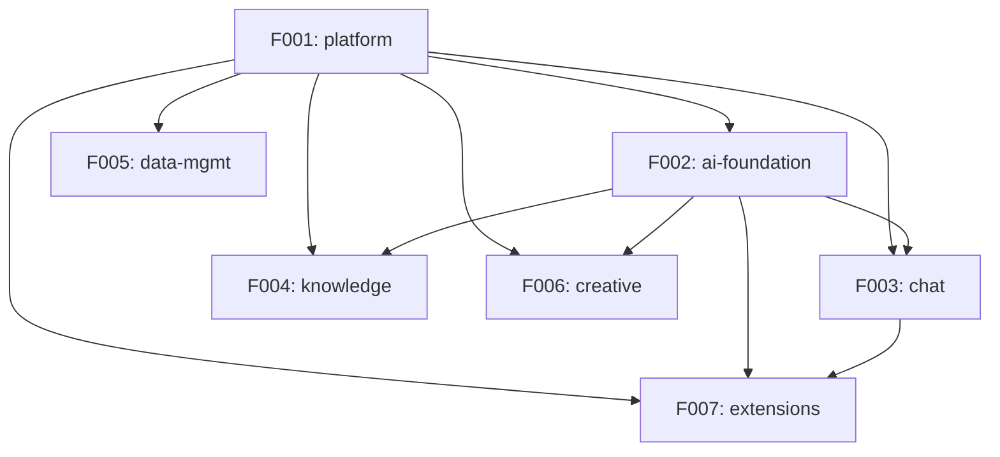

# Project Roadmap: Cherry Studio v1.7.21

**Source**: /Users/coolhero/Study/oss/cherry-studio
**Generated**: 2026-03-02
**Strategy**: Scope: Full | Stack: Same

---

## Project Overview

### Existing Project Summary
- **Project Description**: Cherry Studio is a multi-LLM-provider AI assistant desktop client that allows users to interact with 60+ AI providers through a unified interface. It provides streaming chat, RAG knowledge bases, AI image generation, translation, and extensibility through MCP tools and an OpenAI-compatible API server. Target users are power users and developers who work with multiple AI providers.
- **Domain**: AI Desktop Assistant (multi-provider LLM client)
- **Architecture Type**: Electron 3-process (Main + Preload + Renderer), pnpm monorepo

### Tech Stack
| Area | Technology | Version |
|------|-----------|---------|
| Language | TypeScript | 5.8 |
| Runtime | Electron | 40.6.1 |
| UI Framework | React | 19.2 |
| State | Redux Toolkit + redux-persist | 2.2 |
| UI Library | Ant Design + Tailwind CSS | 5.27 / 4.x |
| Rich Editor | TipTap | 3.2 |
| AI SDK | Vercel AI SDK | 6.x |
| Client DB | Dexie (IndexedDB) | 4.x |
| Server DB | LibSQL + Drizzle ORM | 0.14 / 0.44 |
| Build | electron-vite + electron-builder | 5.0 / 26.8 |
| Testing | Vitest + Playwright | 3.2 / 1.55 |
| Package Mgr | pnpm (monorepo) | 10.27 |

### Project Scale
- Source files: ~1,666
- Entities: 39
- API endpoints: 21 REST endpoints + ~260 IPC channels
- Identified Features: 7

---

## Rebuild Strategy

### Implementation Scope: Full
- Pipeline processes all Features (Tier 1/2/3).

### Tech Stack Strategy: Same
- Use the same tech stack as existing. Implementation patterns can be reused.

---

## Feature Catalog

### Tier 1 — Essential
> Foundation of the project. The system cannot function without these.

| ID | Feature | Description | Rationale |
|----|---------|-------------|-----------|
| F001 | platform | Electron shell, window management, IPC bridge, config, theme, shortcuts, tray, updater, file management, settings UI | Foundation: all 6 other Features depend on it. Owns IPC bridge (260+ channels), file system, window management. 6 reverse dependencies |
| F002 | ai-foundation | Provider registry, model management, AI SDK integration, assistant/topic CRUD | Domain core: owns Provider/Model/Assistant/Topic entities referenced by 5 Features. 60+ provider integrations |
| F003 | chat | Full chat pipeline, message streaming, block management, MCP tool calling, web search, memory injection | The app's raison d'etre: AI conversation with streaming, 11 block types, plugin architecture, MCP protocol support |
| F004 | knowledge | Knowledge base CRUD, document ingestion, embedding, vector search, reranking, preprocessing | Key differentiator: RAG pipeline with document preprocessing (5 providers), vector search, reranking (5 strategies) |

### Tier 2 — Recommended
> Features that complete the core user experience. System works without them but core value is significantly diminished.

| ID | Feature | Description | Rationale |
|----|---------|-------------|-----------|
| F005 | data-mgmt | Backup/restore, WebDAV/S3/local sync, Nutstore, LAN transfer, Redux state sync | Production essential: data persistence and migration across storage backends. System works without but users lose data safety |

### Tier 3 — Optional
> Supplementary features, admin tools, convenience features. Can be added in later phases.

| ID | Feature | Description | Rationale |
|----|---------|-------------|-----------|
| F006 | creative | AI image generation (paintings) across 8+ providers, translation with language detection and history | Supplementary: AI painting across SiliconFlow/DMXAPI/OpenAI/etc., and translation with auto-detection, history, custom languages |
| F007 | extensions | Notes editor (TipTap), mini apps, code tools, selection assistant, API server, agent system (Drizzle/LibSQL), OpenClaw | Supplementary: collection of peripheral features including rich text notes, external tool integration, and autonomous agent system |

---

## Dependency Graph

### Visualization

### Dependency Table

| Feature | Depends On | Dependency Type | Dependency Details |
|---------|------------|-----------------|-------------------|
| F002-ai-foundation | F001-platform | Infrastructure | Uses IPC bridge, file system, config management |
| F003-chat | F001-platform | Infrastructure | Uses IPC bridge, file system |
| F003-chat | F002-ai-foundation | Entity reference | References Provider, Model, Assistant, Topic entities |
| F004-knowledge | F001-platform | Infrastructure | Uses IPC bridge, file system |
| F004-knowledge | F002-ai-foundation | Entity reference | References Model entity for embeddings |
| F005-data-mgmt | F001-platform | Infrastructure | Uses IPC bridge, file system for backup/restore |
| F006-creative | F001-platform | Infrastructure | Uses IPC bridge, file system |
| F006-creative | F002-ai-foundation | Entity reference | References Provider, Model for image generation and translation |
| F007-extensions | F001-platform | Infrastructure | Uses IPC bridge, file system |
| F007-extensions | F002-ai-foundation | Entity reference | References Model, Assistant entities |
| F007-extensions | F003-chat | API call | API server exposes chat endpoints; uses MCP server management |

---

## Release Groups

Features are grouped into release groups based on dependency order. A preceding group must be completed before the subsequent group can begin.

### Release 1: Foundation
> Core infrastructure that all other Features are built upon. Establishes the Electron shell, IPC bridge, window management, config system, and all platform-level services.

| Order | Feature | Tier | Notes |
|-------|---------|------|-------|
| 1 | F001-platform | Tier 1 | No dependencies. Must be completed first as all 6 other Features depend on it. Owns 260+ IPC channels, file system, window management, theme, tray, updater, shortcuts, and settings UI. |

### Release 2: Core AI
> Core AI business logic including provider management, chat pipeline, and knowledge base RAG. F002 must be completed first; F003 and F004 can then proceed in parallel.

| Order | Feature | Tier | Notes |
|-------|---------|------|-------|
| 2a | F002-ai-foundation | Tier 1 | Depends on F001. Must complete before F003 and F004. Owns Provider, Model, Assistant, Topic entities. 60+ provider integrations via Vercel AI SDK. |
| 2b | F003-chat | Tier 1 | Depends on F001, F002. Can run in parallel with F004 after F002 completes. Streaming chat with 11 block types, MCP tool calling, web search, memory injection. |
| 2b | F004-knowledge | Tier 1 | Depends on F001, F002. Can run in parallel with F003 after F002 completes. RAG pipeline with document preprocessing, vector search, 5 reranking strategies. |

### Release 3: Data Safety
> Data persistence, backup/restore, and cross-device synchronization. Ensures users can safely maintain and transfer their data.

| Order | Feature | Tier | Notes |
|-------|---------|------|-------|
| 3 | F005-data-mgmt | Tier 2 | Depends on F001. WebDAV/S3/local sync, Nutstore, LAN transfer, Redux state sync. Could technically start after Release 1 but grouped here for logical sequencing. |

### Release 4: Enhancement
> Supplementary features that extend the platform. Both can proceed in parallel.

| Order | Feature | Tier | Notes |
|-------|---------|------|-------|
| 4a | F006-creative | Tier 3 | Depends on F001, F002. AI image generation across 8+ providers, translation with auto-detection and history. Can run in parallel with F007. |
| 4a | F007-extensions | Tier 3 | Depends on F001, F002, F003. Notes editor (TipTap), mini apps, code tools, API server, agent system, OpenClaw. Can run in parallel with F006. |

---

## Cross-Feature Entity Dependencies

Maps entities shared across Features. Used as a cross-reference when writing data-model.md during spec-kit /speckit.plan.

| Entity | Owner Feature | Referencing Features | Reference Type |
|--------|--------------|---------------------|----------------|
| FileMetadata | F001-platform | F003-chat, F004-knowledge, F006-creative | FK reference |
| Shortcut | F001-platform | (none) | Owner only |
| User | F001-platform | F005-data-mgmt | FK reference |
| Provider | F002-ai-foundation | F003-chat, F004-knowledge, F006-creative, F007-extensions | FK reference |
| Model | F002-ai-foundation | F003-chat, F004-knowledge, F006-creative, F007-extensions | FK reference |
| Assistant | F002-ai-foundation | F003-chat, F004-knowledge, F006-creative | FK reference |
| Topic | F002-ai-foundation | F003-chat | FK reference |
| Message | F003-chat | F007-extensions | FK reference (API server) |
| MessageBlock | F003-chat | F007-extensions | FK reference (API server) |
| MCPServer | F003-chat | F007-extensions | FK reference |
| KnowledgeBase | F004-knowledge | F002-ai-foundation | FK reference (assistant link) |
| WebDavConfig | F005-data-mgmt | (none) | Owner only |
| S3Config | F005-data-mgmt | (none) | Owner only |
| Agent | F007-extensions | (none) | Owner only |

---

## Cross-Feature API Dependencies

Maps API call relationships between Features. Used as a cross-reference when writing contracts/ during spec-kit /speckit.plan.

| API | Provider Feature | Consumer Features | Call Purpose |
|-----|-----------------|-------------------|-------------|
| IPC: `file:*` (46 channels) | F001-platform | F003-chat, F004-knowledge, F005-data-mgmt, F006-creative, F007-extensions | File operations (read, write, manage, upload, download) |
| IPC: `app:*` (46 channels) | F001-platform | F002-ai-foundation, F003-chat, F004-knowledge, F005-data-mgmt, F006-creative, F007-extensions | App management (config, theme, window, tray, shortcuts, updater) |
| Provider/Model resolution | F002-ai-foundation | F003-chat, F004-knowledge, F006-creative | AI provider access and model resolution for inference and embedding |
| IPC: `mcp:*` (15 channels) | F003-chat | F007-extensions | MCP server management (list, start, stop, tool invocation) |
| IPC: `knowledge-base:*` (7 channels) | F004-knowledge | F003-chat | RAG search in chat (query knowledge base, retrieve relevant documents) |
| IPC: `memory:*` (12 channels) | F003-chat | F007-extensions | Memory access (read, write, search conversation memory) |
| REST: `POST /v1/chat/completions` | F007-extensions | External clients | OpenAI-compatible chat completions API |
| REST: `POST /v1/messages` | F007-extensions | External clients | Anthropic-compatible messages API |
