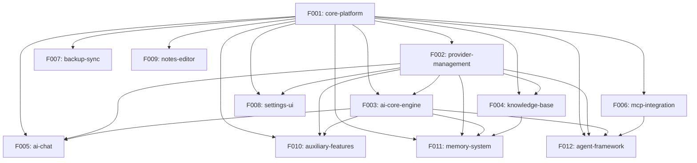

# Project Roadmap: Cherry Studio

**Source**: /Users/coolhero/Study/oss/cherry-studio
**Generated**: 2026-03-04
**Strategy**: Scope: core | Stack: new

---

## Project Overview

### Existing Project Summary
- **Project Description**: AI desktop assistant supporting multi-provider LLM chat, agents, knowledge bases, notes, translation, image generation, and MCP tool integration. Targets power users who want a unified interface for multiple AI providers.
- **Domain**: AI/Productivity Desktop Application
- **Architecture Type**: Electron monorepo (Main process + Renderer + Shared packages)

### Tech Stack
| Area | Technology | Version |
|------|-----------|---------|
| Language | TypeScript | 5.8 |
| Runtime/Platform | Electron | 40 |
| UI Framework | React | 19 |
| UI Component Library | Ant Design (current) → shadcn/ui + Radix (new) | 5.27 → latest |
| Styling | styled-components + Tailwind (current) → Tailwind CSS only (new) | 6+4 → 4 |
| State Management | Redux Toolkit (current) → Zustand + persist (new) | 2.2 → latest |
| Data Fetching | React Query | 5 |
| Routing | React Router (current) → TanStack Router (new) | 6 → latest |
| DB (Main) | SQLite + Drizzle ORM + libsql | 0.44 |
| DB (Renderer) | Dexie (IndexedDB) | 4 |
| Rich Text Editor | TipTap | 3 |
| AI SDK | Vercel AI SDK + custom aiCore | 6 |
| MCP | @modelcontextprotocol/sdk | 1.27 |
| Build | electron-vite (Vite/rolldown) | 5 |
| Testing | Vitest + Playwright | 3.2 / 1.55 |
| Package Manager | pnpm | 10 |

### Project Scale
- Source files: ~1000+
- Entities: ~60
- API endpoints: 20 REST + ~220 IPC channels
- Identified Features: 12

---

## Rebuild Strategy

### Implementation Scope: Core
Features are classified into Tiers (Tier 1/2/3). Pipeline initially processes only Tier 1 Features. Tier 2/3 Features are generated but deferred in `sdd-state.md`. Use `/smart-sdd expand` to activate additional Tiers when ready.

### Tech Stack Strategy: New
Migrate to optimized modern tech stack. See `specs/reverse-spec/stack-migration.md` for details.

**Key changes**: Ant Design → shadcn/ui + Radix, styled-components → Tailwind-only, Redux Toolkit → Zustand, React Router → TanStack Router. All other technologies kept as-is.

---

## Feature Catalog by Tier

### Tier 1 — Essential
> Foundation of the project. The system cannot function without these.

| ID | Feature | Description | Rationale |
|----|---------|-------------|-----------|
| F001 | core-platform | Electron shell, window management, IPC framework, config management, i18n, theming, and file operations | Foundation: ALL 11 other Features depend on it. Owns app lifecycle, IPC bridge, window management, file storage. |
| F002 | provider-management | Provider CRUD, model management, API key configuration, provider type registry | 8+ Features depend on provider/model configuration. Without it, no AI functionality works. Owns Provider and Model entities. |
| F003 | ai-core-engine | Vercel AI SDK wrapper with plugin system, runtime executor, middleware, provider-specific options builders | The AI execution layer powering chat, agents, knowledge, memory, translation. Owns plugin system and executor. |
| F004 | knowledge-base | RAG pipeline with embedding, vector search, reranking, document preprocessing, and knowledge item management | Signature feature of Cherry Studio. Memory system depends on its embedding infrastructure. Owns KnowledgeBase, KnowledgeItem entities. |
| F005 | ai-chat | Chat UI with message streaming, context window management, multi-model dispatch, block-based message rendering | The primary user-facing feature — the entire app exists for AI chat. Owns Message, MessageBlock, Topic, Assistant entities. |

### Tier 2 — Recommended
> Features that complete the core user experience. System works without them but core value is significantly diminished.

| ID | Feature | Description | Rationale |
|----|---------|-------------|-----------|
| F006 | mcp-integration | MCP server lifecycle management, tool calling, transport layers (stdio/SSE/HTTP), hub runtime | Tool calling is a key differentiator. Agent framework depends on it. Owns MCPServer, MCPTool, MCPPrompt, MCPResource entities. |
| F007 | backup-sync | Multi-backend backup (WebDAV, S3, local), auto-sync with exponential backoff, LAN transfer, data versioning | Data safety is critical for a desktop app. Owns backup formats and multi-backend sync logic. |
| F008 | settings-ui | Settings pages for all features, keyboard shortcuts, display configuration, general preferences | Required to configure providers, models, and all features. No settings = unusable app. |

### Tier 3 — Optional
> Supplementary features, admin tools, convenience features. Can be added in later phases.

| ID | Feature | Description | Rationale |
|----|---------|-------------|-----------|
| F009 | notes-editor | TipTap-based rich text editor, file tree management, full-text search, markdown file storage | Independent feature with no reverse dependencies. Can be added after core functionality. |
| F010 | auxiliary-features | Translation, image generation (paintings), mini apps, web search providers, OCR, file management, API server | Bundled nice-to-have features that enhance the app but aren't essential. |
| F011 | memory-system | User memory fact extraction, CRUD, semantic deduplication, embedding-based search | Enhancement to chat experience. Depends on knowledge-base embedding infrastructure. No reverse deps. |
| F012 | agent-framework | Claude Code agents with sessions, tool permissions, plugin system, slash commands | Advanced autonomous agent system. Depends on MCP integration. Complex standalone module. |

---

## Dependency Graph

### Visualization

### Dependency Table

| Feature | Depends On | Dependency Type | Dependency Details |
|---------|------------|-----------------|-------------------|
| F002 | F001 | Infrastructure | Uses IPC framework, config, store persistence |
| F003 | F001, F002 | Infrastructure + Entity | Uses IPC for main process APIs; needs Provider configs for AI SDK |
| F004 | F001, F002 | Infrastructure + Entity | Uses file storage, IPC; needs Provider for embedding models |
| F005 | F001, F002, F003 | Infrastructure + Entity + API | Uses IPC, store; needs Provider configs; calls aiCore executor |
| F006 | F001 | Infrastructure | Uses IPC for process management, file system |
| F007 | F001 | Infrastructure | Uses IPC for file operations, config persistence |
| F008 | F001, F002 | Infrastructure + Entity | Uses IPC; displays Provider and Model configurations |
| F009 | F001 | Infrastructure | Uses IPC for file operations, config |
| F010 | F001, F002, F003 | Infrastructure + Entity + API | Uses IPC; needs Provider configs; calls aiCore for translation/paintings |
| F011 | F001, F002, F003, F004 | Infrastructure + Entity + API + Embedding | Uses IPC; needs Provider; calls aiCore for LLM; reuses knowledge-base embedding infra |
| F012 | F001, F002, F003, F006 | Infrastructure + Entity + API + MCP | Uses IPC; needs Provider; calls aiCore; depends on MCP for tool execution |

---

## Release Groups

### Release 1: Foundation
> Core infrastructure that all other Features are built upon

| Order | Feature | Tier | Notes |
|-------|---------|------|-------|
| 1 | F001-core-platform | Tier 1 | Must be first — all Features depend on it |
| 2 | F002-provider-management | Tier 1 | Needed by all AI-related Features |

### Release 2: AI Core
> Core AI functionality — the engine and primary interface

| Order | Feature | Tier | Notes |
|-------|---------|------|-------|
| 3 | F003-ai-core-engine | Tier 1 | AI SDK wrapper needed by chat and all AI features |
| 4 | F004-knowledge-base | Tier 1 | RAG pipeline, can be built alongside ai-core |
| 5 | F005-ai-chat | Tier 1 | Primary user interface, depends on F003 |

### Release 3: Enhancement
> Features that complete the core experience

| Order | Feature | Tier | Notes |
|-------|---------|------|-------|
| 6 | F006-mcp-integration | Tier 2 | Tool calling, independent of chat core |
| 7 | F007-backup-sync | Tier 2 | Data safety, independent module |
| 8 | F008-settings-ui | Tier 2 | Configuration UI, depends on F001+F002 |

### Release 4: Extended Features
> Supplementary features added after core is stable

| Order | Feature | Tier | Notes |
|-------|---------|------|-------|
| 9 | F009-notes-editor | Tier 3 | Independent rich text editor |
| 10 | F010-auxiliary-features | Tier 3 | Translation, paintings, mini apps, etc. |
| 11 | F011-memory-system | Tier 3 | Depends on F004 knowledge-base |
| 12 | F012-agent-framework | Tier 3 | Depends on F006 MCP |

---

## Cross-Feature Entity Dependencies

| Entity | Owner Feature | Referencing Features | Reference Type |
|--------|--------------|---------------------|----------------|
| Assistant | F005-ai-chat | F004-knowledge-base, F006-mcp-integration, F008-settings-ui, F010-auxiliary | FK reference (assistantId) |
| Topic | F005-ai-chat | F007-backup-sync, F010-auxiliary | FK reference (topicId) |
| Message | F005-ai-chat | F004-knowledge-base, F007-backup-sync, F011-memory-system | FK reference |
| MessageBlock | F005-ai-chat | F006-mcp-integration (tool blocks), F010-auxiliary | FK reference (messageId) |
| Provider | F002-provider-management | F003-ai-core-engine, F004-knowledge-base, F005-ai-chat, F008-settings-ui, F010-auxiliary, F011-memory-system, F012-agent-framework | FK reference (provider) |
| Model | F002-provider-management | F003-ai-core-engine, F004-knowledge-base, F005-ai-chat, F010-auxiliary, F011-memory-system | FK reference (model) |
| MCPServer | F006-mcp-integration | F005-ai-chat, F008-settings-ui, F012-agent-framework | FK reference (serverId) |
| MCPTool | F006-mcp-integration | F005-ai-chat, F012-agent-framework | FK reference |
| KnowledgeBase | F004-knowledge-base | F005-ai-chat, F008-settings-ui | FK reference |
| KnowledgeItem | F004-knowledge-base | F011-memory-system | FK reference |
| Agent (Drizzle) | F012-agent-framework | — | Primary entity |
| Session (Drizzle) | F012-agent-framework | — | FK to Agent |
| SessionMessage (Drizzle) | F012-agent-framework | — | FK to Session |
| MemoryItem | F011-memory-system | F005-ai-chat | FK reference |
| FileMetadata | F001-core-platform | F004-knowledge-base, F005-ai-chat, F010-auxiliary | FK reference |
| Shortcut | F008-settings-ui | F001-core-platform | FK reference |
| WebSearchProvider | F010-auxiliary | F005-ai-chat | FK reference |
| NotesTreeNode | F009-notes-editor | — | Self-referential tree |
| Painting variants | F010-auxiliary | — | Primary entities |
| TranslateHistory | F010-auxiliary | — | Primary entity |
| QuickPhrase | F005-ai-chat | — | Primary entity |

---

## Cross-Feature API Dependencies

| API | Provider Feature | Consumer Features | Call Purpose |
|-----|-----------------|-------------------|-------------|
| IPC: `app:info`, `app:set-theme`, config | F001-core-platform | All Features | App info, config, theme |
| IPC: file operations (`file:*`) | F001-core-platform | F004, F005, F007, F009, F010 | File read/write/upload |
| IPC: `mcp:*` channels | F006-mcp-integration | F005-ai-chat, F012-agent-framework | Tool listing, calling, server management |
| IPC: `knowledge-base:*` channels | F004-knowledge-base | F005-ai-chat | KB search, add, delete |
| IPC: `memory:*` channels | F011-memory-system | F005-ai-chat | Memory search, add, update |
| IPC: `backup:*` channels | F007-backup-sync | F008-settings-ui | Backup/restore operations |
| REST: `POST /v1/chat/completions` | F010-auxiliary (API server) | External clients | OpenAI-compatible chat |
| REST: `POST /v1/messages` | F010-auxiliary (API server) | External clients | Anthropic-compatible messages |
| REST: `/v1/agents/*` | F012-agent-framework | External clients | Agent CRUD + sessions |
| REST: `/v1/mcps/*` | F006-mcp-integration | External clients | MCP server proxy |
| aiCore executor | F003-ai-core-engine | F005, F010, F011 | LLM streaming/generation |
| KnowledgeBaseParams infra | F004-knowledge-base | F011-memory-system | Embedding config reuse |
