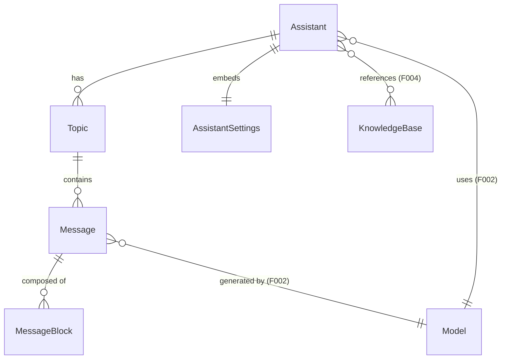

# Data Model: AI Chat (F005)

**Feature**: 005-ai-chat
**Date**: 2026-03-04

## Entities

### Assistant

Primary organizational unit for AI conversations.

| Field | Type | Constraints | Description |
|-------|------|------------|-------------|
| id | string | PK, uuid | Unique identifier |
| name | string | required | Display name |
| prompt | string | optional, default '' | System prompt text |
| model | Model \| null | optional | Default model reference (from F002) |
| defaultModel | Model \| null | optional | Fallback model if primary unavailable |
| settings | AssistantSettings | required | Per-assistant configuration |
| topics | Topic[] | required, default [] | Conversation threads (managed in store, persisted in Dexie) |
| type | AssistantType | required | 'default' \| 'system' \| 'agent' \| 'chat' |
| emoji | string | optional | Display emoji |
| description | string | optional | Description text |
| enableWebSearch | boolean | optional, default false | Web search toggle |
| webSearchProviderId | string | optional | Web search provider ID |
| enableUrlContext | boolean | optional, default false | URL context toggle |
| enableGenerateImage | boolean | optional, default false | Image generation toggle |
| enableMemory | boolean | optional, default false | Memory system toggle |
| mcpMode | McpMode | optional, default 'disabled' | 'disabled' \| 'auto' \| 'manual' |
| mcpServers | McpServerRef[] | optional, default [] | Attached MCP server references |
| knowledgeBaseIds | string[] | optional, default [] | Attached KB IDs (F004) |
| knowledgeRecognition | string | optional, default 'off' | 'off' \| 'on' |
| tags | string[] | optional, default [] | Organizational tags |
| regularPhrases | QuickPhrase[] | optional, default [] | Attached quick phrases |

### AssistantSettings

Embedded in Assistant. Controls AI request parameters.

| Field | Type | Constraints | Description |
|-------|------|------------|-------------|
| contextCount | number | optional, default 5, max 100 | Messages in context window |
| temperature | number | 0-2, default 0.7 | Sampling temperature |
| enableTemperature | boolean | optional, default true | Whether temperature is active |
| topP | number | 0-1, default 1.0 | Top-p sampling |
| enableTopP | boolean | optional, default false | Whether topP is active |
| maxTokens | number | optional | Maximum output tokens |
| enableMaxTokens | boolean | optional, default false | Whether maxTokens is active |
| streamOutput | boolean | required, default true | Whether to stream responses |
| reasoning_effort | ReasoningEffort | optional, default 'default' | 'none'\|'low'\|'medium'\|'high'\|'xhigh'\|'auto'\|'default' |
| reasoning_effort_cache | ReasoningEffort | optional | Cached value for model switch |
| qwenThinkMode | boolean | optional, default false | Qwen-specific thinking mode |
| toolUseMode | ToolUseMode | optional, default 'function' | 'function' \| 'prompt' |
| defaultModel | Model \| null | optional | Settings-level default model |
| customParameters | CustomParam[] | optional, default [] | Custom key-value parameters |

### Topic

Conversation thread within an assistant.

| Field | Type | Constraints | Description |
|-------|------|------------|-------------|
| id | string | PK, uuid | Unique identifier |
| assistantId | string | FK → Assistant | Owning assistant |
| name | string | required, default 'New Topic' | Display name |
| type | TopicType | optional, default 'chat' | 'chat' \| 'session' |
| pinned | boolean | required, default false | Whether pinned to top |
| isNameManuallyEdited | boolean | optional, default false | Prevents auto-naming |
| prompt | string | optional | Topic-level custom prompt |
| createdAt | string | required, ISO | Creation timestamp |
| updatedAt | string | required, ISO | Last update timestamp |
| messages | Message[] | transient | Loaded on demand, not persisted in store |

### Message

Individual message in a conversation topic.

| Field | Type | Constraints | Description |
|-------|------|------------|-------------|
| id | string | PK, uuid | Unique identifier |
| topicId | string | FK → Topic, indexed | Owning topic |
| assistantId | string | FK → Assistant | Owning assistant |
| role | MessageRole | required | 'user' \| 'assistant' \| 'system' |
| blocks | string[] | required, default [] | Ordered array of MessageBlock IDs |
| modelId | string | optional | Model used for this response |
| model | Model \| null | optional | Full model reference |
| status | MessageStatus | required | User: SUCCESS; Assistant: PENDING\|PROCESSING\|SEARCHING\|SUCCESS\|PAUSED\|ERROR |
| type | string | optional | Special type (e.g., 'clear') |
| useful | boolean | optional | User feedback |
| askId | string | optional | Links response to question message |
| mentions | Model[] | optional | @mentioned models for multi-model |
| usage | Usage \| null | optional | Token usage stats |
| metrics | Metrics \| null | optional | Performance metrics |
| multiModelMessageStyle | MultiModelStyle | optional | 'horizontal'\|'vertical'\|'fold'\|'grid' |
| foldSelected | boolean | optional | Whether fold view is expanded |
| traceId | string | optional | Trace reference |
| agentSessionId | string | optional | Agent session reference |
| providerMetadata | ProviderMetadata | optional | Provider-specific metadata |
| createdAt | string | required, ISO | Creation timestamp |
| updatedAt | string | optional, ISO | Last update timestamp |

### MessageBlock

Content unit within a message. Discriminated union on `type` field.

**Base fields** (all block types):

| Field | Type | Constraints | Description |
|-------|------|------------|-------------|
| id | string | PK, uuid | Unique identifier |
| messageId | string | FK → Message, indexed | Owning message |
| type | BlockType | required | Discriminator: MAIN_TEXT\|THINKING\|TRANSLATION\|IMAGE\|CODE\|TOOL\|FILE\|ERROR\|CITATION\|VIDEO\|COMPACT\|UNKNOWN |
| status | BlockStatus | required | PENDING\|PROCESSING\|STREAMING\|SUCCESS\|ERROR\|PAUSED |
| createdAt | string | required, ISO | Creation timestamp |
| updatedAt | string | optional, ISO | Last update timestamp |
| model | Model \| null | optional | Model that produced this block |
| metadata | Record\<string, unknown\> | optional | Extensible metadata |
| error | string \| null | optional | Error message if status=ERROR |

**Variant-specific fields**:

| Variant | Additional Fields |
|---------|------------------|
| MAIN_TEXT | content: string, citations: CitationRef[], knowledgeBaseIds: string[] |
| THINKING | content: string, thinking_millsec: number |
| TRANSLATION | content: string, sourceBlockId: string, sourceLanguage: string, targetLanguage: string |
| IMAGE | url: string \| null, file: FileMetadata \| null, metadata: ImageMetadata |
| CODE | content: string, language: string |
| TOOL | toolId: string, toolName: string, arguments: string, rawMcpToolResponse: unknown |
| FILE | file: FileMetadata |
| ERROR | error: string |
| CITATION | webSearchResults: WebSearchResponse, knowledgeReferences: KBRef[], memoryReferences: MemoryRef[] |
| VIDEO | url: string \| null, filePath: string \| null |
| COMPACT | content: string, compactedContent: string |
| UNKNOWN | content: string |

### QuickPhrase

Reusable text snippet for message input.

| Field | Type | Constraints | Description |
|-------|------|------------|-------------|
| id | string | PK, uuid | Unique identifier |
| title | string | required | Short label |
| content | string | required | Full phrase text |
| prompt | string | optional | Associated prompt |
| enabled | boolean | required, default true | Active toggle |
| sortOrder | number | optional | Display order |

## Relationships



## Dexie Schema (version 3)

```
assistants: '&id, type'
topics: '&id, assistantId, pinned'
messages: '&id, topicId, assistantId, createdAt'
message_blocks: '&id, messageId, type'
quick_phrases: '&id, enabled'
```

## Storage Strategy

| Entity | Primary Store | Persistence | Sync |
|--------|-------------|-------------|------|
| Assistant | useAssistantStore (Zustand) | Zustand persist (localStorage) | broadcastSync |
| AssistantSettings | Embedded in Assistant | Via parent | Via parent |
| Topic | useAssistantStore (embedded in Assistant) | Zustand persist | broadcastSync |
| Message | useMessageStore (Zustand) + Dexie | Dexie (source of truth), loaded on demand | broadcastSync for active topic |
| MessageBlock | useMessageBlockStore (Zustand) + Dexie | Dexie (source of truth), loaded with messages | broadcastSync for active topic |
| QuickPhrase | useAssistantStore (embedded or separate section) | Zustand persist | broadcastSync |
