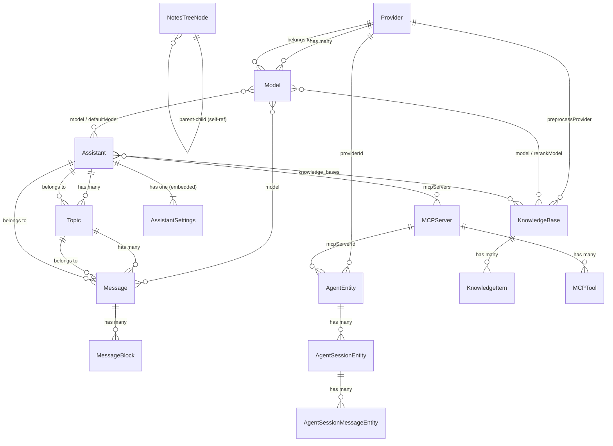

# Entity Registry: Cherry Studio

**Source**: /Users/coolhero/Study/oss/cherry-studio
**Generated**: 2026-03-04
**Total Entities**: 22 (18 primary + 4 secondary)
**Total Relationships**: 34

---

## Entity Index

| # | Entity | Owner Feature | Fields | Relationships | Storage |
|---|--------|---------------|--------|---------------|---------|
| E01 | [FileMetadata](#e01-filemetadata) | F001-core-platform | 11 | 3 outbound refs | IndexedDB (Dexie) |
| E02 | [Provider](#e02-provider) | F002-provider-management | 17+ | 10 outbound refs | IndexedDB (Dexie) |
| E03 | [Model](#e03-model) | F002-provider-management | 12 | 6 outbound refs | Embedded in Provider |
| E04 | [Assistant](#e04-assistant) | F005-ai-chat | 21 | 5 outbound refs | IndexedDB (Dexie) |
| E05 | [AssistantSettings](#e05-assistantsettings) | F005-ai-chat | 14 | 1 (embedded Model) | Embedded in Assistant |
| E06 | [Topic](#e06-topic) | F005-ai-chat | 9 | 2 outbound refs | IndexedDB (Dexie) |
| E07 | [Message](#e07-message) | F005-ai-chat | 21 | 4 outbound refs | IndexedDB (Dexie) |
| E08 | [MessageBlock](#e08-messageblock) | F005-ai-chat | 9 base + variants | 2 outbound refs | IndexedDB (Dexie) |
| E09 | [QuickPhrase](#e09-quickphrase) | F005-ai-chat | 6 | 0 | IndexedDB (Dexie) |
| E10 | [KnowledgeBase](#e10-knowledgebase) | F004-knowledge-base | 14 | 3 outbound refs | IndexedDB (Dexie) |
| E11 | [KnowledgeItem](#e11-knowledgeitem) | F004-knowledge-base | 15 + 6 variants | 1 outbound ref | IndexedDB (Dexie) |
| E12 | [KnowledgeReference](#e12-knowledgereference) | F004-knowledge-base | 6 | 0 (transient) | In-memory |
| E12b | [KnowledgeNote](#e12b-knowledgenote-secondary) | F004-knowledge-base | 3 | 1 ref | IndexedDB (Dexie) |
| E13 | [MCPServer](#e13-mcpserver) | F006-mcp-integration | 20+ | 3 outbound refs | IndexedDB (Dexie) |
| E14 | [MCPTool](#e14-mcptool) | F006-mcp-integration | 4 | 1 outbound ref | In-memory / cached |
| E15 | [MemoryItem](#e15-memoryitem) | F011-memory-system | 10 | 1 outbound ref | SQLite (Drizzle) |
| E16 | [AgentEntity](#e16-agententity) | F012-agent-framework | 14 | 0 | SQLite (Drizzle) |
| E17 | [AgentSessionEntity](#e17-agentsessionentity) | F012-agent-framework | 6 | 1 outbound ref | SQLite (Drizzle) |
| E18 | [AgentSessionMessageEntity](#e18-agentsessionmessageentity) | F012-agent-framework | 7 | 1 outbound ref | SQLite (Drizzle) |
| E19 | [WebSearchProvider](#e19-websearchprovider) | F010-auxiliary-features | 12 | 1 outbound ref | IndexedDB (Dexie) |
| E20 | [Painting / PaintingAction](#e20-painting--paintingaction) | F010-auxiliary-features | 8+ | 0 | IndexedDB (Dexie) |
| E21 | [TranslateHistory / TranslateLanguage](#e21-translatehistory--translatelanguage) | F010-auxiliary-features | 8+ | 0 | IndexedDB (Dexie) |
| E22 | [NotesTreeNode](#e22-notestreenode) | F009-notes-editor | 7 | 1 (self-ref) | IndexedDB (Dexie) |

---

## Enumeration Types

These shared enum types are referenced across multiple entities.

| Enum | Values | Used By |
|------|--------|---------|
| ProviderType | `openai`, `anthropic`, `gemini`, `azure`, `ollama`, `lmstudio`, `openrouter`, `together`, `fireworks`, `groq`, `mistral`, `custom` (12 types) | Provider |
| ModelType | (array of capability tags) | Model |
| FileType | `image`, `video`, `audio`, `document`, `text`, `code`, `other`, `archive` | FileMetadata |
| AssistantType | `default`, `system`, `agent`, `chat` | Assistant |
| TopicType | `chat`, `session` | Topic |
| MessageRole | `user`, `assistant`, `system` | Message |
| MessageType | (variant discriminator) | Message |
| MessageStatus | `pending`, `processing`, `searching`, `success`, `paused`, `error` | Message |
| BlockType | `main_text`, `thinking`, `translation`, `image`, `code`, `tool`, `file`, `error`, `citation`, `video`, `compact`, `unknown` (12 types) | MessageBlock |
| BlockStatus | `pending`, `processing`, `streaming`, `success`, `error`, `paused` | MessageBlock |
| KnowledgeItemType | `file`, `url`, `note`, `sitemap`, `directory` (+ 2 variants = 7 total) | KnowledgeItem |
| ProcessingStatus | `pending`, `processing`, `completed`, `error` | KnowledgeItem |
| McpServerType | `sse`, `streamableHttp`, `stdio`, `inMemory` | MCPServer |

---

## Primary Entities

---

### E01: FileMetadata

**Owner**: F001-core-platform
**Description**: Represents metadata about files uploaded or managed by the application.
**Referenced by**: F004 (knowledge-base), F005 (ai-chat), F010 (auxiliary-features)

#### Fields

| Field | Type | Constraints | Description |
|-------|------|-------------|-------------|
| `id` | string | **PK**, UUID, auto-generated | Unique file identifier |
| `name` | string | required | Display name of the file |
| `origin_name` | string | required | Original filename at upload |
| `path` | string | required | Storage path on filesystem |
| `size` | number | >= 0 | File size in bytes |
| `ext` | string | required | File extension (e.g., `.pdf`) |
| `type` | FileType | enum, required | Category classification |
| `created_at` | number | timestamp | Creation timestamp (epoch ms) |
| `count` | number | >= 0 | Word or character count |
| `tokens` | number | >= 0 | Estimated token count |
| `purpose` | string | optional | Usage context label |

**Field count**: 11

#### Relationships

| Direction | Target | Cardinality | FK Field | Description |
|-----------|--------|-------------|----------|-------------|
| Referenced by | KnowledgeItem | 1:N | KnowledgeItem.uniqueId | Files used as knowledge items |
| Referenced by | Message | 1:N | Message.files | Files attached to messages |
| Referenced by | Painting | 1:N | — | Generated image files |

#### Validation Rules

- `size` must be >= 0.
- `ext` must include the leading dot or be a bare extension (implementation-dependent).
- `type` must be one of the FileType enum values; defaults to `other` if unrecognized.

---

### E02: Provider

**Owner**: F002-provider-management
**Description**: Represents an AI provider configuration (e.g., OpenAI, Anthropic). 63 system provider IDs are pre-defined.
**Referenced by**: F003, F004, F005, F008, F010, F011, F012

#### Fields

| Field | Type | Constraints | Description |
|-------|------|-------------|-------------|
| `id` | string | **PK** | Unique provider identifier |
| `name` | string | required | Display name |
| `type` | ProviderType | enum, required | Provider type discriminator |
| `apiKey` | string | optional | API authentication key |
| `apiHost` | string | optional | Custom API base URL |
| `apiVersion` | string | optional | API version string (e.g., Azure) |
| `models` | Model[] | default `[]` | Available models for this provider |
| `enabled` | boolean | required | Whether provider is active |
| `isSystem` | boolean | required | Whether it is a built-in system provider |
| `isAuthorized` | boolean | required | Whether credentials are validated |
| `providerSettings` | object | optional | Provider-specific config overrides |
| `extra_field_1..10` | various | optional | ~10 additional provider-specific fields (OAuth tokens, rate limits, etc.) |

**Field count**: 17+ (core 12 + ~10 provider-specific)

#### Relationships

| Direction | Target | Cardinality | FK Field | Description |
|-----------|--------|-------------|----------|-------------|
| Has many | Model | 1:N | Model.provider_id | Models belonging to this provider |
| Referenced by | Assistant | N:M | Assistant.model.provider_id | Assistants using this provider's models |
| Referenced by | KnowledgeBase | 1:N | KnowledgeBase.preprocessProvider | KB using provider for preprocessing |
| Referenced by | AgentEntity | 1:N | AgentEntity.providerId | Agents configured to use this provider |
| Referenced by | MemoryItem (via runtime) | — | — | Memory system uses provider for embeddings |

#### Validation Rules

- `apiKey` should be present when `isAuthorized` is true (unless OAuth-based).
- `type` must match one of the 12 ProviderType enum values.
- System providers (`isSystem = true`) cannot be deleted, only disabled.
- 63 SystemProviderIds are predefined constants.

---

### E03: Model

**Owner**: F002-provider-management
**Description**: Represents an AI model available through a provider. Tracks capabilities (vision, function calling, reasoning).
**Referenced by**: F003, F004, F005, F010, F011

#### Fields

| Field | Type | Constraints | Description |
|-------|------|-------------|-------------|
| `id` | string | **PK** | Unique model identifier |
| `provider_id` | string | **FK** to Provider | Owning provider |
| `name` | string | required | Display name |
| `group` | string | optional | Model family grouping |
| `owned_by` | string | optional | Organization that owns the model |
| `description` | string | optional | Model description |
| `type` | ModelType[] | optional | Capability tags array |
| `functionCall` | boolean | default false | Supports function/tool calling |
| `vision` | boolean | default false | Supports image input |
| `reasoning` | boolean | default false | Supports chain-of-thought / reasoning |
| `maxTokens` | number | optional | Maximum output tokens |
| `maxContext` | number | optional | Maximum context window size |

**Field count**: 12

#### Relationships

| Direction | Target | Cardinality | FK Field | Description |
|-----------|--------|-------------|----------|-------------|
| Belongs to | Provider | N:1 | `provider_id` | Parent provider |
| Referenced by | Assistant | N:M | Assistant.model, Assistant.defaultModel | Models assigned to assistants |
| Referenced by | Message | 1:N | Message.model, Message.modelId | Model that generated a message |
| Referenced by | KnowledgeBase | 1:N | KnowledgeBase.model, KnowledgeBase.rerankModel | Embedding and rerank models |
| Referenced by | Topic (indirect) | — | — | Via messages in topic |
| Referenced by | Message.mentions | N:M | Message.mentions[] | Models mentioned in multi-model dispatch |

#### Validation Rules

- `provider_id` must reference a valid Provider.
- `maxTokens` and `maxContext`, when present, must be > 0.
- `functionCall`, `vision`, `reasoning` default to false if not specified.

---

### E04: Assistant

**Owner**: F005-ai-chat
**Description**: Represents a chat assistant persona with system prompt, model configuration, and associated resources.
**Referenced by**: F004, F006, F008, F010

#### Fields

| Field | Type | Constraints | Description |
|-------|------|-------------|-------------|
| `id` | string | **PK**, UUID | Unique assistant identifier |
| `name` | string | required | Display name |
| `prompt` | string | required | System prompt text |
| `model` | Model \| null | nullable, embedded | Currently active model |
| `defaultModel` | Model \| null | nullable, embedded | Default model reference |
| `settings` | AssistantSettings | embedded, required | Configuration settings |
| `topics` | Topic[] | default `[]` | Conversation topics |
| `type` | AssistantType | enum, required | `'default'`, `'system'`, `'agent'`, `'chat'` |
| `emoji` | string | optional | Emoji icon for UI display |
| `description` | string | optional | Assistant description |
| `enableWebSearch` | boolean | optional | Enable web search integration |
| `webSearchProviderId` | string | optional | Web search provider identifier |
| `enableUrlContext` | boolean | optional | Enable URL context extraction |
| `enableGenerateImage` | boolean | optional | Enable image generation |
| `enableMemory` | boolean | optional | Enable memory system |
| `mcpMode` | McpMode | optional | MCP mode: `'disabled'`, `'auto'`, `'manual'` |
| `mcpServers` | McpServerRef[] | optional | Linked MCP servers (id + name refs) |
| `knowledgeBaseIds` | string[] | optional | Linked knowledge base IDs |
| `knowledgeRecognition` | string | optional | Knowledge recognition config |
| `tags` | string[] | optional | Category tags |
| `regularPhrases` | QuickPhrase[] | optional | Embedded quick phrases |

**Field count**: 21

#### Relationships

| Direction | Target | Cardinality | FK Field | Description |
|-----------|--------|-------------|----------|-------------|
| Has many | Topic | 1:N | Topic.assistantId | Conversations under this assistant |
| Has one | AssistantSettings | 1:1 | embedded | Inline configuration |
| References | Model | N:1 | `model`, `defaultModel` | AI model assignments |
| References | KnowledgeBase | N:M | `knowledgeBaseIds[]` | Linked knowledge bases (by ID) |
| References | McpServerRef | N:M | `mcpServers[]` | Linked MCP servers (id + name) |

#### Validation Rules

- `type` must be one of AssistantType enum values.
- `prompt` can be empty string but field must be present.
- System assistants (`type = 'system'`) cannot be deleted by the user.
- `model` and `defaultModel` are nullable; at least one should be set for the assistant to function.

---

### E05: AssistantSettings

**Owner**: F005-ai-chat
**Description**: Configuration parameters for an Assistant's AI behavior. Embedded within Assistant, not stored independently.

#### Fields

| Field | Type | Constraints | Description |
|-------|------|-------------|-------------|
| `contextCount` | number | optional, default 5 | Number of prior messages to include as context (-1 = unlimited) |
| `temperature` | number | optional, range 0.0-2.0 | Sampling temperature |
| `enableTemperature` | boolean | optional | Whether temperature override is active |
| `topP` | number | optional, range 0.0-1.0 | Nucleus sampling parameter |
| `enableTopP` | boolean | optional | Whether topP override is active |
| `maxTokens` | number | optional | Max output tokens override |
| `enableMaxTokens` | boolean | optional | Whether maxTokens override is active |
| `streamOutput` | boolean | optional, default true | Enable streaming responses |
| `reasoning_effort` | ReasoningEffort | optional | Reasoning intensity: `'none'`, `'low'`, `'medium'`, `'high'`, `'xhigh'`, `'auto'`, `'default'` |
| `reasoning_effort_cache` | ReasoningEffort | optional | Cached reasoning effort for model switching |
| `qwenThinkMode` | boolean | optional | Qwen-specific think mode toggle |
| `toolUseMode` | ToolUseMode | optional | Tool use mode: `'function'` or `'prompt'` |
| `defaultModel` | Model \| null | optional, embedded | Default model reference |
| `customParameters` | CustomParam[] | optional | Custom key-value parameter overrides |

**Field count**: 14

#### Relationships

| Direction | Target | Cardinality | FK Field | Description |
|-----------|--------|-------------|----------|-------------|
| Embedded in | Assistant | 1:1 | — | Parent assistant owns this settings object |
| References | Model | N:1 | `defaultModel` | Settings-level default model |

#### Validation Rules

- `contextCount` defaults to 5; -1 means unlimited (CONTEXT_COUNT_UNLIMITED).
- `temperature`, when enabled, must be in range [0.0, 2.0].
- `topP`, when enabled, must be in range [0.0, 1.0].
- `maxTokens`, when enabled, must be > 0.
- `streamOutput` defaults to true if omitted.
- `reasoning_effort_cache` is used internally for model-switching; cached before model change, restored on switch-back.

---

### E06: Topic

**Owner**: F005-ai-chat
**Description**: Represents a conversation thread within an assistant. Contains an ordered list of messages.
**Referenced by**: F007 (backup-sync), F010 (auxiliary-features)

#### Fields

| Field | Type | Constraints | Description |
|-------|------|-------------|-------------|
| `id` | string | **PK**, UUID | Unique topic identifier |
| `assistantId` | string | **FK** to Assistant | Parent assistant |
| `name` | string | required | Topic display name (auto-generated or manual) |
| `type` | TopicType | optional, default `'chat'` | `'chat'` or `'session'` |
| `pinned` | boolean | default false | Whether topic is pinned to top |
| `isNameManuallyEdited` | boolean | optional, default false | Whether name was manually set by user |
| `prompt` | string | optional | Topic-level system prompt override |
| `createdAt` | string | ISO 8601 | Creation timestamp |
| `updatedAt` | string | ISO 8601 | Last update timestamp |

**Field count**: 9

#### Relationships

| Direction | Target | Cardinality | FK Field | Description |
|-----------|--------|-------------|----------|-------------|
| Belongs to | Assistant | N:1 | `assistantId` | Parent assistant |
| Has many | Message | 1:N | Message.topicId | Messages in this topic (stored independently in Dexie) |

#### Validation Rules

- `assistantId` must reference a valid Assistant.
- `type` defaults to `'chat'`.
- `pinned` defaults to false.
- `isNameManuallyEdited` defaults to false; when true, auto-naming is suppressed.

---

### E07: Message

**Owner**: F005-ai-chat
**Description**: Represents a single message in a conversation. Contains content and block-based structured sub-elements. Central entity for the chat system.
**Referenced by**: F004 (knowledge context injection), F007 (backup), F011 (memory extraction)

#### Fields

| Field | Type | Constraints | Description |
|-------|------|-------------|-------------|
| `id` | string | **PK**, UUID | Unique message identifier |
| `topicId` | string | **FK** to Topic | Owning topic/conversation |
| `assistantId` | string | **FK** to Assistant | Owning assistant |
| `role` | MessageRole | enum, required | `'user'`, `'assistant'`, `'system'` |
| `blocks` | string[] | default `[]` | Block IDs referencing MessageBlock entities |
| `modelId` | string | optional | Model ID shorthand |
| `model` | Model \| null | optional, embedded | Model used for generation |
| `status` | MessageStatus | enum, required | `'pending'`, `'processing'`, `'searching'`, `'success'`, `'paused'`, `'error'` |
| `type` | string | optional | Message variant type |
| `useful` | boolean | optional | User feedback (thumbs up/down) |
| `askId` | string | optional | Correlation ID for request-response pairs |
| `mentions` | Model[] | optional | Models mentioned in multi-model dispatch |
| `usage` | Usage \| null | optional | Token usage statistics (prompt, completion, total) |
| `metrics` | Metrics \| null | optional | Performance metrics (completion tokens, time to first token) |
| `multiModelMessageStyle` | MultiModelStyle | optional | Display style: `'horizontal'`, `'vertical'`, `'fold'`, `'grid'` |
| `foldSelected` | boolean | optional | Whether fold view is selected |
| `traceId` | string | optional | Trace ID for debugging/observability |
| `agentSessionId` | string | optional | Agent session correlation ID |
| `providerMetadata` | ProviderMetadata | optional | Provider-specific metadata (Record<string, unknown>) |
| `createdAt` | string | ISO 8601 | Creation timestamp |
| `updatedAt` | string | optional, ISO 8601 | Last update timestamp |

**Field count**: 21

#### Relationships

| Direction | Target | Cardinality | FK Field | Description |
|-----------|--------|-------------|----------|-------------|
| Belongs to | Topic | N:1 | `topicId` | Parent topic |
| Belongs to | Assistant | N:1 | `assistantId` | Parent assistant |
| Has many | MessageBlock | 1:N | `blocks[]` (IDs) | Structured content blocks (stored independently in Dexie) |
| References | Model | N:1 | `model`, `modelId` | Model that generated the message |

#### Validation Rules

- `role` must be one of `'user'`, `'assistant'`, `'system'`.
- `status` must be one of MessageStatus enum values.
- `blocks` contains block IDs (string[]), not embedded block objects.
- `askId` pairs a user message with its assistant response.
- `mentions` is only populated for multi-model dispatch scenarios.

---

### E08: MessageBlock

**Owner**: F005-ai-chat
**Description**: Structured content block within a Message. Uses a discriminated union of 12 block types, each with specialized fields.
**Referenced by**: F006 (tool blocks), F010 (auxiliary features)

#### Base Fields (MessageBlockBase)

| Field | Type | Constraints | Description |
|-------|------|-------------|-------------|
| `id` | string | **PK**, UUID | Unique block identifier |
| `messageId` | string | **FK** to Message | Parent message |
| `type` | BlockType | discriminated union, required | Block variant type |
| `status` | BlockStatus | enum, required | `'pending'`, `'processing'`, `'streaming'`, `'success'`, `'error'`, `'paused'` |
| `createdAt` | string | ISO 8601 | Creation timestamp |
| `updatedAt` | string | optional, ISO 8601 | Last update timestamp |
| `model` | Model \| null | optional, embedded | Model used for generation |
| `metadata` | Record<string, unknown> | optional | Arbitrary metadata |
| `error` | string \| null | optional | Error message (shared across variants) |

**Base field count**: 9

#### Block Type Variants (12 types)

| Variant | Type Discriminator | Additional Fields |
|---------|-------------------|-------------------|
| MainTextBlock | `'main_text'` | `content` (string), `citations?` (CitationRef[]), `knowledgeBaseIds?` (string[]) |
| ThinkingBlock | `'thinking'` | `content` (string), `thinking_millsec?` (number) |
| TranslationBlock | `'translation'` | `content` (string), `sourceBlockId?` (string), `sourceLanguage?` (string), `targetLanguage?` (string) |
| ImageBlock | `'image'` | `url?` (string \| null), `file?` (FileMetadata \| null), `imageMetadata?` (ImageMetadata) |
| CodeBlock | `'code'` | `content` (string), `language?` (string) |
| ToolBlock | `'tool'` | `toolId?` (string), `toolName?` (string), `arguments?` (string), `rawMcpToolResponse?` (unknown) |
| FileBlock | `'file'` | `file?` (FileMetadata) |
| ErrorBlock | `'error'` | `error` (string — overrides base) |
| CitationBlock | `'citation'` | `webSearchResults?` (WebSearchResponse), `knowledgeReferences?` (KnowledgeReference[]), `memoryReferences?` (MemoryRef[]) |
| VideoBlock | `'video'` | `url?` (string \| null), `filePath?` (string \| null) |
| CompactBlock | `'compact'` | `content` (string), `compactedContent?` (string) |
| UnknownBlock | `'unknown'` | `content` (string) |

#### Relationships

| Direction | Target | Cardinality | FK Field | Description |
|-----------|--------|-------------|----------|-------------|
| Belongs to | Message | N:1 | `messageId` | Parent message |
| References (CitationBlock) | KnowledgeReference | N:M | `knowledgeReferences[]` | KB search results |

---

### E09: QuickPhrase

**Owner**: F005-ai-chat
**Description**: Predefined text snippets that users can quickly insert into chat messages.

#### Fields

| Field | Type | Constraints | Description |
|-------|------|-------------|-------------|
| `id` | string | **PK** | Unique phrase identifier |
| `title` | string | required | Display title |
| `content` | string | required | Phrase text content |
| `prompt` | string | optional | Associated prompt template |
| `enabled` | boolean | required | Whether phrase is active |
| `sortOrder` | number | optional | Display ordering position |

**Field count**: 6

#### Relationships

None. QuickPhrase is a standalone lookup entity (also embedded in Assistant.regularPhrases).

#### Validation Rules

- `title` and `content` are required and must be non-empty strings.
- `enabled` defaults to true for new phrases.
- `sortOrder` determines display order; lower values appear first.

---

### E10: KnowledgeBase

**Owner**: F004-knowledge-base
**Description**: Represents a RAG knowledge base with embedding configuration, chunking parameters, and a collection of knowledge items.
**Referenced by**: F005 (ai-chat), F008 (settings-ui)

#### Fields

| Field | Type | Constraints | Description |
|-------|------|-------------|-------------|
| `id` | string | **PK**, UUID | Unique knowledge base identifier |
| `name` | string | required | Display name |
| `model` | Model | required, embedded | Embedding model reference |
| `description` | string | optional | Description text |
| `documentCount` | number | default 30 | Max documents to retrieve per query |
| `chunkSize` | number | default 1000 | Text chunk size (characters) |
| `chunkOverlap` | number | default 200 | Overlap between chunks |
| `items` | KnowledgeItem[] | default `[]` | Collection of knowledge items |
| `rerankModel` | Model | optional, embedded | Model used for result reranking |
| `preprocessModel` | Model | optional, embedded | Model for document preprocessing |
| `preprocessProvider` | string | optional, FK to Provider | Provider for preprocessing |
| `version` | number | default 1 | Schema version for migration |
| `created_at` | number | timestamp | Creation timestamp |
| `updated_at` | number | timestamp | Last update timestamp |

**Field count**: 14

#### Relationships

| Direction | Target | Cardinality | FK Field | Description |
|-----------|--------|-------------|----------|-------------|
| Has many | KnowledgeItem | 1:N | KnowledgeItem.baseId | Items in this knowledge base |
| References | Model | N:1 | `model`, `rerankModel`, `preprocessModel` | Embedding, reranking, and preprocessing models |
| References | Provider | N:1 | `preprocessProvider` | Provider for preprocessing |

#### Validation Rules

- `chunkSize` must be > 0; default 1000.
- `chunkOverlap` must be >= 0 and < `chunkSize`; default 200.
- `documentCount` must be > 0; default 30.
- `model` is required -- an embedding model must be selected.
- `version` starts at 1 and is incremented on schema changes.

---

### E11: KnowledgeItem

**Owner**: F004-knowledge-base
**Description**: An individual content item within a knowledge base. Discriminated union of 6 types for different content sources.

#### Base Fields

| Field | Type | Constraints | Description |
|-------|------|-------------|-------------|
| `id` | string | **PK**, UUID | Unique item identifier |
| `baseId` | string | **FK** to KnowledgeBase | Parent knowledge base |
| `type` | KnowledgeItemType | required | `file` \| `url` \| `sitemap` \| `note` \| `directory` \| `video` |
| `content` | FileMetadata \| string | type-dependent | File metadata for file/video/directory; URL string for url/sitemap; note ID for note |
| `uniqueId` | string | optional | Primary dedup/index identifier assigned by loader |
| `uniqueIds` | string[] | optional | All index identifiers (for multi-chunk items like sitemaps) |
| `status` | ProcessingStatus | required | `pending` \| `processing` \| `completed` \| `error` |
| `progress` | number | range 0-100 | Processing progress percentage |
| `error` | string | optional | Error message if status is `error` |
| `retryCount` | number | default 0 | Number of processing retries |
| `sourceUrl` | string | optional | Source URL for url/sitemap items |
| `remark` | string | optional | User annotation |
| `isPreprocessed` | boolean | optional | Whether PDF preprocessing was applied |
| `created_at` | number | timestamp | Creation timestamp |
| `updated_at` | number | timestamp | Last update timestamp |

**Base field count**: 15

#### Item Type Variants (6 types)

| Variant | Type Discriminator | Additional Fields |
|---------|-------------------|-------------------|
| file | `file` | content: FileMetadata (with fileId, fileName, fileSize) |
| url | `url` | sourceUrl (required), content: URL string |
| sitemap | `sitemap` | sourceUrl (required), content: sitemap URL |
| note | `note` | content: note ID (actual text in knowledge_notes table) |
| directory | `directory` | content: FileMetadata (directory path), progress tracked via IPC |
| video | `video` | content: FileMetadata (video file, SRT transcript) |

#### Relationships

| Direction | Target | Cardinality | FK Field | Description |
|-----------|--------|-------------|----------|-------------|
| Belongs to | KnowledgeBase | N:1 | `baseId` | Parent knowledge base |

#### Validation Rules

- `baseId` must reference a valid KnowledgeBase.
- `status` transitions: `pending` -> `processing` -> `completed` | `error`.
- `progress` must be in range [0, 100].
- `retryCount` must be >= 0.
- Processing is queue-based with 30 concurrent items and 80MB workload cap.

---

### E12: KnowledgeReference

**Owner**: F004-knowledge-base
**Description**: A transient object representing a search result from a knowledge base query. Not persisted independently -- returned from RAG search operations.

#### Fields

| Field | Type | Constraints | Description |
|-------|------|-------------|-------------|
| `id` | string | required | Reference identifier |
| `content` | string | required | Retrieved text chunk |
| `sourceUrl` | string | optional | Source URL of the referenced content |
| `type` | string | optional | Content type of the source |
| `score` | number | optional | Relevance/similarity score |
| `metadata` | object | optional | Additional context metadata |

**Field count**: 6

#### Relationships

None. KnowledgeReference is a transient result object, not a persisted entity.

#### Validation Rules

- `score`, when present, is typically in range [0.0, 1.0] (cosine similarity).

---

### E12b: KnowledgeNote (secondary)

**Owner**: F004-knowledge-base
**Description**: Separate storage for note content, decoupled from KnowledgeItem. Stored in dedicated Dexie table.

#### Fields

| Field | Type | Constraints | Description |
|-------|------|-------------|-------------|
| `id` | string | **PK**, matches KnowledgeItem.id | Note identifier |
| `content` | string | required | Full note text |
| `updated_at` | number | timestamp | Last update timestamp |

**Field count**: 3
**Storage**: IndexedDB (Dexie) — separate `knowledge_notes` table

#### Relationships

| Direction | Target | Cardinality | FK Field | Description |
|-----------|--------|-------------|----------|-------------|
| References | KnowledgeItem | 1:1 | `id` | Matches the note-type item |

---

### E13: MCPServer

**Owner**: F006-mcp-integration
**Description**: Configuration for a Model Context Protocol (MCP) server providing tools to the application. Supports 4 transport types.
**Referenced by**: F005 (ai-chat), F008 (settings-ui), F012 (agent-framework)

#### Fields

| Field | Type | Constraints | Description |
|-------|------|-------------|-------------|
| `id` | string | **PK** | Unique server identifier |
| `name` | string | required | Display name |
| `description` | string | optional | Server description |
| `baseUrl` | string | optional | Server URL (for SSE/HTTP types) |
| `command` | string | optional | Executable command (for stdio type) |
| `args` | string[] | optional | Command arguments (for stdio type) |
| `env` | Record<string, string> | optional | Environment variables |
| `type` | McpServerType | enum, required | `sse`, `streamableHttp`, `stdio`, `inMemory` |
| `isActive` | boolean | required | Whether server is currently active |
| `provider` | string | optional | Associated provider identifier |
| `timeout` | number | optional | Request timeout in ms (default 60000) |
| `longRunning` | boolean | default false | Enable extended timeout (10min) |
| `disabledTools` | string[] | optional | Tool names to disable |
| `registryUrl` | string | optional | Registry URL for discovery |
| `autoApprove` | string[] | optional | Tool names auto-approved for execution |
| `headers` | Record<string, string> | optional | Custom HTTP headers |
| `dxtPath` | string | optional | Path to DXT extension definition |
| `extra_field_1..3` | various | optional | ~3 additional fields (OAuth, caching config, etc.) |

**Field count**: 20+

#### Relationships

| Direction | Target | Cardinality | FK Field | Description |
|-----------|--------|-------------|----------|-------------|
| Has many | MCPTool | 1:N | MCPTool.serverId | Tools provided by this server |
| Referenced by | Assistant | N:M | Assistant.mcpServers[] | Assistants using this server |
| Referenced by | AgentEntity | 1:N | AgentEntity.mcpServerId | Agents using this server |

#### Validation Rules

- `type = 'stdio'` requires `command` to be set.
- `type = 'sse'` or `type = 'streamableHttp'` requires `baseUrl` to be set.
- `timeout` defaults to 60000ms (60s); when `longRunning = true`, extended to 600000ms (10min).
- `disabledTools` names must match tool names from the server's tool list.

---

### E14: MCPTool

**Owner**: F006-mcp-integration
**Description**: A tool exposed by an MCP server, following the MCP protocol Tool type. Typically discovered at runtime and cached.

#### Fields

| Field | Type | Constraints | Description |
|-------|------|-------------|-------------|
| `name` | string | required | Tool name (unique within server) |
| `description` | string | required | Human-readable tool description |
| `inputSchema` | JSON Schema | required | JSON Schema defining tool parameters |
| `serverId` | string | **FK** to MCPServer | Owning MCP server |

**Field count**: 4

#### Relationships

| Direction | Target | Cardinality | FK Field | Description |
|-----------|--------|-------------|----------|-------------|
| Belongs to | MCPServer | N:1 | `serverId` | Parent MCP server |

#### Validation Rules

- `name` must be unique within a given MCPServer.
- `inputSchema` must be a valid JSON Schema object.
- Tool availability is dynamic -- tools are discovered when a server becomes active and cached with TTL (5-60min).

---

### E15: MemoryItem

**Owner**: F011-memory-system
**Description**: A user memory fact extracted from conversations. Stored in SQLite via Drizzle ORM. Supports embedding-based semantic search and soft-delete.
**Referenced by**: F005 (ai-chat)

#### Fields

| Field | Type | Constraints | Description |
|-------|------|-------------|-------------|
| `id` | string | **PK** | Unique memory identifier |
| `content` | string | required | Memory fact text |
| `embedding` | Float32Array | optional | 1536-dimensional embedding vector |
| `metadata` | JSON | optional | Arbitrary metadata |
| `created_at` | string | ISO 8601 | Creation timestamp |
| `updated_at` | string | ISO 8601 | Last update timestamp |
| `is_deleted` | number | 0 or 1, default 0 | Soft-delete flag |
| `hash` | string | SHA-256 | Content hash for deduplication |
| `user_id` | string | default `'default-user'` | Owning user identifier |
| `agent_id` | string | optional | Associated agent identifier |

**Field count**: 10

#### Relationships

| Direction | Target | Cardinality | FK Field | Description |
|-----------|--------|-------------|----------|-------------|
| Referenced by | Message (via runtime) | — | — | Memory context injected into chat messages |

#### Validation Rules

- `hash` is SHA-256 of `content`; used for exact-match deduplication.
- Semantic deduplication: cosine similarity >= 0.85 between embeddings triggers merge.
- `embedding` dimensions are normalized to unit length (1536-dim).
- `is_deleted = 1` means soft-deleted; excluded from queries by default.
- `user_id` defaults to `'default-user'` for single-user desktop context.

---

### E16: AgentEntity

**Owner**: F012-agent-framework
**Description**: Represents an autonomous agent definition. Stored in SQLite via Drizzle ORM. Part of the Claude Code-style agent system.

#### Fields

| Field | Type | Constraints | Description |
|-------|------|-------------|-------------|
| `id` | string | **PK**, UUID | Unique agent identifier |
| `name` | string | required | Agent display name |
| `model` | string | required | Model ID string |
| `instructions` | string | required | Agent system instructions |
| `description` | string | optional | Agent description |
| `maxTurns` | number | optional | Maximum conversation turns |
| `toolPermissions` | JSON | required | Allowed/denied tool permissions map |
| `mcpServerId` | string | optional, FK to MCPServer | Associated MCP server |
| `providerId` | string | optional, FK to Provider | Associated provider |
| `connectionType` | string | optional | Connection type for external agents |
| `connectionConfig` | JSON | optional | Connection configuration |
| `createdAt` | string | ISO 8601 | Creation timestamp |
| `updatedAt` | string | ISO 8601 | Last update timestamp |
| `enableRealTimeStreaming` | boolean | default false | Enable real-time streaming output |

**Field count**: 14

#### Relationships

| Direction | Target | Cardinality | FK Field | Description |
|-----------|--------|-------------|----------|-------------|
| Has many | AgentSessionEntity | 1:N | AgentSessionEntity.agentId | Sessions for this agent |
| References | MCPServer | N:1 | `mcpServerId` | MCP server for tool access |
| References | Provider | N:1 | `providerId` | AI provider |

#### Validation Rules

- `name` and `instructions` are required, non-empty.
- `model` must be a valid model ID string.
- `toolPermissions` is a JSON object mapping tool names to permission booleans.
- `maxTurns`, when present, must be > 0.

---

### E17: AgentSessionEntity

**Owner**: F012-agent-framework
**Description**: Represents a session (conversation instance) with an agent. Tracks lifecycle status.

#### Fields

| Field | Type | Constraints | Description |
|-------|------|-------------|-------------|
| `id` | string | **PK**, UUID | Unique session identifier |
| `agentId` | string | **FK** to AgentEntity | Parent agent |
| `status` | string | enum: `active`, `completed`, `error`, `cancelled` | Session lifecycle status |
| `metadata` | JSON | optional | Session metadata |
| `createdAt` | string | ISO 8601 | Creation timestamp |
| `updatedAt` | string | ISO 8601 | Last update timestamp |

**Field count**: 6

#### Relationships

| Direction | Target | Cardinality | FK Field | Description |
|-----------|--------|-------------|----------|-------------|
| Belongs to | AgentEntity | N:1 | `agentId` | Parent agent |
| Has many | AgentSessionMessageEntity | 1:N | AgentSessionMessageEntity.sessionId | Messages in this session |

#### Validation Rules

- `agentId` must reference a valid AgentEntity.
- `status` transitions: `active` -> `completed` | `error` | `cancelled`.
- Sessions in `active` status are the only ones that accept new messages.

---

### E18: AgentSessionMessageEntity

**Owner**: F012-agent-framework
**Description**: A message within an agent session. Supports tool call/result pairs and token usage tracking.

#### Fields

| Field | Type | Constraints | Description |
|-------|------|-------------|-------------|
| `id` | string | **PK**, UUID | Unique message identifier |
| `sessionId` | string | **FK** to AgentSessionEntity | Parent session |
| `role` | string | enum: `user`, `assistant`, `system`, `tool` | Message author role |
| `content` | string | required | Message text content |
| `toolCalls` | JSON | optional | Array of tool call objects |
| `toolResults` | JSON | optional | Array of tool result objects |
| `tokenUsage` | JSON | optional | Token count breakdown (prompt/completion/total) |
| `createdAt` | string | ISO 8601 | Creation timestamp |

**Field count**: 8

#### Relationships

| Direction | Target | Cardinality | FK Field | Description |
|-----------|--------|-------------|----------|-------------|
| Belongs to | AgentSessionEntity | N:1 | `sessionId` | Parent session |

#### Validation Rules

- `sessionId` must reference a valid AgentSessionEntity.
- `role` must be one of `user`, `assistant`, `system`, `tool`.
- `role = 'tool'` messages should have `toolResults` populated.
- `toolCalls` and `toolResults` are JSON arrays when present.

---

### E19: WebSearchProvider

**Owner**: F010-auxiliary-features
**Description**: Configuration for a web search provider used to augment chat with real-time web results.

#### Fields

| Field | Type | Constraints | Description |
|-------|------|-------------|-------------|
| `id` | string | **PK** | Unique provider identifier |
| `name` | string | required | Display name |
| `apiKey` | string | required | API authentication key |
| `baseUrl` | string | optional | Custom API base URL |
| `engines` | string[] | optional | Search engine identifiers |
| `contentLimit` | number | optional | Max content length per result |
| `count` | number | optional | Number of results to return |
| `enabled` | boolean | required | Whether provider is active |
| `customHeaders` | Record<string, string> | optional | Custom HTTP headers |
| `excludeDomains` | string[] | optional | Domains to exclude from results |
| `filterMode` | string | optional | Content filter mode |
| `filterList` | string[] | optional | Content filter patterns |

**Field count**: 12

#### Relationships

| Direction | Target | Cardinality | FK Field | Description |
|-----------|--------|-------------|----------|-------------|
| Referenced by | Message (via runtime) | — | — | Search results injected into chat context |

#### Validation Rules

- `apiKey` is required for the provider to function.
- `count`, when present, must be > 0.
- `contentLimit`, when present, must be > 0.

---

## Secondary Entities

---

### E20: Painting / PaintingAction

**Owner**: F010-auxiliary-features
**Description**: Represents image generation requests and results. PaintingAction captures individual generation steps and parameters.

#### Fields (Painting)

| Field | Type | Constraints | Description |
|-------|------|-------------|-------------|
| `id` | string | **PK** | Unique painting identifier |
| `prompt` | string | required | Image generation prompt |
| `negativePrompt` | string | optional | Negative prompt (what to exclude) |
| `model` | string | required | Model used for generation |
| `provider` | string | required | Provider used for generation |
| `status` | string | enum | Generation status |
| `images` | array | optional | Generated image results |
| `settings` | object | optional | Generation parameters (size, steps, etc.) |

**Estimated field count**: 8+

#### PaintingAction Variants

PaintingAction captures specific generation actions with parameters like:
- `textToImage`: prompt-based generation
- `imageToImage`: transformation of an existing image
- `upscale`: resolution enhancement
- `inpaint`: selective region editing

#### Relationships

None. Painting is a standalone feature entity.

---

### E21: TranslateHistory / TranslateLanguage

**Owner**: F010-auxiliary-features
**Description**: TranslateHistory records past translation operations. TranslateLanguage defines available language options.

#### Fields (TranslateHistory)

| Field | Type | Constraints | Description |
|-------|------|-------------|-------------|
| `id` | string | **PK** | Unique history entry identifier |
| `sourceText` | string | required | Original text |
| `targetText` | string | required | Translated result |
| `sourceLang` | string | required | Source language code |
| `targetLang` | string | required | Target language code |
| `model` | string | optional | Model used for translation |
| `provider` | string | optional | Provider used |
| `createdAt` | string | ISO 8601 | Timestamp |

**Estimated field count**: 8

#### Fields (TranslateLanguage)

| Field | Type | Constraints | Description |
|-------|------|-------------|-------------|
| `code` | string | **PK** | ISO language code |
| `name` | string | required | Language display name |
| `nativeName` | string | optional | Name in the language itself |

**Estimated field count**: 3

#### Relationships

None. Both are standalone lookup/history entities.

---

### E22: NotesTreeNode

**Owner**: F009-notes-editor
**Description**: Represents a node in the notes file tree. Self-referential tree structure supporting folders and note files.

#### Fields

| Field | Type | Constraints | Description |
|-------|------|-------------|-------------|
| `id` | string | **PK** | Unique node identifier |
| `parentId` | string | optional, **FK** to self | Parent node (null for root) |
| `name` | string | required | Display name |
| `type` | string | enum: `folder`, `note` | Node type |
| `path` | string | optional | File path for note nodes |
| `children` | NotesTreeNode[] | optional | Child nodes (for folders) |
| `sortOrder` | number | optional | Display order within parent |

**Estimated field count**: 7

#### Relationships

| Direction | Target | Cardinality | FK Field | Description |
|-----------|--------|-------------|----------|-------------|
| Self-referential | NotesTreeNode | 1:N | `parentId` | Parent-child tree structure |

#### Validation Rules

- `type = 'folder'` nodes can have children; `type = 'note'` nodes are leaf nodes.
- `parentId = null` indicates a root-level node.
- `name` must be unique among siblings (within the same parent).

---

## Cross-Entity Relationship Map

---

## Storage Layer Summary

| Storage Backend | Entities | Technology |
|----------------|----------|------------|
| IndexedDB (Renderer) | FileMetadata, Provider, Model, Assistant, AssistantSettings, Topic, Message, MessageBlock, QuickPhrase, KnowledgeBase, KnowledgeItem, MCPServer, WebSearchProvider, Painting, TranslateHistory, NotesTreeNode | Dexie.js v4 |
| SQLite (Main Process) | MemoryItem, AgentEntity, AgentSessionEntity, AgentSessionMessageEntity | Drizzle ORM + libsql |
| In-Memory / Cached | MCPTool, KnowledgeReference | Runtime cache with TTL |

---

## Entity Count Summary

| Category | Count |
|----------|-------|
| Primary entities | 19 |
| Secondary entities | 3 (with sub-variants) |
| **Total entities** | **22** |
| Total fields (estimated) | ~220+ |
| Total relationships | ~34 |
| Enum types | 14 |
| Block type variants | 12 |
| Knowledge item type variants | 7 |
| Painting action variants | 4 |
