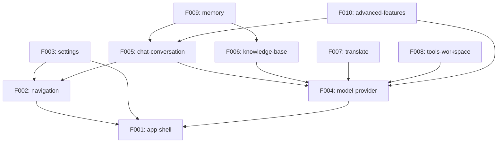

# Angdu Studio 로드맵

## 프로젝트 개요

Angdu Studio는 Cherry Studio를 기반으로 완전히 새로운 스택으로 리빌드하는 AI 데스크톱 채팅 애플리케이션이다. 멀티 프로바이더 지원, RAG 기반 지식베이스, 시맨틱 메모리, 에이전트 시스템 등 Cherry Studio의 전체 기능을 포함하며, UI/상태관리/데이터 계층을 현대적 스택으로 교체한다.

## 리빌드 전략

| 항목 | 값 |
|------|-----|
| **모드** | Rebuild (완전 재구축) |
| **범위** | Full Scope (전체 기능) |
| **스택** | New Stack (UI, 상태관리, 데이터 계층 교체) |
| **소스** | Cherry Studio (`cherry-studio`) |
| **타겟** | Angdu Studio (`angdu-studio`) |
| **네이밍** | Cherry → Angdu, Cherry Studio → Angdu Studio |
| **아키타입** | ai-assistant |

### 스택 변경 요약

| 계층 | Cherry Studio (현재) | Angdu Studio (신규) |
|------|---------------------|---------------------|
| UI 컴포넌트 | Ant Design | shadcn/ui + Radix UI |
| 상태관리 | Redux Toolkit + redux-persist | Zustand + persist middleware |
| 데이터 저장 | Dexie (IndexedDB, renderer) | better-sqlite3 (main process, IPC) |
| 스타일링 | styled-components | Tailwind CSS 4 |
| LLM 통합 | LangChain + Vercel AI SDK | Vercel AI SDK only |
| 라우터 | React Router v6 | React Router v7 (HashRouter) |
| 유지 스택 | TypeScript, Electron, electron-vite, TipTap, Vitest+Playwright, Biome, better-sqlite3+Drizzle | (동일) |

## Feature Catalog

| ID | Feature | 설명 | 의존성 |
|----|---------|------|--------|
| F001 | app-shell | Electron 부트스트랩, BrowserWindow, IPC 브릿지, config 영속화, 테마 | — |
| F002 | navigation | Navbar (top/left), 탭 시스템, 사이드바 아이콘, HashRouter 라우팅 | F001 |
| F003 | settings | 설정 페이지 (일반/표시/데이터/단축키), 백업/복원 | F001, F002 |
| F004 | model-provider | 프로바이더 CRUD, API key 관리, 모델 관리, 헬스체크 | F001 |
| F005 | chat-conversation | 채팅 UI, 메시지, 토픽, 어시스턴트, 스트리밍, InputBar | F002, F004 |
| F006 | knowledge-base | KB CRUD, RAG 문서 수집, 벡터 검색, 리랭킹 | F004 |
| F007 | translate | 번역 UI, 언어 감지, OCR 연동 | F004 |
| F008 | tools-workspace | Code tools, Paintings, Notes, Files, MCP 서버, Store | F004 |
| F009 | memory | 시맨틱 메모리 저장소, 자동 추출, 메모리 검색 | F005, F006 |
| F010 | advanced-features | Selection assistant, Agent (Claude Code), API 서버, 웹 검색 | F004, F005 |

## Dependency Graph

## Release Groups

### RG-1: Foundation

| Feature | 설명 |
|---------|------|
| F001 app-shell | Electron 부트스트랩, BrowserWindow, preload 브릿지, config 영속화 (better-sqlite3), 테마 시스템 |

**마일스톤**: Electron 앱이 기동되고, IPC를 통한 config 읽기/쓰기, 테마 전환이 동작한다.

### RG-2: Core UI & Infrastructure

| Feature | 설명 |
|---------|------|
| F002 navigation | Navbar (top/left 모드), 탭 시스템, 사이드바 아이콘, HashRouter 라우팅 |
| F003 settings | 설정 페이지 (일반/표시/데이터/단축키), 백업/복원 (로컬/WebDAV/S3) |
| F004 model-provider | 프로바이더 CRUD, API key 암호화(safeStorage), 모델 자동 검색, 헬스체크 |

**마일스톤**: 앱 네비게이션, 설정, 프로바이더/모델 관리가 완전히 동작한다.

### RG-3: Core Features

| Feature | 설명 |
|---------|------|
| F005 chat-conversation | 채팅 UI, 메시지 블록 시스템, 토픽, 어시스턴트, 스트리밍, InputBar, TipTap 에디터 |
| F006 knowledge-base | KB CRUD, RAG 파이프라인 (chunk→embed→store→search→rerank), 벡터 검색 |
| F007 translate | 번역 UI, 언어 감지, OCR 연동, 번역 이력 |
| F008 tools-workspace | Code tools, Paintings (이미지 생성), Notes, Files, MCP 서버 관리, Mini App Store |

**마일스톤**: AI 채팅, 지식베이스 RAG, 번역, 도구 모음이 모두 동작한다.

### RG-4: Advanced Features

| Feature | 설명 |
|---------|------|
| F009 memory | 시맨틱 메모리 저장소, 대화에서 자동 추출, 벡터 유사도 검색, 메모리 주입 |
| F010 advanced-features | Selection assistant, Agent (Claude Code SDK), API 서버 (Express), 웹 검색 |

**마일스톤**: 시맨틱 메모리와 고급 에이전트 기능이 동작한다.

## Demo Groups

### DG-01: AI 채팅 대화

| 항목 | 값 |
|------|-----|
| **Features** | F001, F002, F004, F005 |
| **시나리오** | 앱 기동 → 프로바이더 설정 → 어시스턴트 생성 → 채팅 대화 (스트리밍) → 토픽 관리 |
| **SBI Coverage** | B001–B050, B086–B200 |

### DG-02: 지식 기반 RAG 대화

| 항목 | 값 |
|------|-----|
| **Features** | F001, F004, F005, F006 |
| **시나리오** | KB 생성 → 문서 업로드 → 임베딩 처리 → RAG 채팅 → 인용 확인 |
| **SBI Coverage** | B001–B030, B086–B240 |

### DG-03: 설정 및 데이터 관리

| 항목 | 값 |
|------|-----|
| **Features** | F001, F002, F003, F004 |
| **시나리오** | 설정 페이지 진입 → 일반/표시/데이터 설정 변경 → 백업 생성 → 복원 → 프로바이더 헬스체크 |
| **SBI Coverage** | B001–B120 |

### DG-04: 도구 및 고급 기능

| 항목 | 값 |
|------|-----|
| **Features** | F004, F007, F008, F010 |
| **시나리오** | 번역 실행 → 이미지 생성 → MCP 서버 연결 → Agent 세션 → 웹 검색 |
| **SBI Coverage** | B086–B120, B241–B320, B346–B380 |

## Cross-Feature Entity Dependencies

엔티티가 어떤 Feature에서 정의되고, 어떤 Feature에서 소비되는지 매핑한다.

| 엔티티 | 정의 Feature | 소비 Feature |
|--------|-------------|-------------|
| AppConfig | F001 | F002, F003, F004, F005, F006, F007, F008, F009, F010 |
| Provider | F004 | F005, F006, F007, F008, F009, F010 |
| Model | F004 | F005, F006, F007, F008, F009, F010 |
| Assistant | F005 | F009, F010 |
| Topic | F005 | F009, F010 |
| Message / MessageBlock | F005 | F009, F010 |
| KnowledgeBase | F006 | F005 (채팅 RAG), F009 (메모리 저장) |
| KnowledgeItem | F006 | F005, F009 |
| MemoryItem | F009 | F005 (메모리 주입) |
| MCPServer | F008 | F005 (채팅 MCP 도구), F010 (에이전트 MCP) |
| Agent / AgentSession | F010 | (자체 소비) |
| FileMetadata | F001 | F005, F006, F007, F008 |
| Shortcut | F003 | F001 (글로벌 단축키 등록) |

## Cross-Feature API Dependencies

Feature 간 IPC 채널 의존성을 매핑한다.

| 소비 Feature | 제공 Feature | IPC 채널 그룹 | 용도 |
|-------------|-------------|-------------|------|
| F002 | F001 | Config:get/set | 탭/네비게이션 상태 영속화 |
| F003 | F001 | Config:get/set, Backup:* | 설정 읽기/쓰기, 백업/복원 |
| F004 | F001 | Config:get/set, Aes:encrypt/decrypt | API key 암호화 저장 |
| F005 | F004 | (Zustand 직접 import) | 프로바이더/모델 조회 |
| F005 | F006 | KnowledgeBase:search, KnowledgeBase:rerank | RAG 채팅 시 KB 검색 |
| F005 | F009 | Memory:search | 메모리 주입 |
| F006 | F004 | (Zustand 직접 import) | 임베딩 모델 조회 |
| F006 | F001 | File:upload, File:read | 문서 파일 관리 |
| F007 | F004 | (Zustand 직접 import) | 번역 모델 조회 |
| F008 | F004 | (Zustand 직접 import) | 이미지 생성/MCP 모델 조회 |
| F008 | F001 | Mcp:*, File:* | MCP 서버 관리, 파일 관리 |
| F009 | F005 | (Zustand 직접 import) | 대화 메시지에서 메모리 추출 |
| F009 | F006 | (벡터 저장소 공유) | 벡터 임베딩 재사용 |
| F010 | F005 | (메시지 시스템 공유) | Agent 메시지 표시 |
| F010 | F001 | AgentMessage:*, ApiServer:* | 에이전트 영속화, API 서버 |
