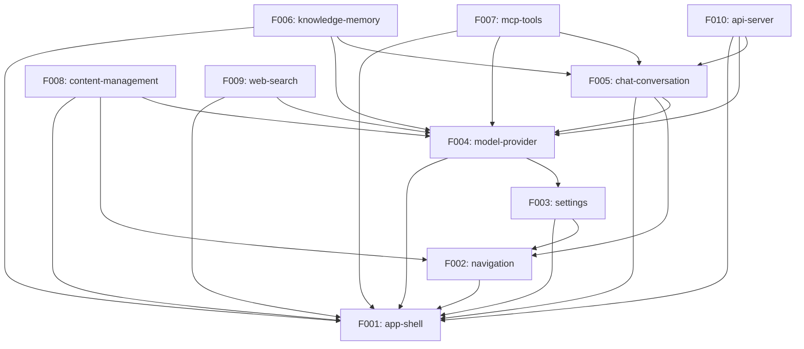

# Angdu Studio — Reverse-Spec Roadmap

## Project Overview

**Origin**: Cherry Studio v1.7.24 (CherryHQ/cherry-studio)
**Target**: Angdu Studio (rebuild with core scope, new stack)
**Archetype**: AI Desktop Assistant
**Platform**: Electron + React + TypeScript

Cherry Studio is a full-featured AI desktop chat application supporting 50+ model providers, MCP tool integration, knowledge base RAG, web search, image generation, translation, notes, and a REST API server. Angdu Studio rebuilds the core functionality on a modernized stack, dropping non-essential features and simplifying the architecture.

## Tech Stack

### Current Detected Stack (Cherry Studio)

| Layer | Technology | Version/Notes |
|-------|-----------|---------------|
| Runtime | Electron | electron-vite build system |
| UI Framework | React 19 | with @ant-design/v5-patch-for-react-19 |
| Component Library | Ant Design 5 | @ant-design/icons, @ant-design/cssinjs |
| State Management | Redux Toolkit | via @reduxjs/toolkit, redux-persist |
| CSS | Styled Components / Ant Design CSS-in-JS | @emotion/is-prop-valid |
| Database | LibSQL | @libsql/client 0.14.0, Drizzle ORM for agents |
| Language | TypeScript | tsgo for type checking |
| Build | electron-vite | Vite-based |
| Package Manager | pnpm | Workspaces |
| AI SDK | Vercel AI SDK | @ai-sdk/* multi-provider |
| API Framework | Express | REST API server |
| Testing | Vitest | with Playwright for E2E |
| Linting | Biome + ESLint + oxlint | |
| i18n | Custom | check/sync/translate scripts |

### New Stack (Angdu Studio)

| Layer | Technology | Migration |
|-------|-----------|-----------|
| Runtime | Electron | Kept |
| UI Framework | React | Kept |
| Component Library | shadcn/ui + Tailwind CSS 4 | Replaces Ant Design |
| State Management | Zustand | Replaces Redux Toolkit |
| CSS | Tailwind CSS 4 | Replaces CSS-in-JS |
| Database | better-sqlite3 | Replaces LibSQL |
| Language | TypeScript | Kept |
| AI SDK | Vercel AI SDK | Kept |
| API Framework | Express | Kept |

## Project Scale

| Metric | Value |
|--------|-------|
| Total source files | ~1708 |
| Lines of code | ~326K LoC |
| Entity types | 18+ |
| API endpoint groups | 7+ |
| Features (rebuild scope) | 10 |
| Providers supported | 50+ system providers |
| Store modules | 30+ |
| Service classes (renderer) | 40+ |
| Service classes (main) | 40+ |

## Rebuild Strategy

**Approach**: Core Scope + New Stack

- Rebuild only the 10 identified Features (F001-F010)
- Drop miniapps, OpenClaw, OCR, Nutstore sync, painting provider variants, marketplace
- Migrate UI from Ant Design to shadcn/ui + Tailwind CSS 4
- Replace Redux with Zustand for simpler state management
- Replace LibSQL with better-sqlite3 for local-first storage
- Maintain Vercel AI SDK integration for multi-provider support
- Preserve the API server for external tool integration

## Feature Catalog

### Tier 0 — Foundation (Kept, not rebuilt)

Electron framework is kept as-is. No T0 feature extraction needed.

### Tier 1 — Core Features

| ID | Feature | Description | Rationale |
|----|---------|-------------|-----------|
| F001 | app-shell | Electron bootstrap, window management, IPC bridge, system tray, global shortcuts, deep link handling | Foundation for all other features. Manages app lifecycle, window creation, preload scripts, and cross-process communication. |
| F002 | navigation | Tab-based routing, sidebar/top navigation mode, page navigation, sidebar icon management | Controls how users move between features. Supports multiple layout modes and tab management. |
| F003 | settings | General settings, display/theme settings, data management, keyboard shortcuts configuration, quick phrases management | Central configuration hub. Affects behavior of all other features through user preferences. |
| F004 | model-provider | Model and provider management, multi-provider abstraction, model capabilities, endpoint type routing, provider API options | Core abstraction layer. Every AI feature depends on model selection and provider configuration. |
| F005 | chat-conversation | Chat UI with message blocks, streaming output, assistant configuration, topic management, multi-model messages, mentions | Primary user interaction surface. Handles the complete chat lifecycle from input to rendered output. |

### Tier 2 — Extended Features

| ID | Feature | Description | Rationale |
|----|---------|-------------|-----------|
| F006 | knowledge-memory | Knowledge base creation/management, RAG pipeline with embeddings, document ingestion, memory service for persistent facts | Enhances chat with external knowledge. Involves embedding models, vector search, and document processing. |
| F007 | mcp-tools | MCP server management (stdio/SSE/streamableHttp), tool discovery, tool execution with approval, builtin MCP servers, DXT packages | Extends model capabilities with external tools. Manages server lifecycle and protocol communication. |
| F008 | content-management | Notes with tree structure, file management, paintings/image generation, translation with history, chat history browsing | Secondary content features that complement the core chat experience. |

### Tier 3 — Peripheral Features

| ID | Feature | Description | Rationale |
|----|---------|-------------|-----------|
| F009 | web-search | Web search provider management (Tavily, SearxNG, Exa, local browser), search integration with chat, result injection | Augments chat responses with real-time web information. Multiple provider backends. |
| F010 | api-server | REST API server with Express, agents CRUD, sessions CRUD, session messages, OpenAI-compatible chat completions, Anthropic-compatible messages, MCP proxy endpoints | Exposes app functionality via HTTP API for external tool integration. |

## Dependency Graph

## Dependency Table

| Feature | Depends On | Depended By |
|---------|-----------|-------------|
| F001 app-shell | (none) | F002, F003, F004, F005, F006, F007, F008, F009, F010 |
| F002 navigation | F001 | F003, F005, F008 |
| F003 settings | F001, F002 | F004 |
| F004 model-provider | F001, F003 | F005, F006, F007, F008, F009, F010 |
| F005 chat-conversation | F001, F002, F004 | F006, F007, F010 |
| F006 knowledge-memory | F001, F004, F005 | (none) |
| F007 mcp-tools | F001, F004, F005 | (none) |
| F008 content-management | F001, F002, F004 | (none) |
| F009 web-search | F001, F004 | (none) |
| F010 api-server | F001, F004, F005 | (none) |

## Release Groups

| Group | Features | Gate Criteria |
|-------|----------|---------------|
| RG-1 | F001 (app-shell) | Electron window launches, IPC bridge functional, tray icon visible, shortcuts registered |
| RG-2 | F002 (navigation), F003 (settings) | Tab routing works, sidebar/top mode toggle, settings pages render, preferences persist |
| RG-3 | F004 (model-provider) | Provider CRUD works, model list fetches, endpoint type routing correct, API key storage secure |
| RG-4 | F005 (chat-conversation) | Chat send/receive works, streaming renders, message blocks display, topic CRUD functional |
| RG-5 | F006 (knowledge-memory), F007 (mcp-tools), F008 (content-management) | Knowledge RAG returns results, MCP tools execute, notes/files/translate functional |
| RG-6 | F009 (web-search), F010 (api-server) | Web search results inject into chat, API server starts/stops, CRUD endpoints respond correctly |

## Demo Groups

### DG-01: Basic Chat

**Features**: F001, F002, F004, F005
**Scenario**: User launches app, navigates to chat, selects a model provider and model, sends a message, receives streamed response with message blocks.
**SBI Coverage**: B001–B055, B081–B160

### DG-02: Knowledge RAG

**Features**: F004, F005, F006
**Scenario**: User creates a knowledge base, adds documents, starts a chat with knowledge base attached, receives responses augmented with retrieved knowledge references.
**SBI Coverage**: B081–B195

### DG-03: Multi-Tool

**Features**: F003, F007, F008, F009
**Scenario**: User configures MCP servers in settings, enables web search, uses tools during chat. Creates notes, manages files, performs translations.
**SBI Coverage**: B056–B080, B196–B290

### DG-04: External API

**Features**: F004, F005, F010
**Scenario**: User enables API server in settings, configures API key. External client sends OpenAI-compatible chat completion request. Creates agent, creates session, sends session message via REST API.
**SBI Coverage**: B081–B160, B291–B330

## Cross-Feature Entity Dependencies

This table shows which entities are shared across features and their primary owner.

| Entity | Owner Feature | Used By |
|--------|--------------|---------|
| Assistant | F005 | F003, F006, F007, F008, F009 |
| Model | F004 | F005, F006, F007, F008, F009, F010 |
| Provider | F004 | F005, F010 |
| Topic | F005 | F006, F007 |
| Message | F005 | F006, F007, F010 |
| MessageBlock | F005 | F006, F007, F008 |
| MCPServer | F007 | F005, F010 |
| MCPTool | F007 | F005, F010 |
| KnowledgeBase | F006 | F005 |
| KnowledgeItem | F006 | F005 |
| MemoryItem | F006 | F005 |
| WebSearchProvider | F009 | F005 |
| FileMetadata | F008 | F005, F006 |
| QuickPhrase | F003 | F005 |
| NotesTreeNode | F008 | (none) |
| TranslateHistory | F008 | (none) |
| Painting | F008 | (none) |
| AgentEntity | F010 | (none) |
| AgentSessionEntity | F010 | F005 |

## Cross-Feature API Dependencies

The REST API server (F010) exposes endpoints that depend on internal services from multiple features.

| API Group | Route Prefix | Depends On Features |
|-----------|-------------|-------------------|
| Health | GET /health | F001 (app lifecycle) |
| Chat Completions | POST /v1/chat/completions | F004 (provider resolution), F005 (streaming pipeline) |
| Messages | POST /v1/messages | F004 (provider resolution, Anthropic client) |
| Models | GET /v1/models | F004 (provider/model registry) |
| MCP | GET/ALL /v1/mcps/* | F007 (MCP server management) |
| Agents | /v1/agents/* | F010 (agents database via Drizzle) |
| Sessions | /v1/agents/:agentId/sessions/* | F010 (sessions database), F005 (message persistence) |
| Session Messages | /v1/agents/:agentId/sessions/:sessionId/messages/* | F010 (messages database), F005 (agent session execution) |
