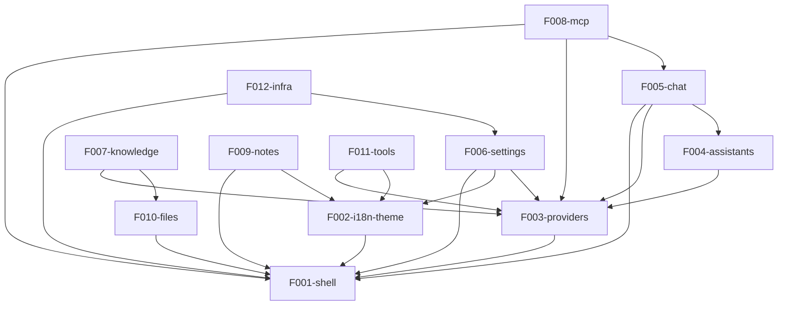

# Angdu Studio - Rebuild Roadmap

> Reverse-spec Phase 4 deliverable. Source: Cherry Studio codebase analysis.

## 1. Project Overview

| Item | Value |
|------|-------|
| **Source** | Cherry Studio (CherryHQ/cherry-studio) |
| **Target** | Angdu Studio |
| **Scope** | Core (12 features) |
| **Stack Strategy** | New Stack |

### Tech Stack

| Layer | Cherry Studio (Source) | Angdu Studio (Target) |
|-------|----------------------|----------------------|
| Framework | Electron + React + TypeScript | Electron + React + TypeScript |
| UI Library | Ant Design | shadcn/ui + Tailwind CSS |
| State Management | Redux Toolkit | Zustand |
| AI SDK | Vercel AI SDK + OpenAI SDK | Vercel AI SDK |
| Rich Text Editor | TipTap | TipTap |
| Knowledge Base | EmbedJS (vector DB) | EmbedJS (vector DB) |
| Build Tool | electron-vite | electron-vite |
| API Server | Express | Express |

## 2. Rebuild Strategy

- **Scope**: Core -- 12 features extracted from reverse-spec analysis
- **Stack**: New -- UI migrated from Ant Design to shadcn/ui+Tailwind, state from Redux to Zustand
- **Electron Framework**: Preserved as-is (same IPC patterns, main/renderer split)
- **Data Model**: Preserved structure, adapted for Zustand stores

## 3. Feature Catalog

### T1 - Core Features (6)

| ID | Feature | Description |
|----|---------|-------------|
| F001-shell | Shell | Electron window management, titlebar, tray, lifecycle, menus, IPC infrastructure |
| F002-i18n-theme | i18n & Theme | Localization (en, zh-CN, zh-TW), dark/light themes, display settings |
| F003-providers | Providers | AI provider management (20+ providers via Vercel AI SDK), model configuration, API keys |
| F004-assistants | Assistants | Assistant presets, library/store, customization, emoji icons |
| F005-chat | Chat | Chat UI, message handling, streaming responses, topics/conversations, message input toolbar |
| F006-settings | Settings | App configuration (Model Provider, Default Model, General, Display, Data, MCP, Web Search, Memories, API Server, Doc Processing, Quick Phrases, Keyboard Shortcuts) |

### T2 - Enhancement Features (3)

| ID | Feature | Description |
|----|---------|-------------|
| F007-knowledge | Knowledge Base | Knowledge base, document embedding (EmbedJS), vector search, RAG, document preprocessing |
| F008-mcp | MCP | MCP server management, tool invocation, resource management, 10+ built-in MCP servers |
| F009-notes | Notes | Note management with TipTap rich text editor, markdown import, folder organization |

### T3 - Extended Features (3)

| ID | Feature | Description |
|----|---------|-------------|
| F010-files | Files | File management, preview, upload, search |
| F011-tools | Tools | Translate (with OCR), paintings (image generation), code tools (Python execution), mini-apps, launchpad |
| F012-infra | Infrastructure | Backup/sync (WebDAV, S3, LAN), auto-update, API server (Express), web search, selection toolbar |

## 4. Dependency Graph

### Mermaid Diagram

### Dependency Table

| Feature | Depends On | Dependency Reason |
|---------|-----------|-------------------|
| F002-i18n-theme | F001-shell | IPC for theme changes, window chrome |
| F003-providers | F001-shell | IPC for API key storage, secure config |
| F004-assistants | F003-providers | Model selection for assistants |
| F005-chat | F001-shell, F003-providers, F004-assistants | Window context, provider API calls, assistant config |
| F006-settings | F001-shell, F002-i18n-theme, F003-providers | Window IPC, theme switching, provider config UI |
| F007-knowledge | F003-providers, F010-files | Embedding model from provider, file access for documents |
| F008-mcp | F001-shell, F003-providers, F005-chat | IPC for server lifecycle, provider for AI, chat integration |
| F009-notes | F001-shell, F002-i18n-theme | Window/file IPC, i18n for UI |
| F010-files | F001-shell | IPC for file system operations |
| F011-tools | F003-providers, F002-i18n-theme | Provider for AI tools (translate, image gen), i18n |
| F012-infra | F001-shell, F006-settings | IPC for backup/update, settings for config |

## 5. Release Groups

### RG-1: Foundation

**Features**: F001-shell, F002-i18n-theme, F003-providers

**Goal**: Standalone Electron app with themed UI shell, i18n, and AI provider configuration.

**Exit Criteria**:
- Electron window renders with custom titlebar and tray
- Theme switching (light/dark/system) works
- At least 3 locales load correctly
- Provider can be added with API key, models fetched

### RG-2: Core Business

**Features**: F004-assistants, F005-chat, F006-settings

**Goal**: Functional AI chat application with assistant presets and full settings panel.

**Exit Criteria**:
- Assistants can be created, edited, and selected
- Chat messages stream from configured provider
- Topics can be created, renamed, pinned
- All settings sections render and persist values

### RG-3: Enhancement

**Features**: F007-knowledge, F008-mcp, F009-notes, F010-files, F011-tools, F012-infra

**Goal**: Full feature parity with Cherry Studio core features.

**Exit Criteria**:
- Knowledge base can ingest documents and answer RAG queries
- MCP servers can be added, started, and tools invoked
- Notes can be created with rich text editor
- Files can be uploaded, previewed, managed
- Translate, image generation, code tools functional
- Backup/restore works for WebDAV, S3, LAN

## 6. Demo Groups

### DG-01: Basic AI Chat

**Features**: F001, F002, F003, F004, F005

**SBI Coverage**: TBD (after SBI numbering)

**Demonstrates**: End-to-end chat flow from shell launch to streaming AI response with assistant selection.

### DG-02: Knowledge-Augmented Chat

**Features**: F003, F005, F007, F010

**SBI Coverage**: TBD

**Demonstrates**: RAG pipeline -- upload document, create knowledge base, ask question, get grounded answer.

### DG-03: Productivity Tools

**Features**: F003, F008, F009, F011

**SBI Coverage**: TBD

**Demonstrates**: Translate text, generate images, execute code, use MCP tools, take notes.

### DG-04: MCP & External Integration

**Features**: F005, F008, F012

**SBI Coverage**: TBD

**Demonstrates**: Chat with MCP tool invocation, API server exposed for external clients, backup/restore.

## 7. Cross-Feature Entity Dependencies

| Entity | Owner Feature | Used By |
|--------|--------------|---------|
| `Provider` | F003-providers | F004, F005, F006, F007, F008, F011, F012 |
| `Model` | F003-providers | F004, F005, F006, F007, F008, F011 |
| `Assistant` | F004-assistants | F005, F006 |
| `Topic` | F005-chat | F005 |
| `Message` | F005-chat | F005, F008 |
| `MessageBlock` | F005-chat | F005 |
| `KnowledgeBase` | F007-knowledge | F004, F005 |
| `MCPServer` | F008-mcp | F004, F005, F006, F012 |
| `FileMetadata` | F010-files | F005, F007, F009 |
| `NotesTreeNode` | F009-notes | F009 |
| `SettingsState` | F006-settings | F001, F002, F003, F005, F008, F012 |
| `WebDavConfig` | F012-infra | F006 |
| `S3Config` | F012-infra | F006 |
| `ApiServerConfig` | F012-infra | F006 |
| `QuickPhrase` | F006-settings | F005 |
| `Shortcut` | F006-settings | F001 |

## 8. Cross-Feature API Dependencies

| IPC Channel Group | Owner Feature | Called By |
|-------------------|--------------|----------|
| `app:*` (lifecycle, window, paths) | F001-shell | All features |
| `window:*` (resize, minimize, maximize) | F001-shell | F005, F006 |
| `config:*` (get/set) | F001-shell | F006 |
| `file:*` (upload, read, delete, etc.) | F010-files | F005, F007, F009, F011 |
| `knowledge-base:*` (create, search, etc.) | F007-knowledge | F005 |
| `mcp:*` (add, remove, call-tool, etc.) | F008-mcp | F005, F006 |
| `backup:*` (WebDAV, S3, LAN, local) | F012-infra | F006 |
| `api-server:*` (start, stop, status) | F012-infra | F006 |
| `shortcuts:*` (update) | F006-settings | F001 |
| `selection:*` (toolbar, actions) | F012-infra | F005 |
| `memory:*` (add, search, list) | F005-chat | F006 |
| `notification:*` (send) | F001-shell | F005, F007, F012 |
