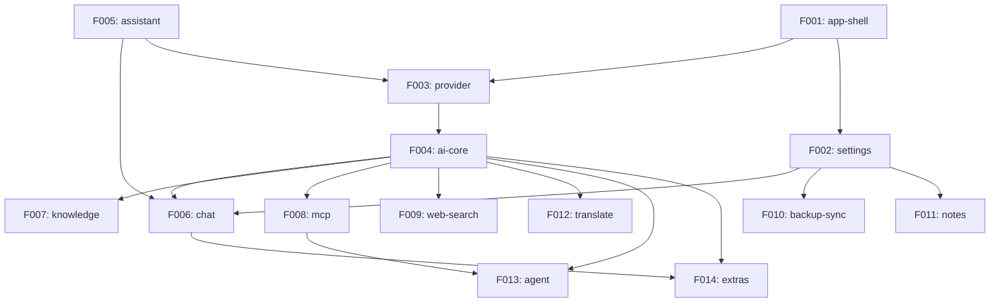

# Angdu Studio — Roadmap

> Rebuilt from Cherry Studio (`/Users/coolhero/Develop/cherry-studio`)
> Generated: 2026-03-14

---

## 1. Project Identity

| Field | Value |
|-------|-------|
| **Project** | Angdu Studio |
| **Source** | Cherry Studio |
| **Domain** | AI Desktop Application |
| **Scope** | Core |
| **Identity** | Cherry Studio → Angdu Studio |

### Overview

AI-powered desktop chat application supporting multiple LLM providers with conversation management, knowledge base, MCP tool integration, and plugin system.

### Architecture

Electron (main/preload/renderer) + monorepo (pnpm workspaces)

### Scale

~1,779 source files, 51 entities, 25+ API endpoints, 14 Features

---

## 2. Tech Stack (New)

| Layer | Technology |
|-------|-----------|
| Language | TypeScript 5.x |
| Framework | Electron (latest) + electron-vite |
| UI | React 19 + Tailwind CSS 4 + shadcn/ui |
| State | Zustand + persist |
| DB | Drizzle ORM + SQLite (LibSQL) |
| AI | Vercel AI SDK |
| Rich Text | Tiptap 3 |
| Testing | Vitest + Playwright |
| I18n | i18next |

---

## 3. Feature Catalog

### Tier 1 — Essential

| ID | Name | Description | Rationale |
|----|------|-------------|-----------|
| F001 | app-shell | Electron window management, IPC architecture, security, bootstrap, native integration (tray, menus, shortcuts) | Required: all other Features depend on this foundation |
| F002 | settings | App configuration persistence, display settings, keyboard shortcuts, data management | Required: every Feature reads/writes settings |
| F003 | provider | AI provider configuration, API key management, model listing, multi-provider support (20+ providers) | Required: AI completions need provider config |
| F004 | ai-core | Multi-provider AI completion engine with middleware pipeline, plugin system, streaming, and provider abstraction | Required: the engine powering all AI interactions |
| F005 | assistant | Assistant CRUD, presets, tags, assistant-specific settings (temperature, context, etc.), default assistant | Required: assistants drive all chat conversations |
| F006 | chat | Chat UI with message display, input toolbar, topic management, message blocks, streaming responses, markdown rendering | Required: the primary user-facing feature |

### Tier 2 — Recommended

| ID | Name | Description | Rationale |
|----|------|-------------|-----------|
| F007 | knowledge | Knowledge base management, RAG pipeline with embeddings and search, document processing, reranking | Differentiating: RAG is a major product value |
| F008 | mcp | MCP server management, tool discovery, hub aggregation, OAuth, built-in servers (filesystem, browser) | Differentiating: tool integration for advanced use |
| F009 | web-search | Web search provider management, search integration into chat, multiple providers (Tavily, Exa, local search) | Enhancing: real-time information in conversations |
| F010 | backup-sync | Multi-destination backup (WebDAV, S3, local), auto-sync scheduling, Nutstore integration, data restore | Essential: data safety across devices |

### Tier 3 — Optional

| ID | Name | Description | Rationale |
|----|------|-------------|-----------|
| F011 | notes | Rich text note editor (Tiptap), note tree management, markdown import/export, search | Supplementary: standalone note-taking |
| F012 | translate | AI translation with OCR support, language detection, translation history, custom languages | Supplementary: translation tool |
| F013 | agent | Claude Code agent system, API server (Express), agent sessions, tool permissions | Advanced: developer-facing feature |
| F014 | extras | Mini apps, image generation (paintings), code tools, memory system, selection assistant, file management | Enhancement: grab-bag of extra features |

---

## 4. Dependency Graph



---

## 5. Release Groups

| RG | Name | Features | Tier |
|----|------|----------|------|
| RG-1 | Foundation | F001-app-shell, F002-settings | T1 |
| RG-2 | Provider | F003-provider | T1 |
| RG-3 | Engine | F004-ai-core, F005-assistant | T1 |
| RG-4 | Chat | F006-chat | T1 |
| RG-5 | Features | F007-knowledge, F008-mcp, F009-web-search, F010-backup-sync, F011-notes, F012-translate | T2, T3 |
| RG-6 | Advanced | F013-agent, F014-extras | T3 |

### Execution Order

```
RG-1 Foundation
  └─► RG-2 Provider
        └─► RG-3 Engine
              └─► RG-4 Chat
                    └─► RG-5 Features (parallel within group)
                          └─► RG-6 Advanced (parallel within group)
```

---

## 6. Demo Groups

| DG | Name | Features | SBI Coverage |
|----|------|----------|-------------|
| DG-01 | Basic Chat Flow | F001, F002, F003, F004, F005, F006 | B001–B120 |
| DG-02 | Knowledge-Augmented Chat | F006, F004, F003, F007 | B121–B160 |
| DG-03 | Tool-Enhanced Chat | F006, F004, F008, F009 | B161–B200 |
| DG-04 | Data Persistence & Sync | F002, F010, F011, F012 | B201–B250 |

---

## 7. Cross-Feature Dependencies

### Entity Dependencies

| Entity | Owner | Consumers | Type |
|--------|-------|-----------|------|
| Provider | F003-provider | F004-ai-core, F005-assistant, F006-chat | Entity reference |
| Model | F003-provider | F004-ai-core, F005-assistant, F006-chat, F007-knowledge, F012-translate | Entity reference |
| Assistant | F005-assistant | F006-chat, F007-knowledge | Entity reference |
| Topic | F006-chat | F005-assistant | Entity reference (embedded) |
| Message / MessageBlock | F006-chat | F004-ai-core, F007-knowledge, F008-mcp, F009-web-search | Entity reference |
| KnowledgeBase | F007-knowledge | F005-assistant | Entity reference |
| MCPServer | F008-mcp | F005-assistant, F004-ai-core | Entity reference |
| Settings | F002-settings | All Features | Shared config |

### API Dependencies

| API | Owner | Consumers | Purpose |
|-----|-------|-----------|---------|
| IPC: mcp:list-tools | F008-mcp | F004-ai-core, F006-chat | Tool discovery |
| IPC: knowledgeBase:search | F007-knowledge | F006-chat | RAG search |
| IPC: backup:* | F010-backup-sync | F002-settings | Backup operations |
| IPC: memory:* | F014-extras | F006-chat | Memory injection |
| HTTP: /v1/chat/completions | F013-agent | External clients | OpenAI-compatible API |
