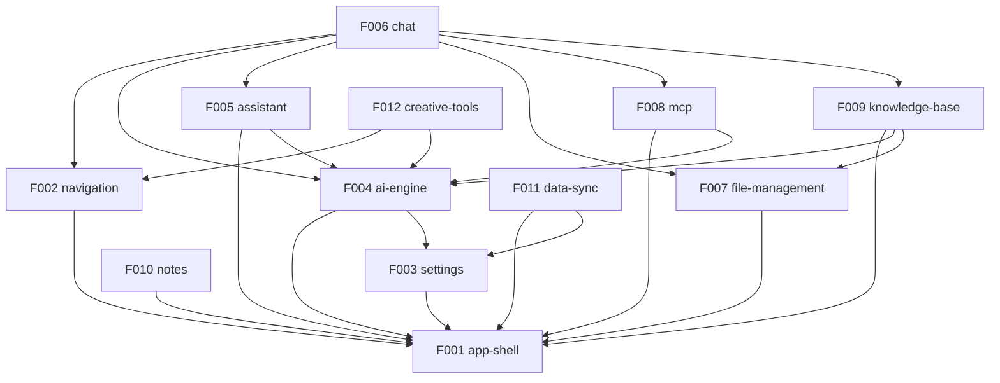

# Angdu Studio — Roadmap

> Generated by `/reverse-spec` Phase 4 — 2026-03-13
> Source: Cherry Studio v1.7.24 → Angdu Studio (core rebuild)

---

## 1. Project Overview

**Angdu Studio** is a desktop AI assistant application rebuilt from Cherry Studio. It provides multi-provider AI chat, knowledge-augmented RAG, MCP tool integration, creative tools (art, translation, code), and notes — all in an Electron desktop shell.

**Rebuild scope**: Core (all 12 features)
**Stack strategy**: New (Ant Design → shadcn/ui, Redux → Zustand 5, styled-components → Tailwind CSS 4)
**Identity**: Cherry Studio → Angdu Studio, @cherrystudio → @angdu

---

## 2. Tech Stack

| Layer | Cherry Studio (Source) | Angdu Studio (Target) | Notes |
|-------|----------------------|----------------------|-------|
| Runtime | Electron 40 | Electron 40 | Keep |
| UI Framework | React 19 | React 19 | Keep |
| Component Library | Ant Design 5 + @ant-design/icons | shadcn/ui + Radix UI + Lucide | **Migrate** |
| State Management | Redux Toolkit + redux-persist | Zustand 5 + persist middleware | **Migrate** |
| CSS | styled-components + Ant Design CSS-in-JS | Tailwind CSS 4 only | **Migrate** |
| Language | TypeScript 5.8+ | TypeScript 5.8+ | Keep |
| Bundler | electron-vite 5 (rolldown-vite 7) | electron-vite 5 (rolldown-vite 7) | Keep |
| AI SDK | Vercel AI SDK 6 (@ai-sdk/*) | Vercel AI SDK 6 (@ai-sdk/*) | Keep |
| Database (main) | Drizzle ORM + LibSQL | Drizzle ORM + LibSQL | Keep |
| Database (renderer) | Dexie (IndexedDB) | Dexie (IndexedDB) | Keep |
| Rich Text | TipTap 3 | TipTap 3 | Keep |
| Testing | Vitest + Playwright | Vitest + Playwright | Keep |
| MCP | @modelcontextprotocol/sdk 1.x | @modelcontextprotocol/sdk 1.x | Keep |
| Drag & Drop | @dnd-kit | @dnd-kit | Keep |
| Router | react-router-dom 6 (HashRouter) | react-router-dom 6 (HashRouter) | Keep |
| Internationalization | i18next + react-i18next | i18next + react-i18next | Keep |
| Animation | framer-motion / motion | framer-motion / motion | Keep |
| Code Highlighting | Shiki + CodeMirror | Shiki + CodeMirror | Keep |

---

## 3. Rebuild Strategy

**Approach**: Feature-by-feature incremental rebuild using SDD (Spec-Driven Development).

1. **Phase 1** — Reverse-spec the source to extract architecture, patterns, and feature boundaries
2. **Phase 2** — Generate SDD specs per feature, applying stack migrations
3. **Phase 3** — Implement features in Release Group order (RG-1 → RG-5)
4. **Phase 4** — Verify each feature against its SDD spec
5. **Phase 5** — Integration demos per Demo Group

**Key principle**: Business logic, IPC contracts, DB schemas, and AI SDK integration transfer directly. Only UI layer (components, state, CSS) requires rethinking for the new stack.

---

## 4. Feature Catalog

### Tier 1 — Core (6 features)

| ID | Feature | Description | Rationale |
|----|---------|-------------|-----------|
| F001 | app-shell | Electron main process, window management (main/mini), custom titlebar, IPC bridge, system tray, auto-update | Foundation — everything depends on this |
| F002 | navigation | Sidebar icon navigation, HashRouter routing, theme toggle, layout | Core UX — needed for any page to render |
| F003 | settings | All settings pages (general, display, shortcuts, provider config, model settings, agent settings, MCP settings) | Configuration layer — providers need this before AI works |
| F004 | ai-engine | Provider abstraction (20+ providers), model selection, AI SDK integration, streaming/completion, memory, copilot | Core business value — AI chat requires this |
| F005 | assistant | Assistant CRUD, presets store/marketplace, agent management, quick phrases | Primary interaction model — assistants frame every chat |
| F006 | chat | Chat interface, topics/tabs, message display/streaming, input toolbar, message operations | Primary UI — the main screen users interact with |

### Tier 2 — Extended (3 features)

| ID | Feature | Description | Rationale |
|----|---------|-------------|-----------|
| F007 | file-management | File storage service, upload/download, document handling, file browser page | Supports chat attachments and knowledge ingestion |
| F008 | mcp | MCP server lifecycle, tool injection into AI requests, MCP settings, built-in servers | Extends AI with external tools — high value but additive |
| F009 | knowledge-base | KB management, RAG pipeline, embedding generation, document ingestion | Knowledge-augmented chat — depends on files and AI engine |

### Tier 3 — Creative (3 features)

| ID | Feature | Description | Rationale |
|----|---------|-------------|-----------|
| F010 | notes | Notes editor (TipTap rich text), note tree management, Obsidian export | Standalone feature, independent of chat |
| F011 | data-sync | Backup/restore, WebDAV/S3/Nutstore cloud sync, local transfer, data migration | Data portability — important but not core flow |
| F012 | creative-tools | AI art/paintings, translation, code tools, mini-apps, OpenClaw, launchpad | Collection of creative utilities using AI engine |

---

## 5. Dependency Graph

### Mermaid

### Dependency Table

| Feature | Depends On | Depended By |
|---------|-----------|-------------|
| F001 app-shell | — | F002, F003, F004, F005, F007, F008, F009, F010, F011 |
| F002 navigation | F001 | F006, F012 |
| F003 settings | F001 | F004, F011 |
| F004 ai-engine | F001, F003 | F005, F006, F008, F009, F012 |
| F005 assistant | F001, F004 | F006 |
| F006 chat | F002, F004, F005, F007, F008, F009 | — |
| F007 file-management | F001 | F006, F009 |
| F008 mcp | F001, F004 | F006 |
| F009 knowledge-base | F001, F004, F007 | F006 |
| F010 notes | F001 | — |
| F011 data-sync | F001, F003 | — |
| F012 creative-tools | F002, F004 | — |

---

## 6. Release Groups

### RG-1: Foundation Shell

| Feature | Tier | What ships |
|---------|------|-----------|
| F001 app-shell | T1 | Electron main process boots, main + mini windows open, custom titlebar renders, IPC bridge operational, system tray works, auto-update checks |

**Exit criteria**: App launches with empty shell, windows manage correctly, tray icon appears.

### RG-2: Navigation + Content Pages

| Feature | Tier | What ships |
|---------|------|-----------|
| F002 navigation | T1 | Sidebar with icon navigation, routing between pages, theme toggle, layout container |
| F003 settings | T1 | All settings pages render with form controls (no AI provider connectivity yet) |
| F007 file-management | T2 | File storage service, file browser page, upload/download |
| F010 notes | T3 | TipTap notes editor, note tree, Obsidian export |

**Exit criteria**: All pages navigable, settings persist, files uploadable, notes editable.

### RG-3: AI Engine + Sync

| Feature | Tier | What ships |
|---------|------|-----------|
| F004 ai-engine | T1 | Provider abstraction for 20+ providers, model selection, streaming completions, memory, copilot |
| F011 data-sync | T3 | Backup/restore, WebDAV/S3/Nutstore sync, local transfer |

**Exit criteria**: At least one AI provider connects and streams a response. Backup/restore round-trips.

### RG-4: Assistants + Knowledge + MCP

| Feature | Tier | What ships |
|---------|------|-----------|
| F005 assistant | T1 | Assistant CRUD, presets marketplace, agent management, quick phrases |
| F008 mcp | T2 | MCP server lifecycle, tool injection, built-in servers |
| F009 knowledge-base | T2 | KB management, RAG pipeline, embedding generation |

**Exit criteria**: Assistants can be created/configured, MCP tools inject into AI requests, KB search returns relevant chunks.

### RG-5: Chat + Creative

| Feature | Tier | What ships |
|---------|------|-----------|
| F006 chat | T1 | Full chat interface with topics/tabs, message streaming, input toolbar, message operations |
| F012 creative-tools | T3 | Paintings, translate, code tools, mini-apps, OpenClaw, launchpad |

**Exit criteria**: End-to-end chat flow works (select assistant → send message → stream response → manage topics). Creative tools functional.

---

## 7. Demo Groups

### DG-01: Core Chat Experience

**Features**: F001, F002, F004, F005, F006
**Story**: User launches app → navigates sidebar → selects assistant → sends message → receives streaming AI response → manages topics/tabs.

| SBI | Description | Coverage |
|-----|-------------|----------|
| TBD | TBD | TBD |

### DG-02: Knowledge-Augmented Chat

**Features**: F004, F006, F007, F009
**Story**: User uploads documents → creates knowledge base → starts chat with KB attached → AI response includes RAG-retrieved context.

| SBI | Description | Coverage |
|-----|-------------|----------|
| TBD | TBD | TBD |

### DG-03: Configuration & Sync

**Features**: F003, F004, F008, F011
**Story**: User configures AI provider → sets up MCP servers → creates backup → restores on another machine.

| SBI | Description | Coverage |
|-----|-------------|----------|
| TBD | TBD | TBD |

### DG-04: Creative Tools Suite

**Features**: F002, F004, F012
**Story**: User navigates to paintings → generates AI art → uses translate tool → explores mini-apps.

| SBI | Description | Coverage |
|-----|-------------|----------|
| TBD | TBD | TBD |

---

## 8. Cross-Feature Entity Dependencies

| Entity | Owning Feature | Consuming Features | Storage |
|--------|---------------|-------------------|---------|
| Assistant | F005 | F006, F004, F012 | Redux→Zustand (renderer, persisted) |
| Topic | F006 | F006 | Dexie (IndexedDB) |
| Message / MessageBlock | F006 | F006, F004 | Dexie (IndexedDB) |
| Provider config | F003 | F004, F008, F009 | Redux→Zustand (renderer, persisted) |
| Model | F004 | F005, F006, F012 | Redux→Zustand (renderer, persisted) |
| FileMetadata | F007 | F006, F009 | Main process (FileStorage service) |
| KnowledgeBase | F009 | F006 | Drizzle + LibSQL (main process) |
| MCPServer config | F008 | F006, F004 | Redux→Zustand (renderer, persisted) |
| Note | F010 | F010 | File system + Zustand |
| Settings (general/display) | F003 | All features | Redux→Zustand (renderer, persisted) |
| Shortcut | F003 | F001, F006 | Redux→Zustand (renderer, persisted) |
| Backup manifest | F011 | F011 | Main process (BackupManager) |

---

## 9. Cross-Feature API Dependencies

| API / IPC Channel | Provider Feature | Consumer Features | Direction |
|-------------------|-----------------|-------------------|-----------|
| `IpcChannel.App_Info` | F001 | All | renderer→main |
| `IpcChannel.App_Proxy` | F001 | F004, F008, F011 | renderer→main |
| `IpcChannel.File_*` (upload/download/open) | F007 | F006, F009, F010 | renderer→main |
| `IpcChannel.Knowledge_*` | F009 | F006 | renderer→main |
| `IpcChannel.MCP_*` | F008 | F006, F004 | renderer→main |
| `IpcChannel.Backup_*` | F011 | F003 | renderer→main |
| `IpcChannel.Export_*` | F006 | F006 | renderer→main |
| `IpcChannel.ReduxStoreReady` | Store (F003) | F001 | renderer→main |
| `IpcChannel.App_SaveData` | F001 | Store (all) | main→renderer |
| `StoreSyncService` (multi-window) | F001 | F005, F003, F004 | renderer↔renderer |
| AI provider API calls | F004 | F006, F012 | renderer→main→external |
| Embedding API calls | F009 | F009 | main→external |
| MCP tool calls | F008 | F006 | main→external |
| WebDAV/S3 sync | F011 | F011 | main→external |
