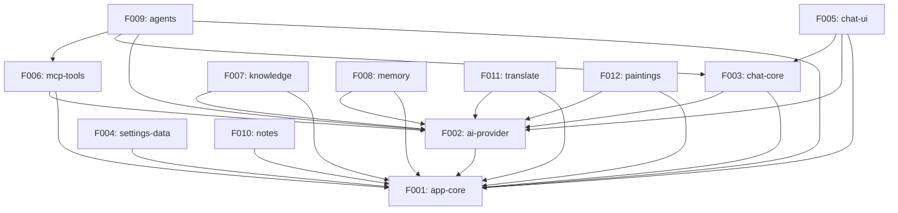

# Angdu Studio -- Rebuild Roadmap

> Generated by `/reverse-spec` Phase 4 -- 2026-03-08
> Source: Cherry Studio (Electron + React + TypeScript AI desktop app)
> Target: Angdu Studio (Electron + React + TypeScript, Zustand, shadcn/ui)

---

## 1. Project Overview

Angdu Studio is a full-featured AI desktop application rebuilt from Cherry Studio.
It provides multi-provider LLM chat, RAG knowledge bases, MCP tool integration,
autonomous agents, image generation, translation, and note-taking -- all within a
tabbed Electron shell.

### Rebuild Strategy

| Dimension | Original (Cherry Studio) | Target (Angdu Studio) |
|-----------|--------------------------|------------------------|
| State management | Redux Toolkit | Zustand |
| UI components | Ant Design 5 | shadcn/ui + Tailwind |
| Identity/branding | Cherry / CherryIN | Angdu |
| Database (server) | SQLite (Drizzle ORM) | SQLite (Drizzle ORM) -- keep |
| Database (client) | Dexie (IndexedDB) | Dexie (IndexedDB) -- keep |
| IPC layer | Electron ipcMain/ipcRenderer | Same pattern, new channel names where branded |
| Build system | Vite + electron-vite | Same |

---

## 2. Feature Catalog

### Tier 1 -- Core (must ship for MVP)

| ID | Name | Description |
|----|------|-------------|
| F001 | app-core | Electron shell, window management, IPC bridge, config store, theme system, auto-update, tray, proxy |
| F002 | ai-provider | Multi-provider LLM abstraction (OpenAI, Anthropic, Gemini, Ollama, 50+ providers), model management, provider config, API key management |
| F003 | chat-core | Assistants, topics, messages, message blocks (text/thinking/tool/citation/image/code/error), conversation lifecycle |
| F005 | chat-ui | Input bar with toolbelt, markdown rendering, streaming display, message actions, search, multi-model views |

### Tier 2 -- Extended

| ID | Name | Description |
|----|------|-------------|
| F004 | settings-data | Settings UI, backup/restore (local/WebDAV/S3), import/export, file management, mini apps launcher |
| F006 | mcp-tools | MCP server lifecycle, tool discovery/execution, built-in MCP servers, DXT packages, tool permissions |
| F007 | knowledge | RAG pipeline: embedding, chunking, vector search, reranking, document preprocessing (PDF/CSV/MD/URL/sitemap) |

### Tier 3 -- Expansion

| ID | Name | Description |
|----|------|-------------|
| F008 | memory | Persistent memory system: vector storage, fact extraction, context injection, user/agent scoping |
| F009 | agents | Agent framework (Claude Code SDK), sessions, plugins, REST API server, tool permissions UI |
| F010 | notes | Markdown note editor (TipTap), file tree, folder organization, favorites, search, .md import |
| F011 | translate | Translation interface, auto-detect language, OCR integration, translate history |
| F012 | paintings | Image generation: multi-provider (SiliconFlow, DMXAPI, OpenAI, Gemini, PPIO), generate/edit/remix/upscale |

---

## 3. Dependency Graph

---

## 4. Release Groups

### RG-1: Foundation (F001, F002)

Delivers: Electron shell boots, provider management works, models can be listed and tested.

- F001 app-core -- zero dependencies
- F002 ai-provider -- depends on F001

### RG-2: Core Chat (F003, F004)

Delivers: Full chat loop end-to-end, settings and backup.

- F003 chat-core -- depends on F001, F002
- F004 settings-data -- depends on F001

### RG-3: Rich Features (F005, F006, F007, F008)

Delivers: Production-quality chat UI, MCP tools, knowledge RAG, memory.

- F005 chat-ui -- depends on F001, F002, F003
- F006 mcp-tools -- depends on F001, F002
- F007 knowledge -- depends on F001, F002
- F008 memory -- depends on F001, F002

### RG-4: Expansion (F009, F010, F011, F012)

Delivers: Agents, notes, translate, image generation.

- F009 agents -- depends on F001, F002, F003, F006
- F010 notes -- depends on F001
- F011 translate -- depends on F001, F002
- F012 paintings -- depends on F001, F002

---

## 5. Demo Groups

### DG-01: Basic Chat Flow

**Features**: F001, F002, F003, F005
**Description**: User opens app, configures a provider with API key, selects a model, sends a message, receives streaming response with thinking blocks, switches assistants/topics.
**SBI Coverage**: TBD

### DG-02: Knowledge-Enhanced Chat

**Features**: F001, F002, F003, F005, F007
**Description**: User creates a knowledge base, uploads documents, configures embedding model, asks a question -- response includes RAG citations from knowledge base.
**SBI Coverage**: TBD

### DG-03: Agent Workflow

**Features**: F001, F002, F003, F005, F006, F009
**Description**: User creates an agent (Claude Code type), configures accessible paths and MCP tools, starts a session, sends a task -- agent uses tools autonomously with permission prompts.
**SBI Coverage**: TBD

### DG-04: Productivity Tools

**Features**: F001, F002, F004, F010, F011, F012
**Description**: User creates notes in markdown editor, translates text between languages, generates images with prompt -- all accessible from tab launcher.
**SBI Coverage**: TBD

---

## 6. Cross-Feature Entity Dependencies

| Entity | Owner | Used By |
|--------|-------|---------|
| Provider | F002 | F003, F005, F006, F007, F008, F009, F011, F012 |
| Model | F002 | F003, F005, F007, F008, F009, F011, F012 |
| Assistant | F003 | F005, F009, F011 |
| Topic | F003 | F005, F007 |
| Message | F003 | F005, F007, F008, F009 |
| MessageBlock | F003 | F005, F009 |
| MCPServer | F006 | F003, F005, F009 |
| MCPTool | F006 | F003, F005, F009 |
| KnowledgeBase | F007 | F003, F005 |
| FileMetadata | F004 | F003, F005, F007, F012 |
| AgentEntity | F009 | (self-contained) |
| Session | F009 | (self-contained) |
| MemoryItem | F008 | F003, F005 |
| Notification | F001 | F004, F007 |

---

## 7. Cross-Feature API Dependencies

| Consumer Feature | Provider Feature | API Surface |
|-----------------|------------------|-------------|
| F003 chat-core | F002 ai-provider | Provider lookup, model resolution, API client creation |
| F005 chat-ui | F003 chat-core | Message CRUD, topic management, assistant selection |
| F005 chat-ui | F002 ai-provider | Model selector, provider status |
| F005 chat-ui | F006 mcp-tools | Tool listing for input bar, tool result display |
| F005 chat-ui | F007 knowledge | Knowledge base selector, citation rendering |
| F005 chat-ui | F008 memory | Memory injection into context |
| F006 mcp-tools | F002 ai-provider | Tool-calling model capabilities |
| F007 knowledge | F002 ai-provider | Embedding model, reranking model API clients |
| F009 agents | F003 chat-core | Message persistence (AgentPersistedMessage) |
| F009 agents | F006 mcp-tools | MCP server management for agent tools |
| F011 translate | F002 ai-provider | LLM calls for translation |
| F012 paintings | F002 ai-provider | Image generation API clients |
