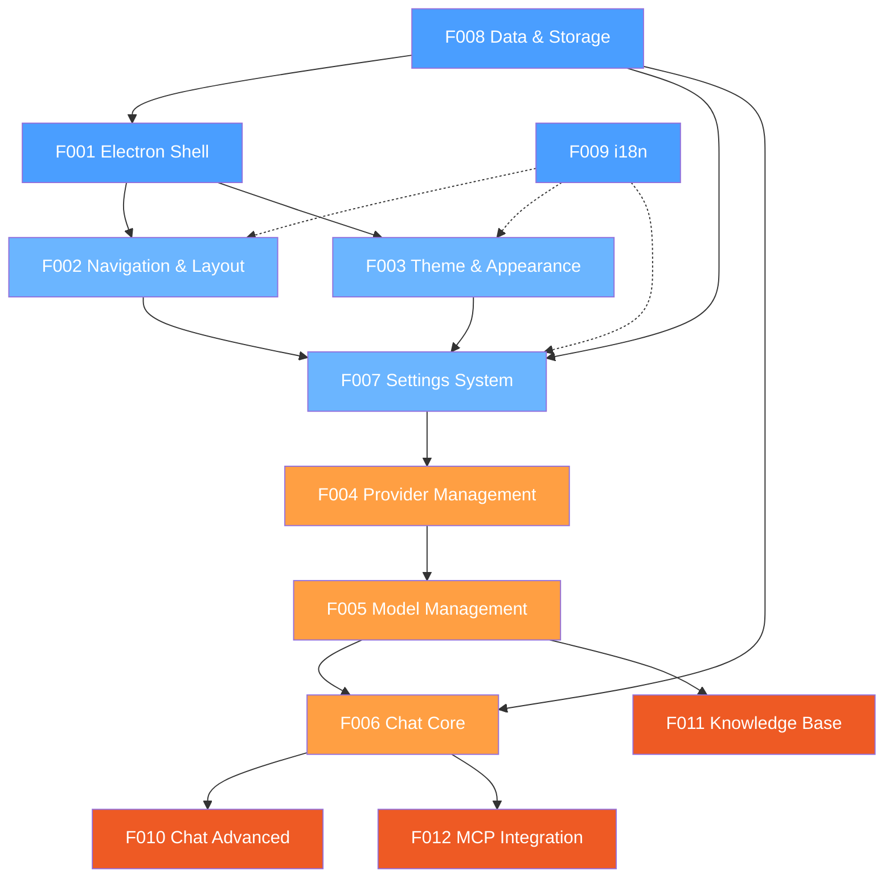

# Angdu Studio — Rebuild Roadmap

> Source: Cherry Studio | Scope: Core | Stack: New
> Date: 2026-03-15

---

## Project Overview

Angdu Studio is a ground-up rebuild of [Cherry Studio](https://github.com/CherryHQ/cherry-studio), an AI-powered desktop chat application supporting 16+ LLM providers. The rebuild preserves all core behaviors while modernizing the technology stack.

**Identity Mapping**: Cherry Studio -> Angdu Studio (Cherry -> Angdu prefix)

### Rebuild Strategy

| Aspect | Choice | Detail |
|--------|--------|--------|
| Scope | Core | 12 Features covering the complete AI chat experience |
| Stack | New | Keep Electron/React/TS; migrate UI, state, and storage layers |
| Runtime | Electron (latest) | Multi-process: main + renderer + preload bridge |
| UI | React 19 + shadcn/ui + Radix + Tailwind CSS 4 | Replace Ant Design 5 |
| State | Zustand + TanStack Query | Replace Redux Toolkit + React Query |
| Storage | Unified SQLite via Drizzle ORM | Replace Dexie (IndexedDB) + SQLite split |
| AI | Vercel AI SDK | Keep — best multi-provider abstraction |
| Rich Text | TipTap + CodeMirror | Keep — best-in-class |
| Build | electron-vite | Keep — purpose-built |
| i18n | i18next | Keep — mature |

---

## Feature Catalog

| ID | Feature | Description | Tier | Release Group |
|----|---------|-------------|------|---------------|
| F001 | Electron Shell | Main process, BrowserWindow, titlebar, window controls, lifecycle, tray, auto-update, zoom | T1 | RG-1 |
| F002 | Navigation & Layout | Tab bar, sidebar, assistants/topics toggle, routing, DnD tab reorder | T1 | RG-2 |
| F003 | Theme & Appearance | Dark/light/system, CSS variables, shadcn/ui tokens, font settings | T1 | RG-2 |
| F004 | Provider Management | Provider CRUD, API key management, 16+ provider types, OAuth, health check | T1 | RG-3 |
| F005 | Model Management | Model listing from APIs, search/filter, pin favorites, default selection, token counting | T1 | RG-3 |
| F006 | Chat Core | Assistants, topics, message composition, streaming LLM, message blocks, message actions | T1 | RG-3 |
| F007 | Settings System | Settings UI panels, Zustand-backed preferences, proxy, launch behavior, language | T1 | RG-2 |
| F008 | Data & Storage | Unified SQLite schema, file ops, local backup/restore, cache management | T1 | RG-1 |
| F009 | i18n | i18next setup, 11 languages, switching | T1 | RG-1 |
| F010 | Chat Advanced | Multi-model, file attachments, advanced blocks (image/tool/citation/error), context management | T2 | RG-4 |
| F011 | Knowledge Base | RAG, vector search, multi-source ingestion, embeddings, re-ranking | T2 | RG-4 |
| F012 | MCP Integration | MCP server management, tool execution, prompts/resources, DXT, tool permissions | T2 | RG-4 |

---

## Dependency Graph

---

## Release Groups

| Group | Name | Features | Goal | Prerequisites |
|-------|------|----------|------|---------------|
| RG-1 | Foundation | F001, F008, F009 | App launches, persists data, supports i18n | None |
| RG-2 | Chrome | F002, F003, F007 | Tab navigation, theming, settings UI | RG-1 |
| RG-3 | AI Core | F004, F005, F006 | Configure providers, select models, chat with LLMs | RG-1, RG-2 |
| RG-4 | Depth | F010, F011, F012 | Multi-model, knowledge RAG, MCP tools | RG-1, RG-2, RG-3 |

### Build Order (within each RG)

- **RG-1**: F008 Data & Storage -> F001 Electron Shell -> F009 i18n
- **RG-2**: F002 Navigation -> F003 Theme -> F007 Settings
- **RG-3**: F004 Providers -> F005 Models -> F006 Chat Core
- **RG-4**: F010 Chat Advanced | F011 Knowledge Base | F012 MCP (parallel)

---

## Demo Groups

### Demo 1: "First Launch to First Chat" (RG-1 + RG-2 + RG-3)

1. Launch Angdu Studio (F001)
2. See the home screen with tab bar and sidebar (F002)
3. Switch to dark theme (F003)
4. Open Settings, configure OpenAI provider with API key (F007, F004)
5. Browse models, pin GPT-4o as default (F005)
6. Create a new assistant, start a topic, send a message, receive streaming response (F006)
7. Verify data persists after app restart (F008)
8. Switch language to Korean (F009)

### Demo 2: "Power User Multi-Model" (RG-4a)

1. Configure multiple providers (OpenAI + Anthropic + Gemini) (F004)
2. In a chat topic, @-mention multiple models for a single question (F010)
3. View responses in grid layout, compare outputs (F010)
4. Attach a PDF file to a follow-up question (F010)

### Demo 3: "Knowledge-Augmented Chat with Tools" (RG-4b)

1. Create a knowledge base, ingest documentation files (F011)
2. Attach knowledge base to an assistant (F006, F011)
3. Ask a question — see RAG-retrieved citations in response (F011)
4. Add an MCP server (filesystem), enable it on the assistant (F012)
5. Ask the assistant to list files in a directory — see tool call/response blocks (F012)

---

## Not in Core Scope (Post-MVP)

- Web search integration
- Memory system
- Translation app
- Image generation / Paintings
- Notes editor
- Code workspace
- Mini apps
- Selection assistant
- API server
- Trace/analytics
- OpenClaw integration
- Cloud backup (WebDAV, S3, LAN transfer)
