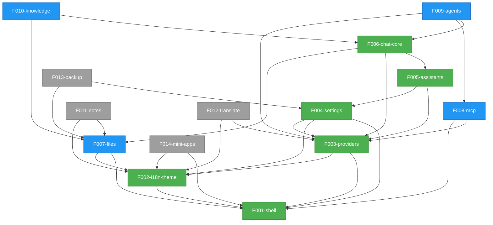

# Angdu Studio — Reverse-Spec Roadmap

## Project Overview

| Field            | Value                                                              |
| ---------------- | ------------------------------------------------------------------ |
| **Project**      | Angdu Studio                                                       |
| **Mode**         | Rebuild (Core scope, New Stack)                                    |
| **Original App** | Cherry Studio — AI-powered desktop chat app (Electron + React + Redux) |
| **New Stack**    | Electron + React 19 + Zustand + Tailwind 4 + shadcn/ui + Vite 7   |
| **Features**     | 14 total (6 Essential, 4 Recommended, 4 Optional)                  |
| **Release Groups** | 4 (RG-1 through RG-4)                                           |

## Rebuild Strategy

Angdu Studio is a ground-up rebuild of Cherry Studio using a modern stack. The rebuild follows a layered release strategy:

1. **RG-1 — Foundation**: Stand up the Electron shell and cross-cutting concerns (i18n, theming) so every subsequent feature has a runtime to attach to.
2. **RG-2 — Provider & Config Layer**: Wire LLM providers, settings infrastructure, and file management — the three services that almost every user-facing feature depends on.
3. **RG-3 — Core UX**: Deliver the primary value loop — assistants, chat, and MCP tool integration.
4. **RG-4 — Extensions**: Add agents, knowledge bases, notes, translation, backup, and mini-apps to round out the full product.

Each release group is independently shippable. Demo groups cut across release groups to validate end-to-end user flows.

---

## Feature Catalog

| ID   | Name           | Tier | RG   | Description | Dependencies | Status  |
| ---- | -------------- | ---- | ---- | ----------- | ------------ | ------- |
| F001 | shell          | T1   | RG-1 | Electron main process, window management, IPC bridge, tray, auto-updates, app menus, system integration | — | pending |
| F002 | i18n-theme     | T1   | RG-1 | Internationalization (11 languages), theming (dark/light), global CSS tokens, font management | F001 | pending |
| F003 | providers      | T1   | RG-2 | LLM provider management (50+ types), model registry, API key management, provider configuration | F001, F002 | pending |
| F004 | settings       | T1   | RG-2 | Settings UI (16 sub-pages), general/display/data config, keyboard shortcuts, quick assistant, selection assistant | F001, F002, F003 | pending |
| F005 | assistants     | T1   | RG-3 | Assistant CRUD, presets, assistant store/library, assistant configuration (system prompts, model binding) | F003, F004 | pending |
| F006 | chat-core      | T1   | RG-3 | Conversations/topics, message streaming, input bar with tools, message blocks, multi-window sync | F005, F003, F007 | pending |
| F007 | files          | T2   | RG-2 | File management, upload/download, file storage, binary/base64 image handling | F001, F002 | pending |
| F008 | mcp            | T2   | RG-3 | MCP server management, tool discovery/invocation, OAuth, prompt/resource access, DXT packages | F003, F001 | pending |
| F009 | agents         | T2   | RG-4 | Agent framework, agent sessions, Claude Code integration, session messages, tool permissions | F006, F008, F003 | pending |
| F010 | knowledge      | T2   | RG-4 | Knowledge base CRUD, document embedding (embedjs), search/rerank, document preprocessing | F006, F007 | pending |
| F011 | notes          | T3   | RG-4 | TipTap rich editor, file tree navigation, markdown import/export, drag handles | F007, F002 | pending |
| F012 | translate      | T3   | RG-4 | Translation UI, language detection (franc), OCR support, split-pane layout | F003, F002 | pending |
| F013 | backup         | T3   | RG-4 | Backup/restore (local, WebDAV, S3), data export/import | F004, F007 | pending |
| F014 | mini-apps      | T3   | RG-4 | Webview-based mini apps (60+ AI services), launchpad grid, custom app support | F001, F002 | pending |

---

## Dependency Graph

---

## Release Groups

| RG   | Features                                           | Theme                   | Entry Criteria                                     |
| ---- | -------------------------------------------------- | ----------------------- | -------------------------------------------------- |
| RG-1 | F001-shell, F002-i18n-theme                        | Foundation              | —                                                  |
| RG-2 | F003-providers, F004-settings, F007-files          | Provider & Config Layer | RG-1 complete                                      |
| RG-3 | F005-assistants, F006-chat-core, F008-mcp          | Core UX                 | RG-2 complete                                      |
| RG-4 | F009-agents, F010-knowledge, F011-notes, F012-translate, F013-backup, F014-mini-apps | Extensions | RG-3 complete (individual features may start when their specific deps are met) |

---

## Demo Groups

Demo groups define end-to-end user flows that validate cross-feature integration. Each demo group exercises a realistic scenario and touches features from multiple release groups.

### DG-01 — Basic Chat Flow

| Field        | Value |
| ------------ | ----- |
| **Features** | F001-shell, F002-i18n-theme, F003-providers, F005-assistants, F006-chat-core |
| **Scenario** | User opens app, configures an LLM provider, creates an assistant, and sends a chat message with streaming response. |
| **Validates** | App launch → provider setup → assistant creation → conversation loop |

### DG-02 — Knowledge-Augmented Chat

| Field        | Value |
| ------------ | ----- |
| **Features** | F006-chat-core, F007-files, F010-knowledge, F011-notes |
| **Scenario** | User creates a knowledge base, adds documents, then chats with KB context injected into prompts. |
| **Validates** | File upload → document embedding → retrieval-augmented chat → note-taking |

### DG-03 — Agent & Tool Workflow

| Field        | Value |
| ------------ | ----- |
| **Features** | F003-providers, F006-chat-core, F008-mcp, F009-agents |
| **Scenario** | User configures an MCP server, creates an agent with tool access, and runs an agent session that invokes external tools. |
| **Validates** | MCP server discovery → tool binding → agent execution → tool invocation round-trip |

### DG-04 — Full App Experience

| Field        | Value |
| ------------ | ----- |
| **Features** | F004-settings, F012-translate, F013-backup, F014-mini-apps |
| **Scenario** | User customizes settings, uses translation, launches a mini-app, and creates a full backup. |
| **Validates** | Settings persistence → translation flow → webview mini-app → backup/restore cycle |

---

## Cross-Feature Entity Dependencies

These shared domain entities are owned by one feature but consumed by others. The owning feature defines the schema; consumers read or reference it.

| Entity             | Owner         | Consumers                                      |
| ------------------ | ------------- | ----------------------------------------------- |
| Window / IPC       | F001-shell    | All features (renderer ↔ main communication)   |
| Theme tokens       | F002-i18n-theme | All features (CSS variables, color scheme)    |
| Locale strings     | F002-i18n-theme | All features (translated UI labels)           |
| Provider config    | F003-providers | F005, F006, F008, F009, F012                   |
| Model definition   | F003-providers | F005, F006, F009, F010, F012                   |
| Settings store     | F004-settings  | F001, F002, F003, F006, F013                   |
| Assistant          | F005-assistants | F006-chat-core, F009-agents                   |
| Conversation/Topic | F006-chat-core | F009-agents, F010-knowledge                   |
| Message            | F006-chat-core | F009-agents, F010-knowledge, F013-backup      |
| File reference     | F007-files     | F006, F010, F011, F013                         |
| MCP server config  | F008-mcp       | F009-agents                                    |
| Knowledge base     | F010-knowledge | F006-chat-core (context injection)             |

## Cross-Feature API Dependencies

Internal APIs (IPC channels, store selectors, service methods) that cross feature boundaries.

| API Surface                  | Provider       | Consumers              | Direction        |
| ---------------------------- | -------------- | ---------------------- | ---------------- |
| `ipc:window.*`               | F001-shell     | All renderer features  | main → renderer  |
| `ipc:tray.*`                 | F001-shell     | F004-settings          | main → renderer  |
| `ipc:file.*`                 | F007-files     | F006, F010, F011, F013 | renderer → main  |
| `useTheme()` / `useLocale()` | F002-i18n-theme | All renderer features | store → component |
| `useProviderStore()`         | F003-providers | F005, F006, F008, F012 | store → component |
| `useSettingsStore()`         | F004-settings  | F001, F002, F003, F006 | store → component |
| `useAssistantStore()`        | F005-assistants | F006, F009            | store → component |
| `useChatStore()`             | F006-chat-core | F009, F010             | store → component |
| `mcpInvokeTool()`            | F008-mcp       | F009-agents            | service call      |
| `knowledgeSearch()`          | F010-knowledge | F006-chat-core         | service call      |
| `backupExport()` / `backupImport()` | F013-backup | F004-settings (UI trigger) | service call |
